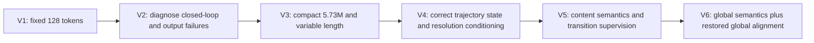

# DreamLite Image Bridge: From V1 to V6

> **Continuation.** The V7-V9 data, ablation, and training-design record is in
> [DreamLite Image Bridge: V7 to V9](DREAMLITE_IMAGE_BRIDGE_V7_TO_V9.md).
> This document intentionally preserves the original V1-V6 history rather than
> renaming old checkpoints or retroactively changing their experiment labels.

## Purpose

This document records why the Mobile-OV DreamLite image bridge changed from
V1 through V6. The goal is not to present every version as a success. It is to
connect each code change to a measured failure mode so that later experiments
do not repeat earlier mistakes.

The deployed generation path is unchanged throughout the compact versions:

```text
prompt
  -> frozen SmolVLM2-500M
  -> trainable DreamLite image bridge
  -> variable-length [B, L, 2048] condition
  -> frozen DreamLite four-call UNet
  -> frozen Tiny VAE
  -> image
```

Native DreamLite replaces SmolVLM2 and the bridge with its frozen Qwen3-VL
text encoder. Qwen3-VL, DreamLite, the Tiny VAE, and SmolVLM2 remain frozen
during bridge distillation.

## Naming Note

Early discussion used the V1 and V2 labels inconsistently for the original
large DreamLite bridge and its later checkpoint evaluations. The repository
contains one maintained pre-compact training path,
`train_dreamlite_image_bridge_1node8gpu.sbatch`; it does not contain a separate
V2 architecture or a standalone V2 training script.

This report therefore uses the following reproducible interpretation:

- **V1** is the initial self-contained, fixed-length DreamLite bridge.
- **V2** is the objective/evaluation iteration of the same pre-compact family.
  It is a research milestone, not a separately maintained architecture.
- **V3-V6** are explicit compact training versions with dedicated scripts.

This distinction prevents checkpoint quality changes from being mistaken for
architecture changes that did not occur.

## Evolution at a Glance

| Version | Architecture | Main objective change | Main lesson |
|---|---|---|---|
| V1 | 10.52M, fixed 128 tokens | Representation, one-call functional, independent closed loop | Shape compatibility and low average loss do not guarantee prompt fidelity |
| V2 | Same pre-compact family | Deeper checkpoint and output analysis | Closed-loop comparisons mixed condition error with state mismatch |
| V3 | 5.73M, variable length | Direct token alignment, stronger moment losses | Compactness worked, but the objective and 512-only regime remained wrong |
| V4 | Same 5.73M compact bridge | Multi-resolution and teacher-forced same-state functional loss | Actual resolution and logical `time_ids` must be separated |
| V5 | Same architecture | Content-aware loss, local contrastive, semantic curriculum, transition loss | Semantic retrieval improved, but pooled alignment and exact 1024 quality regressed |
| V6 | Same architecture | Global contrastive, restored pooled statistics, balanced resolutions and calls | Correct V5's measured trade-offs without adding modules or new data |



## V1: Initial Self-Contained Bridge

V1 established that DreamLite could be integrated directly into this
repository and controlled without cloning a second runtime repository. The
student bridge produced DreamLite's required 2048-dimensional condition and
used the OpenVid short, medium, and long captions.

The representative checkpoint contains 10,516,229 trainable bridge
parameters. It uses fixed 128-token queries, even for short prompts. Its loss
combined interpolated representation alignment, pooled alignment, relational
geometry, one-call frozen-UNet parity, and an independent four-call closed
loop.

The initial result was useful but inconsistent. Some prompts generated
recognizable images while semantically specific prompts, including red panda
and multi-object compositions, failed. The bridge could match average teacher
statistics while losing prompt identity.

The independent closed-loop term also had a conceptual problem. Once native
and student conditions produced different states, later predictions were
compared at different UNet inputs. The loss then mixed two effects:

```text
condition mismatch + accumulated latent-state mismatch
```

It did not provide a clean gradient for correcting only the condition.

## V2: Diagnose Before Redesigning

V2 was the evaluation and objective-analysis stage of the same pre-compact
bridge family. It did not introduce a separately maintained model. Its most
important contribution was identifying that apparent bridge quality depended
strongly on the DreamLite resolution condition.

At `512x512`, images were often close-up, blurry, or incomplete. Factorized
experiments separated three quantities:

```text
actual width/height -> latent grid and scheduler computation
logical width/height -> DreamLite time_ids and composition prior
bridge condition     -> scene semantics
```

Changing only scheduler behavior did little. Keeping a 512 actual grid while
using logical `time_ids=(1024,1024)` recovered much more complete scenes. The
same effect appeared with the native Qwen condition, proving that it was not
invented by the bridge.


This stage produced two durable lessons:

1. A 512-only visual review underestimated the bridge.
2. Functional distillation must evaluate native and student conditions at the
   same latent state.

## V3: Compact Variable-Length Bridge

V3 reduced the trainable bridge to 5,725,189 parameters. This was a real
deployment improvement rather than a loss-only change.

The compact architecture uses:

- four fused SmolVLM2 hidden layers;
- semantic and lexical projections with a learned gate;
- two lightweight query blocks;
- prompt-dependent output length capped at 128;
- one 2048-dimensional DreamLite condition head.

Variable length removed unconditional padded queries. A short native
DreamLite condition no longer forced the student to emit 128 meaningful
positions.

V3 also changed to direct position alignment and added raw token norm, mean,
and standard-deviation terms. However, it still trained functional behavior in
the problematic 512 regime and retained closed-loop supervision. At 30K it
could look sharper than the older bridge while being semantically worse on
some prompts.


The conclusion was not that the compact architecture was too small. The test
showed that image statistics such as edge variance and entropy could improve
while prompt fidelity became worse. Objective correctness had to be fixed
before adding capacity.

## V4: Correct State and Resolution Contracts

V4 kept the V3 architecture exactly. It corrected two training contracts.

### Teacher-forced same-state functional loss

For a sampled DreamLite call `k`, the native condition first constructs the
prefix state without gradients. Native and student predictions are then
evaluated on the same detached state, timestep, source latent, actual grid,
and logical canvas:

```text
x_k = native_prefix(noise, calls 0..k-1)
u_teacher = DreamLite(x_k, t_k, native_condition)
u_student = DreamLite(x_k, t_k, student_condition)
```

Only `u_student` receives gradients. This isolates condition mismatch from
state mismatch.

### Multi-resolution curriculum

V4 introduced explicit `actual@logical` resolution buckets. The scheduler
continues to follow the actual latent grid, while `time_ids` describe the
logical canvas. This preserves low-compute proxy rendering without lying to
the scheduler.

Closed-loop training was disabled. Generation remained the only trained mode;
no editing manifest was supplied.

V4 became a strong behavioral baseline, but the final audit still found weak
rare entities and compositional semantics. Pooled alignment could be good
while content-token identity remained insufficient.

## V5: Content and Deployment-State Semantics

V5 again kept the 5.73M architecture. It added four objective changes.

### Content-aware token regions

The retained native generation condition contains three prefix wrapper tokens,
prompt content, and five suffix wrapper tokens. The mask was verified against
the real DreamLite tokenizer. V5 gave full weight to content and only 0.25
weight to wrapper alignment.

### Local contrastive alignment

V5 added symmetric student-to-teacher retrieval loss before and after
DreamLite's frozen condition projection. It was computed on each GPU's local
batch of four, so each prompt saw only three negatives.

### Semantic prompt curriculum

Training used 80% OpenVid captions and 20% deterministic compositional image
prompts. These prompts expanded object, count, color, relation, material,
style, and composition coverage without using VBench prompts.

### Transition and student-prefix supervision

V5 matched both the same-state UNet prediction and the next scheduler state.
After step 30K, student-prefix states ramped to 25% while native-prefix states
remained 75%. Native and student predictions were still evaluated at the same
state; the invalid independent closed loop stayed disabled.

## What the V5 Audit Actually Showed

The controlled audit compared V5 step 80K with V4 step 100K using the same
prompts, seeds, initial latents, four DreamLite calls, and five resolution
regimes. V5 was not yet at its configured 120K target.

### Semantic behavior

| Metric, 96 prompts | V4 100K | V5 80K | Change |
|---|---:|---:|---:|
| Retrieval Top-1 | 47.92% | 65.63% | +17.71 points |
| Retrieval Top-5 | 80.21% | 91.67% | +11.46 points |
| MRR | 0.614 | 0.749 | +0.135 |
| Hardest-negative margin | -0.0036 | +0.0029 | Became positive |
| Content pooled cosine loss | 0.0420 | 0.0482 | 14.9% worse |

V5 improved prompt separation by moving wrong prompts farther away, not by
uniformly moving every condition closer to its teacher. This explains why red
panda, astronaut, and glass cube improved while pooled alignment regressed.

### Generator behavior

Across 50 controlled images, prompt CLIP increased from 0.2590 to 0.2725 and
image-to-native CLIP increased from 0.8353 to 0.8639. V5 won the prompt CLIP
comparison on 64% of examples.

The improvement was not uniform:

- landscape pixel error improved by 14.4%;
- portrait pixel error improved by 4.6%;
- the 512 proxy improved by 10.7%;
- exact `1024x1024` pixel error regressed by 7.8%;
- a purple vase and giant moon were still omitted in difficult compositions;
- bicycle color and retriever identity sometimes regressed;
- exact text remained unreliable, including for native DreamLite.

Three V5 design limitations match these observations:

1. Contrastive learning used local batch 4 rather than global batch 32.
2. Pooled cosine had only 0.1 weight and pooled/moment terms were absent.
3. Exact `1024x1024` had only 5% resolution probability, while landscape had
   45%.

The `4,2,2,2` call weights also did not consistently fix call zero. At exact
1024, calls zero and one regressed while later calls improved.

## V6: Minimal Correction of V5

V6 changes no trainable module and adds no new dataset. It keeps:

- the 5,725,189-parameter compact bridge;
- variable-length output;
- the verified 3/5 content-wrapper mask;
- 80% OpenVid and 20% existing synthetic prompts;
- mixed teacher/student-prefix same-state supervision;
- transition loss;
- frozen SmolVLM2, Qwen3-VL, DreamLite, and Tiny VAE;
- `closed_loop_weight=0`;
- generation-only training.

### 1. Global distributed contrastive loss

V6 gathers only the fixed-size pooled summaries `[B, 2048]`, not variable
token sequences. On eight GPUs with batch four, each prompt is compared
against 31 global negatives instead of three local negatives.

The gather is differentiable for student summaries and is applied in both raw
and frozen-projected condition spaces. Communication is small relative to the
frozen encoder and UNet forwards.

Because the candidate set is much stronger, the contrastive coefficient is
reduced from 0.2 to 0.1.

### 2. Restore pooled and distribution alignment

For content tokens, V6 uses the following loss in raw and projected spaces:

```text
L_content =
    0.50  * normalized_token_MSE
  + 1.00  * token_cosine
  + 0.10  * wrapper_loss
  + 0.25  * pooled_cosine
  + 0.10  * normalized_pooled_MSE
  + 0.025 * token_mean_error
  + 0.025 * token_std_error
  + 0.10  * global_contrastive

L_representation = L_content(raw) + L_content(frozen_projection(raw))
```

The moment terms are deliberately small. They regularize distribution drift
without returning to V3's heavy raw-statistics objective. Wrapper weight drops
from 0.25 to 0.10 because V5 already matched the mostly constant template
tokens well.

### 3. Rebalance resolution exposure

| Actual grid | Logical canvas | V5 | V6 |
|---|---|---:|---:|
| `512x512` | `1024x1024` | 20% | 15% |
| `768x768` | `1024x1024` | 10% | 10% |
| `1024x1024` | `1024x1024` | 5% | 15% |
| `640x400` | `1280x800` | 25% | 15% |
| `1024x640` | `1280x800` | 20% | 20% |
| `400x640` | `800x1280` | 12% | 10% |
| `640x1024` | `800x1280` | 8% | 15% |

This keeps NeoDragon-compatible landscape at 20%, triples exact native-square
exposure, and gives high-resolution portrait enough weight. V6 deliberately
does not add `512x512@512x512`; supported low-cost square inference remains
`512x512@1024x1024`.

### 4. Equal call sampling

All four DreamLite calls are sampled equally with `1,1,1,1`. The functional
objective is:

```text
L_functional =
    5.00 * prediction_relative_MSE
  + 0.10 * prediction_cosine
  + 1.00 * next_state_relative_MSE
  + 0.05 * next_state_cosine
```

Student-prefix probability still ramps to 25%. This retains V5's measured
terminal improvements while removing the unsupported assumption that call
zero deserves twice the probability of every later call.

## V6 Training Schedule

```text
steps 0-10K:
  raw/projected content alignment
  pooled and moment alignment
  global contrastive alignment

steps 10K-30K:
  linearly ramp same-state functional and transition losses

steps 30K-50K:
  ramp student-prefix state probability from 0% to 25%

steps 50K-120K:
  full V6 objective
```

Default optimization:

```text
8 GPUs
batch per GPU = 4
global batch = 32
AdamW, LR = 4e-5
2K warmup
cosine decay to 0.1 of base LR
FP32 trainable parameters and optimizer states
BF16 frozen-model forwards
latest checkpoint every 5K
archive checkpoint every 10K
```

V6 starts from scratch by default. V3-V6 trainable state dictionaries remain
architecture-compatible, but resuming V5 would confound the V6 objective
ablation with V5's already learned pooled drift.

## Berzelius Commands

Submit the full run from the repository root:

```bash
sbatch scripts/train_dreamlite_compact_v6_1node8gpu.sbatch
```

Inspect its log:

```bash
tail -n 20 logs/mov-dream-v6-<JOBID>.out
```

Run the two-GPU smoke test when local cluster resources are available:

```bash
sbatch scripts/smoke_dreamlite_compact_v6_2gpu.sbatch
```

Expected output:

```text
output/dreamlite_compact_v6/<JOBID>/dreamlite_image_bridge_latest.pt
output/dreamlite_compact_v6/<JOBID>/dreamlite_image_bridge_step010000.pt
output/dreamlite_compact_v6/<JOBID>/history.jsonl
```

The history log includes `semantic_batch_size`; it must be `32` for the
default eight-GPU run. It also logs pooled normalized MSE, token moments,
functional call index, state source, transition error, resolution bucket, and
GPU memory.

## V6 Success Criteria

V6 should not be accepted because its total loss is lower. It should be
compared against V4 100K and V5 checkpoints with fixed prompts, seeds, noise,
actual grids, logical canvases, and all four DreamLite calls.

Minimum expected direction:

1. Preserve or improve V5's 65.63% retrieval Top-1.
2. Recover content pooled cosine to at least the V4 range.
3. Remove the measured exact-1024 regression.
4. Preserve V5's gains on red panda, astronaut, glass cube, landscape, and
   portrait prompts.
5. Avoid regressions in retriever identity, bicycle color, and multi-object
   composition.
6. Keep 512 proxy, landscape, and portrait terminal errors no worse than V5.

Exact typography is not a strict bridge acceptance criterion because native
DreamLite also fails some text-rendering prompts. Editing is also outside V6's
scope because the run has no edit manifest.

## What V6 Intentionally Does Not Add

V6 does not add a new resampler, head, context adapter, hard-negative dataset,
OCR loss, CLIP image loss, trainable DreamLite layer, or closed-loop graph.

These omissions are deliberate. The V5 audit already identified four
objective and sampling issues that can be corrected without changing the
model. V6 is designed to test those corrections cleanly before architecture
or data complexity is increased.
