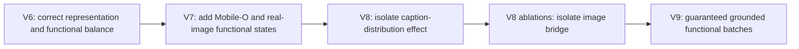

# DreamLite Image Bridge: V7 to V9

## Scope and Decision Context

This is the continuation of
[DreamLite Image Bridge: From V1 to V6](DREAMLITE_IMAGE_BRIDGE_V1_TO_V6.md).
It records the evidence behind V7 and V8, the controlled ablations run after
V8, and the exact reason for the V9-from-scratch training recipe. The purpose
is to preserve a falsifiable experimental narrative, not to present every
checkpoint as an improvement.

The architecture is intentionally unchanged from V6 onward:

```text
prompt
  -> frozen SmolVLM2-500M
  -> 5.73M-parameter variable-length DreamLite image bridge
  -> [B, L, 2048] DreamLite condition
  -> frozen DreamLite four-call UNet and Tiny VAE
  -> first frame
  -> frozen NeoDragon video branch
  -> video
```

Native DreamLite uses frozen Qwen3-VL instead of SmolVLM2 plus the bridge. The
teacher, DreamLite UNet, Tiny VAE, SmolVLM2, and NeoDragon remain frozen in
V7-V9. These versions investigate the **conditioning objective and data
distribution**, not a new generator architecture.



## V7: Why Add Mobile-O and Real Image States?

### Problem observed after V6

V6 corrected several objective issues: content-aware raw/projected alignment,
global contrastive negatives, balanced actual/logical resolution buckets, and
equal sampling of all four DreamLite calls. It still learned mostly from text
captions and generated Gaussian states. This leaves an important ambiguity:
the bridge can imitate Qwen3-VL embeddings on caption distributions while
still failing to preserve the DreamLite response around real image latents.

The quality failures that motivated V7 were composition failures rather than a
complete collapse: missed secondary objects, incorrect colour binding, weak
scene layout, and poor prompt specificity. These are exactly the cases in
which a condition can look close under an average embedding loss while changing
the frozen UNet's behaviour in a visually important way.

### V7 training distribution

V7 retained the V6 bridge and loss family, but mixed Mobile-O data into the
main generation prompt loader. The explicit manifest weights were:

| Source | Manifest sampling weight | Role |
|---|---:|---|
| OpenVid recaptions | 0.50 | Broad video caption coverage; short, medium, and long variants |
| Mobile-O JourneyDB/short-caption manifest | 0.40 | Image-domain captions and raw image paths |
| Mobile-O SFT, when present | 0.10 | Instruction-style captions and raw image paths |
| Synthetic semantic prompts | 0.10 branch probability | Extra counts, colours, relations, scenes, styles; no VBench prompt list |

The last row is a branch that replaces a normal prompt batch, so it is not an
additional manifest weight. When the SFT manifest was unavailable, the first
two sources used the default `0.5/0.4` setup documented by the launcher.

### Image-grounded functional supervision

For an eligible Mobile-O row, V7 used the raw image only to create a valid
DreamLite latent state. It did **not** claim that a caption-image pair was an
editing sample and did not inject the image through DreamLite's edit channel.

```text
real image -> frozen Tiny VAE -> clean latent x_0
noise + native scheduler sigma -> shared state x_k

frozen UNet(x_k, native Qwen condition) -> teacher prediction and transition
frozen UNet(x_k, bridge condition)      -> student prediction and transition
```

The bridge receives gradients through the student UNet condition only. The
loss matches the teacher's prediction and one-step scheduler transition at the
same state, call, actual resolution, and logical `time_ids`.

V7 used a `0.25` probability for this grounded branch, one functional image
per GPU, and a grounded multiplier of `0.5`. This was a useful first attempt
because it introduced real image manifold states without changing the model.
However, it was only an **opportunistic** mechanism: it first drew a normal
mixed prompt batch and could use the grounded loss only when that batch
contained a readable Mobile-O image path. Therefore the effective number of
grounded examples was lower and more variable than the nominal 25% suggests.

### V7 outcome

V7 was the first clear end-to-end improvement after V6. In the one-video-per-
prompt full VBench run used at the time, it produced:

| Checkpoint | Quality | Semantic | Total |
|---|---:|---:|---:|
| V7 Mobile-O, step 120K | 0.8063 | 0.6331 | 0.7717 |

This was encouraging, but it did not prove that the gain came from grounded
functional states. V7 changed data, sample mixture, and training duration at
once. V8 was designed to separate the most important remaining variable: the
caption distribution.

## V8: Caption Distribution, Not Another Architecture

### Question

The V7 result raised a concrete question: does OpenVid improve the image
bridge because it supplies more data, or does it move the text distribution
away from DreamLite's image-generation distribution? DreamLite's teacher is
an image model; OpenVid is valuable for the later video branch but contains
video-oriented captions and a large number of rows without usable still-image
grounding.

V8 retained the compact bridge, frozen models, four-call same-state functional
loss, actual/logical resolution buckets, and no closed-loop training. It ran
two **from-scratch** 160K-step variants:

| Variant | Prompt manifests | Weights | What it tests |
|---|---|---:|---|
| V8 image-only | JourneyDB, short-caption | 0.7143, 0.2857 | Image-caption distribution without OpenVid |
| V8 mix | OpenVid, JourneyDB, short-caption | 0.30, 0.50, 0.20 | Whether OpenVid still helps when image data dominates |

Both used 8 GPUs, batch 4/GPU, global batch 32, BF16 frozen forwards with
FP32 bridge/optimizer states, LR `4e-5`, 2K warm-up, and 5K/10K
latest/archive checkpoint saves. They preserved the V7-style optional grounded
branch (`p=0.25`, functional batch 1, grounded multiplier 0.5), which is
important: V8 is principally a data ablation, not the final grounding recipe.

### Initial VBench evidence

Each result below is a full VBench run with one independently generated video
per prompt. These scores are useful for direction but have sampling noise and
are not by themselves a significance test.

| Variant | Quality | Semantic | Total |
|---|---:|---:|---:|
| V7 Mobile-O, 120K | 0.8063 | 0.6331 | 0.7717 |
| V8 image-only, 160K | **0.8159** | 0.6482 | **0.7824** |
| V8 mix, 160K | 0.8121 | **0.6518** | 0.7801 |

Both V8 variants improved the earlier V7 point estimate. Image-only had the
best total score; mix had a slightly higher semantic score. The differences
between the two V8 variants were too small to support a strong data-mixture
claim, so V8 image-only became the practical baseline because it had the best
total score and the cleanest image-domain distribution.

## V8 Ablations: What Was Actually Tested

The V8 analysis was intentionally layered. Earlier small runs explored the
factorization; the final 100-prompt, three-seed experiment is the causal
evidence used to design V9.

### 1. Repeated V7/V8 checkpoint comparison

`evaluate_vbench_v7_v8_100prompt_3seed_1node1gpu.sbatch` generates the same
stratified 100-prompt VBench subset for V7, V8 image-only, and V8 mix across
three independent seeds. Each cell uses one video per prompt and is scored by
VBench. It answers whether a single full-VBench seed was misleading.

This comparison is useful for ranking checkpoints, but it cannot localize a
failure: image bridge, video bridge, and first-frame-to-video interaction all
change together.

### 2. Exploratory 20-prompt image/video matrix

`ablate_dreamlite_v8_native_video_20prompt_1node1gpu.sbatch` crossed two
first-frame conditions with two NeoDragon conditions:

```text
DreamLite anchor: native Qwen3-VL or V8 image bridge
NeoDragon text:  native ContextAdapter or Exp1 64K video bridge
```

It reused compatible VBench videos when possible and rendered the missing
cells with fixed seeds. This established that both bridges can contribute to
semantic degradation, but 20 prompts and a small number of seeds were not
enough for a final quantitative decision. The run was therefore treated as
diagnostic rather than used to select an architecture.

### 3. Final causal image-bridge ablation: 100 prompts x 3 seeds

`ablate_dreamlite_v8_image_bridge_native_text_vbench_100x3_1node1gpu.sbatch`
is the decisive experiment. It held all non-image components fixed:

```text
same raw VBench prompt
same DreamLite UNet, Tiny VAE, scheduler, resolution, and seed
same released native NeoDragon ContextAdapter and Hybrid DiT
same NeoDragon seed and video render settings

only change: native Qwen3-VL DreamLite condition vs V8 image-bridge condition
```

It generated 100 stratified VBench prompts x 3 seeds x 2 image conditions =
600 videos, then evaluated all VBench dimensions. This is a paired comparison:
for each seed and prompt, the video branch is identical, so the score delta is
attributable to the image bridge and its DreamLite first-frame effect.

| Condition | Quality mean | Semantic mean | Total mean |
|---|---:|---:|---:|
| Native Qwen3-VL DreamLite condition | 0.8490 | 0.8005 | 0.8393 |
| V8 image bridge condition | 0.8366 | 0.7133 | 0.8119 |
| V8 minus native, paired | **-0.0124** | **-0.0873** | **-0.0274** |

All three paired seeds had negative semantic and total deltas. The absolute
scores are only for this selected 100-prompt subset and must not be compared
directly with canonical 944-prompt VBench scores. The paired delta is the
reliable result.

The affected semantic dimensions are highly diagnostic:

| Scaled VBench dimension, V8 minus native | Mean delta | Interpretation |
|---|---:|---|
| Object class | -0.0046 | Basic single-object identity is almost preserved |
| Multiple objects | -0.1094 | Coexistence/count binding degrades; variance is high across seeds |
| Color | -0.1019 | Attribute-to-object binding degrades consistently |
| Spatial relationship | -0.1845 | The largest compositional loss |
| Scene | -0.1242 | Layout/background semantics degrade consistently |

The tokenizer masks agreed exactly (`mask_agreement=1.0`). This rules out a
simple variable-length mask or token-count bug. The issue is that the bridge
condition does not retain enough **content-bearing Qwen3-VL information** for
the frozen DreamLite UNet to bind objects, attributes, relations, scenes, and
style in the same way as native Qwen3-VL.

The highest content-condition mismatch prompts were also informative: Eiffel
Tower plus Van Gogh/surrealism, hula hooping, Hokusai beach, shuttle launch,
zebra plus giraffe, barbequing, and stormtrooper vacuuming. They combine
scene, action, style, or multiple entities. Average embedding similarity alone
was therefore not a sufficient acceptance metric.

## What V8 Proved and What It Did Not

### Established

1. The compact bridge is not suffering a gross format failure: output masks
   match, basic object class is nearly preserved, and V8 beats V7 on the
   one-seed full-VBench point estimate.
2. The image bridge is a demonstrated semantic bottleneck. With native Qwen
   image conditioning and the native NeoDragon video condition, the same
   pipeline scores `+0.0873` semantic and `+0.0274` total above V8.
3. Caption distribution matters, but V8 image-only and V8 mix are close. The
   current evidence does not justify claiming OpenVid is harmful or that one
   mixture is universally optimal.
4. The remaining failure is primarily compositional grounding, not merely
   single-object naming or a missing mask.

### Not established

1. The final ablation does not prove that the video bridge is perfect. The
   native NeoDragon text condition was deliberately fixed to isolate the image
   side. Earlier exploratory matrix runs indicate the video bridge remains a
   separate source of loss.
2. The final ablation does not give a canonical full-VBench native baseline;
   it is a stratified 100-prompt paired study.
3. It does not prove that a larger bridge is needed. The V8 evidence first
   points to insufficient grounded functional signal, not an architecture
   capacity limit.

## V9: From-Scratch Grounded Functional Recipe

V9 is a clean response to the evidence, not a continuation checkpoint. It
starts from random bridge weights and preserves the V8 compact architecture,
native teacher, four-call schedule, resolution buckets, and frozen generator.
It changes one training contract: real-image functional states are sampled by
a dedicated, image-verified loader instead of appearing incidentally in a
normal mixed prompt batch.

### Data and schedule

| Component | V8 image-only | V9 from scratch |
|---|---:|---:|
| Main prompt mixture | JourneyDB 71.4%, short caption 28.6% | JourneyDB 80%, short caption 20% |
| Synthetic compositional branch | 10% | 15% |
| Grounded source | Opportunistic eligible rows | Dedicated JourneyDB loader with verified image paths |
| Grounded probability | 25% attempt, lower effective rate | 50% of post-warm-up updates, guaranteed when selected |
| Grounded functional batch | 1 image/GPU | 2 images/GPU |
| Grounded multiplier | 0.5 | 1.0 |
| Initialization | Random | Random |
| Target steps | 160K | 160K |
| Closed loop | Disabled | Disabled |

The main representation loss remains content-aware and is applied before and
after DreamLite's frozen condition projection. It retains token MSE/cosine,
light wrapper alignment, pooled MSE/cosine, small moments, and global
contrastive alignment. This protects the object recognition and output-format
behaviour already present in V8.

After the first 10K representation warm-up, V9 linearly ramps the regular
same-state functional and transition losses over 20K steps. On 50% of those
updates, the dedicated JourneyDB loader provides valid image-caption pairs:

```text
caption -> V9 bridge condition and native Qwen teacher condition
real paired image -> Tiny VAE -> clean image latent
clean latent + noise at a sampled native sigma -> x_k

match frozen-UNet prediction at x_k
match scheduler transition from x_k
```

This does not add a CLIP loss, train DreamLite, use VBench prompts, or create
an editing task. It simply makes the existing frozen-UNet functional loss occur
frequently and reliably on image-manifold states where object/attribute/scene
binding matters.

### Acceptance gate

V9 must be evaluated with the exact V8 final paired protocol before making a
new architecture change:

```text
100 stratified VBench prompts
3 fixed independent seeds
native NeoDragon text condition and Hybrid DiT fixed
native Qwen image condition vs V9 image bridge condition
all 16 VBench dimensions
```

The primary success criterion is reducing the paired semantic gap to native
Qwen3-VL, especially `spatial_relationship`, `scene`, `color`, and
`multiple_objects`, without losing object-class parity or image quality. A
lower representation loss alone is not acceptance evidence.

If V9 does not materially reduce that paired gap, the next conclusion should
be that the remaining bottleneck is the bridge interface/capacity or a missing
supervision signal, not simply more captions or more training time. That is
the point at which a carefully controlled architecture change is justified.

## Reproducibility

V9 implementation and launch files:

```text
configs/mobile_ov_dreamlite_compact_v9.yaml
scripts/train_dreamlite_compact_v9_grounded_from_scratch_1node8gpu.sbatch
scripts/train_dreamlite_compact_v9_grounded_from_scratch_common.sh
scripts/smoke_dreamlite_compact_v9_2gpu.sbatch
```

Submit from the repository root:

```bash
sbatch scripts/train_dreamlite_compact_v9_grounded_from_scratch_1node8gpu.sbatch
```

Outputs are isolated by Slurm job ID:

```text
output/dreamlite_compact_v9_grounded_from_scratch/<JOBID>/
```

The training log reports the dedicated grounded probability and source
summary. `history.jsonl` records `phase=grounded_functional`,
`dedicated_grounded_batch=true`, and `grounded_images=2` for grounded V9
updates, which makes the intended supervision auditable after the run.
