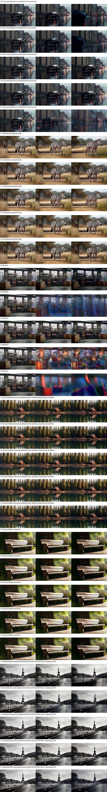
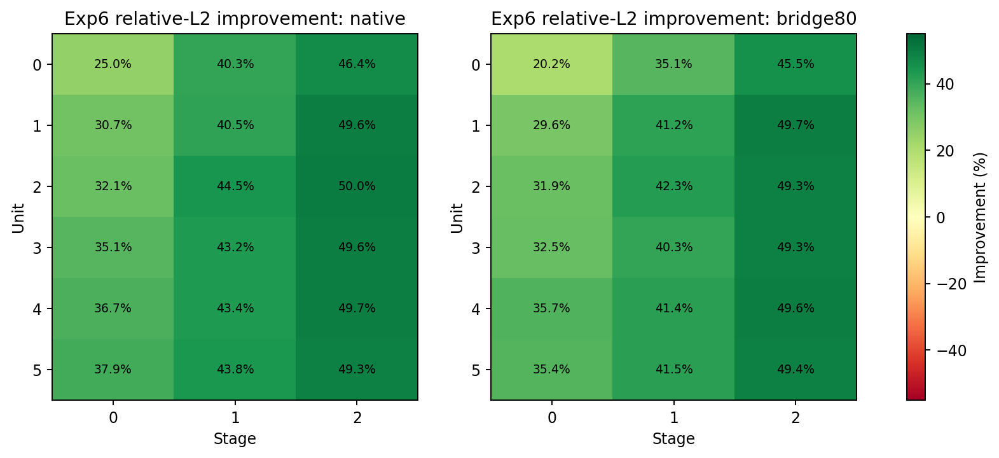

# Exp6 Decision Matrix: 96-Prompt Controlled Ablation

**Date:** July 31, 2026

**Run:** Slurm job `2962`

**Status:** Completed successfully (`ExitCode=0:0`)

**Runtime:** 43 minutes 21 seconds on one NVIDIA H200 NVL GPU

**Decision:** Outcome 2 - local transition recovery succeeds, but end-to-end rollout quality does not improve

## 1. Executive Summary

This ablation was designed to answer one narrow question before spending more compute on NeoDragon DiT training:

> Is Exp6 limited by the Mobile-OV condition contract, by one-step credit assignment, or because the released Hybrid policy cannot be improved safely?

The experiment evaluated 96 held-out VBench prompts under five controlled configurations. Every configuration used the same native SSD1B first-frame anchor, prompt modifier, generation seed, corrective noise, BF16 precision, and NeoDragon Hybrid `1-1-1` schedule.

The result is unusually clear:

- Exp6 improves the local Monolithic-target approximation at all `18/18` unit-stage positions under both native and Mobile-OV conditions.
- Mean local relative-L2 improvement is `41.55%` with native conditions and `40.00%` with the rollout-80K Mobile-OV bridge.
- The dangerous late position `unit 5 / stage 2` improves by approximately `49.3-49.4%`.
- Despite this local success, Exp6 reduces full-rollout optical flow by `58.73-61.13%`.
- First-to-last frame change falls by `37.87-41.03%`.
- Adjacent RGB motion falls by approximately `48.6-48.7%`.
- Prompt CLIP changes only slightly, while subject consistency and sharpness increase because the generated videos become much more static.
- The same behavior appears with native and Mobile-OV conditions and across short, medium, and long prompts.

Therefore, condition mismatch is not the primary explanation for Exp6's failure. Exp6 learned a better isolated one-step approximation, but those locally improved transitions do not compose into a good 18-call trajectory.

The evidence matches the pre-registered **Outcome 2**:

> Local transitions improve, but the full rollout does not. The next valid test is a short-horizon, three-transition truncated-BPTT pilot, not more one-step Exp6 training.

No additional training was launched as part of this ablation.

## 2. Why This Ablation Was Necessary

Exp6 was trained to recover selected NeoDragon Hybrid transitions toward the corresponding native-CFG Monolithic target. Previous small evaluations suggested that the Exp6 transition endpoint could be closer to the Monolithic endpoint than the released Hybrid endpoint.

That observation was encouraging but incomplete. A video is not produced by one isolated transition. NeoDragon Hybrid executes an 18-call trajectory:

```text
6 temporal units x 3 pyramid stages = 18 DiT transitions
```

An update can improve every supervised transition on a fixed state while still producing a worse video after repeated application. Three explanations remained possible:

1. **Condition mismatch:** Exp6 might work with native text conditions but fail with the Mobile-OV bridge.
2. **Credit-assignment failure:** one-step training might not optimize the accumulated 18-call trajectory.
3. **Unsafe adaptation:** the released Hybrid policy might already be near the practical limit of post-distillation adaptation.

The Decision Matrix separates these hypotheses without training another checkpoint.

## 3. Evaluated Configurations

| ID | DiT policy | Text condition | Purpose |
| --- | --- | --- | --- |
| A | Released NeoDragon Hybrid | Native NeoDragon text stack | Native released-policy baseline |
| B | Released NeoDragon Hybrid | MCP rollout bridge 80K | Deployed Mobile-OV condition baseline |
| C | Exp6 step 2K | Native NeoDragon text stack | Isolates the Exp6 DiT update under native conditions |
| D | Exp6 step 2K | MCP rollout bridge 80K | Tests Exp6 on the intended Mobile-OV path |
| E | Released NeoDragon Hybrid | Exp1 functional bridge 64K | Historical strongest bridge reference |

The key comparisons are:

```text
C - A: Exp6 DiT effect under native conditions
D - B: Exp6 DiT effect under Mobile-OV conditions
A - B: Mobile-OV condition penalty on the released policy
C - D: condition sensitivity after the Exp6 update
E - A: Exp1-64K bridge reference against native conditioning
```

## 4. Checkpoints

| Component | Step | Local checkpoint |
| --- | ---: | --- |
| Exp6 Hybrid recovery DiT | 2,000 | `checkpoints/hf_mobile_ov/neo_exp6_hybrid_recovery/exp6_v1_pilot/neodragon_exp6_step002000.pt` |
| MCP full-rollout bridge | 80,000 | `checkpoints/hf_mobile_ov/neo_exp1_rollout_64k_to100k/17174692/neodragon_rollout_bridge_latest.pt` |
| Exp1 functional bridge | 64,000 | `checkpoints/hf_mobile_ov/neo_exp1_bridge_functional/17108893/neodragon_text_bridge_latest.pt` |

Checkpoint validation found:

```text
Exp6 step:              2,000
Exp6 tensors:           585
Exp6 parameters:        1,568,778,304
Rollout bridge step:    80,000
Rollout bridge tensors: 508
Exp1 bridge step:       64,000
Exp1 bridge tensors:    508
```

## 5. Controlled Evaluation Protocol

### 5.1 Prompt sampling

The evaluator selected 96 held-out prompts from the NeoDragon VBench prompt set using seed `2026`. Prompts were stratified by word count:

| Prompt group | Count |
| --- | ---: |
| Short | 32 |
| Medium | 32 |
| Long | 32 |
| Total | 96 |

The minimum prompt length was one word and the maximum was 31 words.

### 5.2 Shared generation controls

All A-E paths used:

```text
Native SSD1B first-frame generator
Exactly the same first-frame anchor per prompt
Exactly the same generation seed per prompt and configuration
Exactly the same initial and corrective noise
NeoDragon default prompt modifier
BF16 inference
Hybrid 1-1-1 schedule
49 output frames
320 x 512 resolution
24 FPS
```

The global generation seed was `1234`. Native SSD1B anchors were generated once, saved, and reused by all five configurations. This prevents first-frame quality or seed variation from being mistaken for a DiT or bridge effect.

### 5.3 Output volume

```text
96 prompts x 5 configurations = 480 generated videos
```

All 480 videos were generated and decoded successfully.

## 6. Evaluation Design

Two complementary evaluations were used. Neither is sufficient alone.

### 6.1 Local 18-transition diagnostic

For each condition bank, the released Hybrid policy generated the state trajectory. At every unit-stage position, the evaluator compared:

```text
Released Hybrid one-step endpoint
Exp6 one-step endpoint
Native-CFG Monolithic ten-step stage endpoint
```

This was repeated at all positions:

```text
unit 0-5 x stage 0-2 = 18 positions
```

The Monolithic teacher used its native condition stack. Initial noise and corrective noise were shared.

The principal local error is normalized endpoint relative L2:

```text
relative_L2 = ||prediction - target||_2 / max(||target - start||_2, epsilon)
```

This normalization measures error relative to the size of the teacher transition, rather than the absolute latent magnitude.

Transition cosine is:

```text
cosine(prediction - start, target - start)
```

It measures whether the student transition moves in the same latent direction as the Monolithic target.

The Exp6/Released gap was also measured to quantify how far the adapted policy moved away from the released Hybrid policy.

### 6.2 Full 18-call video rollout

The full rollout evaluates the actual deployed behavior after all 18 Hybrid transitions. Eight evenly spaced frames from each video were used for CLIP-based metrics.

| Metric | Meaning | Important limitation |
| --- | --- | --- |
| Prompt CLIP | Mean text-frame cosine similarity | Proxy for prompt adherence, not a human preference score |
| Subject CLIP | Mean frame-to-first-frame CLIP similarity | Higher can indicate preservation or simply static output |
| Temporal CLIP | Mean CLIP similarity between adjacent sampled frames | Higher can indicate consistency or insufficient motion |
| Adjacent RGB MAE | Mean pixel change between adjacent decoded frames | Motion magnitude, not motion correctness |
| First-last RGB MAE | Mean pixel change between first and last frame | Long-range change, not semantic quality |
| Optical flow | Mean Farneback flow magnitude | Motion magnitude, not motion realism |
| Mean sharpness | Variance of the Laplacian over frames | Sensitive to texture and compression |
| Last-frame sharpness | Laplacian variance on the last frame | Detects late-rollout degradation |
| Flicker proxy | Second-order temporal luminance residual | Confounded by motion; static video scores well |
| Saturation | Mean HSV saturation | Appearance diagnostic only |

OpenAI CLIP ViT-B/32 (`openai/clip-vit-base-patch32`) was used for semantic proxies.

## 7. Full-Rollout Results

| Config | Prompt CLIP | Subject CLIP | Temporal CLIP | Adjacent MAE | Optical flow | First-last MAE | Mean sharpness | Last sharpness | Flicker | Saturation |
| --- | ---: | ---: | ---: | ---: | ---: | ---: | ---: | ---: | ---: | ---: |
| A | 0.31120 | 0.93614 | 0.97827 | 0.01166 | 0.33119 | 0.11569 | 485.23 | 425.64 | 0.00635 | 0.34376 |
| B | 0.30820 | 0.92567 | 0.97611 | 0.01012 | 0.26400 | 0.11649 | 468.77 | 400.74 | 0.00531 | 0.34683 |
| C | 0.31231 | 0.95349 | 0.98769 | 0.00598 | 0.13670 | 0.07188 | 566.34 | 573.92 | 0.00301 | 0.33464 |
| D | 0.31149 | 0.94511 | 0.98595 | 0.00520 | 0.10263 | 0.06869 | 555.00 | 555.86 | 0.00264 | 0.33692 |
| E | 0.30626 | 0.91136 | 0.97088 | 0.01111 | 0.29236 | 0.12673 | 446.51 | 405.59 | 0.00583 | 0.34089 |



Each prompt block in the contact sheet contains one row for A, B, C, D, and E. Each row shows early, middle, and late frames. C and D visibly preserve the initial image more strongly but often show substantially less motion than A, B, and E.

## 8. Paired Exp6 Effects

### 8.1 Native condition: C versus A

| Metric | Absolute delta | Relative delta | Paired 95% bootstrap interval | Exp6 higher |
| --- | ---: | ---: | ---: | ---: |
| Prompt CLIP | +0.001108 | +0.36% | [-0.000235, +0.002486] | 56.2% |
| Subject CLIP | +0.017344 | +1.85% | [+0.013077, +0.021652] | 86.5% |
| Temporal CLIP | +0.009428 | +0.96% | [+0.007679, +0.011236] | 90.6% |
| Adjacent RGB MAE | -0.005680 | -48.73% | [-0.006394, -0.004994] | 0.0% |
| First-last RGB MAE | -0.043816 | -37.87% | [-0.048241, -0.039511] | 1.0% |
| Optical flow | -0.194490 | -58.73% | [-0.229025, -0.161906] | 0.0% |
| Mean sharpness | +81.11 | +16.72% | [+65.62, +97.05] | 91.7% |
| Last-frame sharpness | +148.28 | +34.84% | [+118.14, +178.39] | 86.5% |
| Flicker proxy | -0.003336 | -52.57% | [-0.003832, -0.002877] | 0.0% |
| Saturation | -0.009119 | -2.65% | [-0.014287, -0.004303] | 35.4% |

The prompt CLIP interval crosses zero, so the native-condition prompt-adherence gain is not robust. Subject and sharpness metrics improve, but motion falls dramatically for essentially every prompt.

### 8.2 Mobile-OV condition: D versus B

| Metric | Absolute delta | Relative delta | Paired 95% bootstrap interval | Exp6 higher |
| --- | ---: | ---: | ---: | ---: |
| Prompt CLIP | +0.003288 | +1.07% | [+0.001184, +0.005782] | 56.2% |
| Subject CLIP | +0.019440 | +2.10% | [+0.014445, +0.024679] | 84.4% |
| Temporal CLIP | +0.009835 | +1.01% | [+0.007359, +0.012527] | 86.5% |
| Adjacent RGB MAE | -0.004922 | -48.64% | [-0.005544, -0.004331] | 3.1% |
| First-last RGB MAE | -0.047795 | -41.03% | [-0.053439, -0.042144] | 4.2% |
| Optical flow | -0.161376 | -61.13% | [-0.190494, -0.133319] | 2.1% |
| Mean sharpness | +86.23 | +18.40% | [+63.20, +107.48] | 88.5% |
| Last-frame sharpness | +155.12 | +38.71% | [+118.45, +190.89] | 85.4% |
| Flicker proxy | -0.002669 | -50.23% | [-0.003045, -0.002306] | 0.0% |
| Saturation | -0.009907 | -2.86% | [-0.016760, -0.003473] | 42.7% |

D reproduces the same behavior as C. The severe motion reduction is therefore not specific to the MCP rollout bridge.

## 9. Condition-Contract Analysis

### 9.1 Released Hybrid: A versus B

Using the native condition stack instead of rollout bridge 80K changes:

```text
Prompt CLIP:      +0.003003 (+0.97%)
Subject CLIP:     +0.010468 (+1.13%)
Optical flow:     +0.067181 (+25.45%)
First-last MAE:   -0.000797 (-0.68%)
Mean sharpness:   +16.46 (+3.51%, interval includes zero)
```

There is a measurable condition-contract effect, particularly on local motion magnitude. It is not zero. However, it is much smaller than the Exp6 effect and does not explain why both C and D become similarly static.

### 9.2 Exp6: C versus D

After the Exp6 update, native instead of rollout-80K conditioning changes:

```text
Prompt CLIP:      +0.000823 (+0.26%)
Subject CLIP:     +0.008372 (+0.89%)
Optical flow:     +0.034068 (+33.19% relative to D's small value)
First-last MAE:   +0.003182 (+4.63%)
Mean sharpness:   +11.34 (+2.04%, interval includes zero)
```

C and D remain much closer to each other than either is to its released-policy counterpart in motion behavior. This rejects the strongest form of the condition-mismatch hypothesis.

### 9.3 Exp1-64K reference: E versus A

On this controlled protocol, Exp1 64K with the released Hybrid policy has:

```text
Prompt CLIP:       -1.59%
Subject CLIP:      -2.65%
First-last change: +9.54%
Optical flow:      -11.72% (bootstrap interval includes zero)
Mean sharpness:    -7.98%
```

Exp1 64K remains an important historical bridge reference, but native NeoDragon conditioning is still the strongest released-policy reference in this specific 96-prompt matrix.

## 10. Prompt-Length Robustness

The Exp6 effect was evaluated separately for the 32 short, 32 medium, and 32 long prompts.

| Comparison | Bucket | Prompt CLIP delta | Subject CLIP delta | Optical-flow delta | First-last delta | Sharpness delta |
| --- | --- | ---: | ---: | ---: | ---: | ---: |
| C-A | Short | +0.000591 | +0.012131 | -0.160860 | -0.041198 | +82.90 |
| C-A | Medium | +0.002777 | +0.022263 | -0.227343 | -0.043921 | +68.97 |
| C-A | Long | -0.000046 | +0.017639 | -0.195265 | -0.046329 | +91.46 |
| D-B | Short | +0.002510 | +0.018723 | -0.152595 | -0.044256 | +80.97 |
| D-B | Medium | +0.005051 | +0.021301 | -0.161457 | -0.042275 | +62.38 |
| D-B | Long | +0.002304 | +0.018295 | -0.170075 | -0.056854 | +115.34 |

The motion collapse appears in every prompt-length bucket. It is not caused by an overrepresentation of short or semantically weak prompts.

## 11. Local 18-Transition Results

### 11.1 Aggregate local metrics

| State bank | Released rel-L2 | Exp6 rel-L2 | Released cosine | Exp6 cosine | Exp6/Released gap | Improved | >=10% improved | Mean position improvement | Late units 4-5 | Unit 5/stage 2 |
| --- | ---: | ---: | ---: | ---: | ---: | ---: | ---: | ---: | ---: | ---: |
| Native | 0.12836 | 0.07288 | 0.99073 | 0.99677 | 0.09966 | 18/18 | 18/18 | 41.55% | 43.47% | 49.34% |
| Bridge 80K | 0.13733 | 0.08022 | 0.98910 | 0.99583 | 0.10209 | 18/18 | 18/18 | 40.00% | 42.18% | 49.41% |

The ratio of the global mean errors and the mean of the 18 per-position improvement ratios are slightly different aggregation methods. The report uses the mean per-position improvement for decision thresholds.

### 11.2 Position-level improvement

| Unit | Stage | Native improvement | Bridge80 improvement |
| ---: | ---: | ---: | ---: |
| 0 | 0 | 25.0% | 20.2% |
| 0 | 1 | 40.3% | 35.1% |
| 0 | 2 | 46.4% | 45.5% |
| 1 | 0 | 30.7% | 29.6% |
| 1 | 1 | 40.5% | 41.2% |
| 1 | 2 | 49.6% | 49.7% |
| 2 | 0 | 32.1% | 31.9% |
| 2 | 1 | 44.5% | 42.3% |
| 2 | 2 | 50.0% | 49.3% |
| 3 | 0 | 35.1% | 32.5% |
| 3 | 1 | 43.2% | 40.3% |
| 3 | 2 | 49.6% | 49.3% |
| 4 | 0 | 36.7% | 35.7% |
| 4 | 1 | 43.4% | 41.4% |
| 4 | 2 | 49.7% | 49.6% |
| 5 | 0 | 37.9% | 35.4% |
| 5 | 1 | 43.8% | 41.5% |
| 5 | 2 | 49.3% | 49.4% |



The gain becomes larger at later pyramid stages. There is no evidence that Exp6 only improves easy early transitions or hides a failure at `unit 4-5 / stage 2`.

## 12. Why Apparently Better Quality Metrics Are Misleading

At first glance, C and D appear better because they have:

```text
higher subject CLIP
higher temporal CLIP
higher mean and last-frame sharpness
lower flicker proxy
```

These metrics must be interpreted jointly with motion.

A nearly static video naturally remains close to its first frame, producing high subject CLIP. Adjacent frames remain semantically and visually similar, producing high temporal CLIP. Static frames retain first-frame detail, increasing late-frame sharpness. The second-order luminance residual also decreases because there is less temporal variation.

The simultaneous `49-61%` reduction in three independent motion proxies shows that the quality gains are not free improvements. Exp6 preserves quality primarily by suppressing the trajectory.

This is also visible in the contact sheet: C and D frequently maintain a crisp anchor while A, B, and E show larger scene evolution.

## 13. Scientific Interpretation

### 13.1 What Exp6 successfully learned

Exp6 is not a failed optimizer run. It learned a strong and consistent mapping from a fixed released-Hybrid state to a one-step endpoint that is closer to the Monolithic endpoint:

```text
18/18 positions improve under native conditions
18/18 positions improve under rollout-80K conditions
transition cosine improves
late units and stages improve strongly
```

This validates the local transition objective and confirms that the Exp6 weights are loaded and active.

### 13.2 What Exp6 did not learn

Exp6 did not learn how its own improved action changes the state distribution seen by subsequent calls. During the local diagnostic, the released Hybrid policy supplies the state bank. During deployment, Exp6 consumes states generated by previous Exp6 transitions.

The resulting mismatch is:

```text
training/diagnostic:
released state k -> one Exp6 transition -> local target

deployment:
Exp6 state 0 -> Exp6 state 1 -> ... -> Exp6 state 18
```

An individually better transition can reduce useful motion, alter the history tensor, and move later calls into states that were not optimized jointly. One-step endpoint supervision cannot assign credit for these downstream consequences.

### 13.3 Why condition mismatch is secondary

If the bridge contract were the primary bottleneck, the expected pattern would be:

```text
C clearly better than A
D not better than B
```

Instead, C and D show the same local success and the same global motion collapse. Native conditioning does not rescue the Exp6 rollout. The Mobile-OV condition contract has a measurable effect, but it is not the main cause of this failure.

### 13.4 Why simply extending Exp6 is not justified

More one-step training would optimize the objective that has already succeeded locally. It offers no mechanism to penalize the accumulated motion suppression that appears only after repeated student calls.

Continuing Exp6 from 2K to 3K or 10K without changing the objective risks making local metrics even better while further entrenching the wrong global policy.

## 14. Pre-Registered Decision Rules

The practical local-pass criteria were:

```text
at least 12/18 improved transitions
late-unit/stage error reduction around or above 10%
```

Observed:

```text
native:    18/18 improved, 43.47% late-unit gain
bridge80:  18/18 improved, 42.18% late-unit gain
```

The full-rollout safety criterion required no major semantic, motion, or sharpness regression. Observed motion changes were far beyond the allowed 5% tolerance:

```text
C-A optical flow:       -58.73%
C-A first-last change:  -37.87%
D-B optical flow:       -61.13%
D-B first-last change:  -41.03%
```

This unambiguously selects:

> **Outcome 2: local transitions improve, but full rollout does not.**

## 15. Recommended Next Experiment

Do not continue the current selected one-step Exp6 objective.

The one remaining DiT experiment justified by this evidence is a three-transition truncated-BPTT pilot initialized from Exp6 2K:

```text
state k
  -> student transition k
  -> student transition k+1
  -> student transition k+2
  -> terminal trajectory loss
```

The student graph should retain gradients through all three transitions. The teacher should run a separate trajectory from the same starting state, with the same schedule and corrective noise.

Proposed objective:

```text
L = mean_j(
      normalized endpoint Charbonnier_j
      + transition cosine_j
    )
    + lambda_terminal * terminal latent loss
    + lambda_trust * released-Hybrid trajectory loss
```

The terminal term is the key change. It makes earlier calls responsible for their effect on later states.

Recommended curriculum:

```text
45% three-call student on-policy
15% three-call noisy history
25% teacher map
10% released Hybrid replay
 5% real endpoint
```

Recommended learning rates:

```text
middle blocks: 5.0e-7
edge blocks:   1.25e-7
I/O layers:    2.5e-7
```

The pilot should be limited to 1K steps with evaluations at 250, 500, and 1,000 steps. If it does not improve full-rollout motion and quality without degrading prompt adherence, DiT adaptation should stop.

This recommendation is a decision from the ablation, not work completed in this run.

## 16. Limitations

1. CLIP-based prompt and subject metrics are proxies and do not replace human preference evaluation or VBench semantic dimensions.
2. Optical flow and pixel differences quantify motion magnitude, not whether the motion is realistic or prompt-correct.
3. Flicker is strongly confounded by motion; lower values are not automatically better.
4. The local Monolithic target uses native text conditioning. The bridge80 local bank therefore includes both policy and condition-contract mismatch by design.
5. State banks are generated by the released Hybrid policy. This is intentional for local comparability, but it is exactly why local diagnostics cannot measure student state drift by themselves.
6. The evaluation covers 96 stratified prompts rather than the full VBench prompt set.
7. Videos are 49 frames at 24 FPS and `320 x 512`; conclusions should be rechecked if the deployment schedule or resolution changes.

None of these limitations explains the central result: the motion reduction is large, paired, consistent across prompt lengths, visible in videos, and reproduced under both condition contracts.

## 17. Reproducibility

### 17.1 Evaluator

```text
tools/evaluate_exp6_decision_matrix.py
```

Supported modes:

```text
all     generate videos, compute full metrics, run local diagnostics, write report
full    generate the A-E matrix and full-rollout metrics only
local   run the local 18-transition diagnostic only
report  regenerate the Markdown report from existing JSON files
```

### 17.2 Slurm entry point

```bash
sbatch scripts/evaluate_exp6_decision_matrix.sbatch
```

The successful run used one H200 NVL GPU and the default output directory:

```text
output/exp6_decision_matrix_20260731/
```

### 17.3 Primary local artifacts

```text
output/exp6_decision_matrix_20260731/REPORT.md
output/exp6_decision_matrix_20260731/full_rollout_metrics.json
output/exp6_decision_matrix_20260731/local_transition_metrics.json
output/exp6_decision_matrix_20260731/full_rollout_contact_sheet.jpg
output/exp6_decision_matrix_20260731/local_transition_heatmaps.png
output/exp6_decision_matrix_20260731/prompts_96.txt
output/exp6_decision_matrix_20260731/videos/{A,B,C,D,E}/
output/exp6_decision_matrix_20260731/native_ssd1b_anchors/
```

### 17.4 Validation performed

```text
1-prompt end-to-end smoke test: passed
Five A-E video paths: passed
CLIP and pixel metrics: passed
All 18 local unit-stage positions: passed
96-prompt full run: passed
480/480 videos generated: passed
5,184 local metric rows produced: passed
Slurm job 2962: COMPLETED, ExitCode 0:0
Python compilation: passed
SBATCH syntax validation: passed
git diff whitespace check: passed
```

## 18. Output Cleanup and Archival

To reduce confusion, 55 old smoke-test and evaluation outputs were moved into:

```text
output/_archive/pre_exp6_decision_matrix_20260731/
```

The archive contains `89.33 GiB`. Nothing was deleted. `MANIFEST.tsv` records each original path, archive path, and size. `README.txt` contains the restore command.

The following canonical directories were intentionally kept at the output root because scripts may depend on them for resume or checkpoint discovery:

```text
output/cache
output/neodragon_dit_bridge_train
output/neodragon_text_bridge_distill
output/neodragon_text_bridge_recaption_distill
output/exp6_decision_matrix_20260731
```

## 19. Final Conclusion

Exp6 2K is a successful local transition approximator but an unsuccessful end-to-end video policy. The experiment provides strong evidence that the immediate bottleneck is multi-transition credit assignment rather than a missing one-step target or a uniquely bad Mobile-OV condition contract.

The correct response is not to train the same objective longer. The next step, if one final DiT attempt is allowed, is a tightly bounded three-call truncated-BPTT pilot. If that pilot cannot convert local gains into full-rollout gains, the released NeoDragon Hybrid should remain frozen and development should move to protected understanding, planning, editing adapters, quantization, and on-device deployment.
