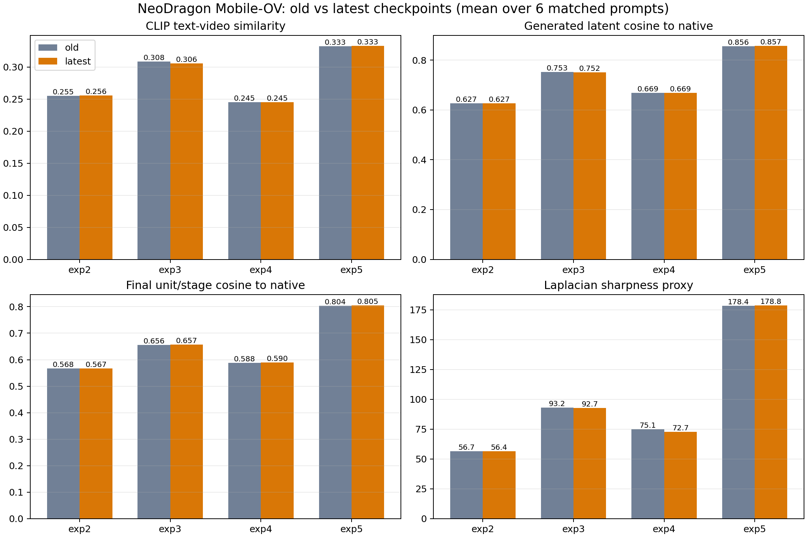
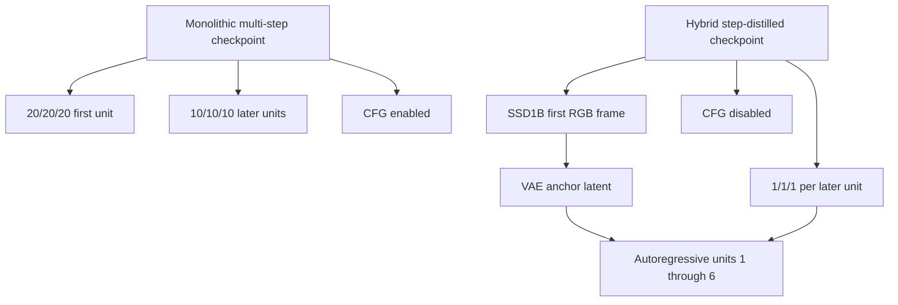
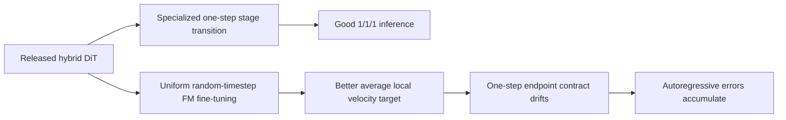
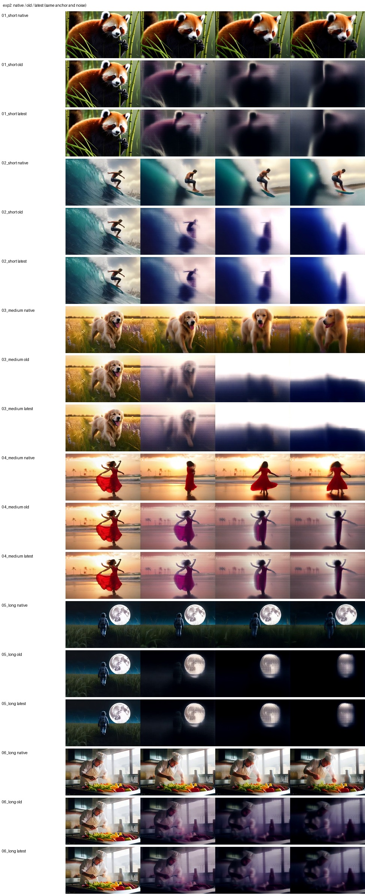
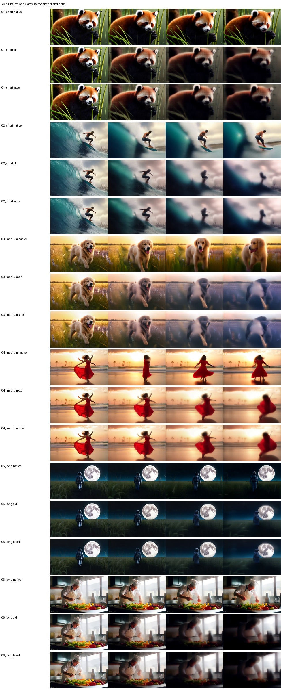
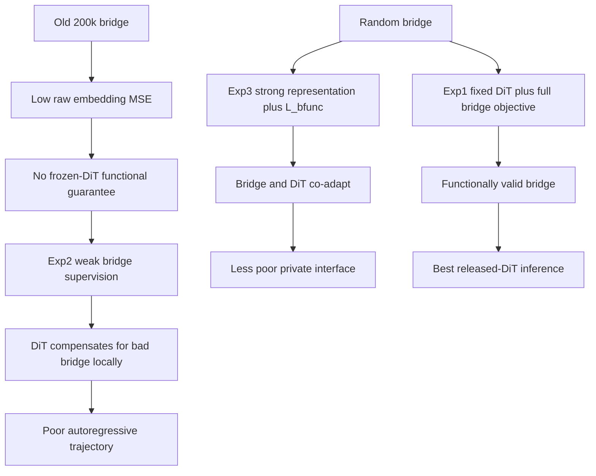
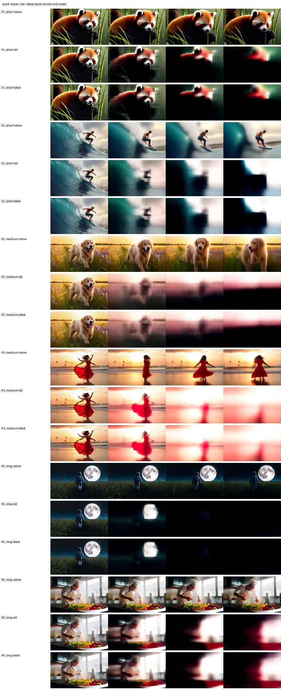

# NeoDragon Exp2, Exp3, and Exp4 Failure Postmortem

Last updated: 2026-07-23

## 1. Decision

Experiments 2, 3, and 4 are confirmed failed experiments for the current
Neo Mobile-OV T2V objective.

Here, "failed" has a precise meaning:

- Training completed and the checkpoints load correctly.
- The optimization code ran without a distributed-training failure.
- The models learned nontrivial latent dynamics.
- The final end-to-end videos are not acceptable relative to the released
  NeoDragon hybrid model or the Exp1-64k bridge with the released DiT.
- Additional training did not produce a meaningful recovery.
- The checkpoints must not be used as initialization for future production
  experiments.

The runs remain valuable negative controls. They show which objectives are
insufficient and why a low scalar flow or distillation loss cannot be treated as
evidence of a healthy one-step autoregressive video generator.

The final evaluated checkpoints are:

| Experiment | Final step | Initialization | Status |
| --- | ---: | --- | --- |
| Exp2 | 240,000 | old 200k bridge + released hybrid DiT | Failed |
| Exp3 | 200,000 | random bridge + released hybrid DiT | Failed |
| Exp4 | 200,000 | random bridge + released hybrid DiT | Failed |

Exp5 is shown in several figures only as a positive control. It is not included
in the Exp2-4 failure decision.

## 2. Evidence Standard

The decision is not based on one attractive or unattractive sample. It combines:

1. Controlled six-prompt inference with two short, two medium, and two long
   captions.
2. Identical seeds, initial noise, SSD first frame, resolution, frame count, and
   hybrid `1-1-1` schedule across old and final checkpoints.
3. Per-stage and per-autoregressive-unit comparison against the released
   NeoDragon hybrid DiT.
4. Decoded-video text alignment, temporal consistency, motion, and sharpness
   diagnostics.
5. Earlier bridge/DiT component-swap ablations.
6. Direct inspection of checkpoint arguments and the executed loss graph.
7. Comparison with the official NeoDragon paper and released implementation.

The complete machine-readable benchmark is retained locally under:

```text
output/neo_exp2345_old_vs_latest_20260723/
```

The aggregate old-versus-final result is:



## 3. NeoDragon Is Not a Generic Flow-Matching Checkpoint

Understanding the failure requires distinguishing the released monolithic and
hybrid models.

### 3.1 Monolithic model

The released monolithic path loads:

```text
context_adapter_multistep_t2v
diffusion_transformer_320p_multistep_t2v
```

Its default denoising schedule is:

```text
first latent unit: 20 steps at each of 3 pyramid stages
later units:       10 steps at each of 3 pyramid stages
CFG:               enabled
```

This model is the multi-step flow model. Its outputs are repeatedly integrated
by the Euler solver, so learning an instantaneous velocity field over the
stage-specific noise interval is consistent with how the checkpoint is used.

### 3.2 Hybrid model

The released hybrid path loads different weights:

```text
context_adapter
diffusion_transformer_320p
```

It also generates the first RGB frame with a separate SSD1B image generator,
encodes that frame with the VAE, and uses it as the first latent unit. The video
DiT then generates six later units autoregressively. Its default schedule is:

```text
later latent units: 1 step at each of 3 pyramid stages
CFG:                disabled
total video DiT NFE: 6 units x 3 stages = 18
```

The public code therefore treats hybrid and monolithic as different models, not
as one checkpoint with a runtime step-count switch.



### 3.3 What the paper says about creating the hybrid DiT

NeoDragon is a compressed model produced by a curriculum, not only by deleting
blocks:

1. The base 24-block MMDiT was reduced to 18 blocks.
2. The pruned model first received a short ground-truth flow-matching recovery
   stage.
3. It then received full-teacher feature and flow distillation.
4. The denoising schedule was compressed with pyramidal step distillation.
5. The final fast pipeline used a separate SSD1B first-frame generator to
   mitigate semantic and color artifacts from the step-distilled video DiT.

The paper reports that direct application of its second pruning-recovery stage
did not match the curriculum of Stage 1 followed by Stage 2. This is direct
evidence that combining individually reasonable objectives does not guarantee
the same optimum.

The text-compression recipe is similarly staged and stationary. NeoDragon
reports that directly matching the large text encoder's embeddings was unstable.
It instead trains a video-generation-specific ContextAdapter against the fixed
MMDiT text-token space using prompt-only data, while the downstream MMDiT stays
frozen. The reported setup uses approximately 1.4M prompts and a global batch of
2,048. This is much closer to Exp1's fixed downstream functional contract than
to Exp3's simultaneous random-bridge and full-DiT optimization.

For the few-step model, the paper does not simply apply ordinary flow matching
for a long time. Its DMD path uses a teacher, a fake model, restricted local
noise levels, CFG teacher predictions, and an additional supervised Cauchy
term. Its progressive path explicitly rolls the teacher forward and trains the
student to match a multi-step endpoint in one step.

Primary references:

- [NeoDragon technical report](https://arxiv.org/html/2511.06055v1)
- [NeoDragon project page](https://qualcomm-ai-research.github.io/neodragon/)
- [Official NeoDragon code](https://github.com/Qualcomm-AI-research/neodragon)

### 3.4 Consequence for our experiments

Exp2-4 all trained the released hybrid `1-1-1` DiT with the ordinary
instantaneous flow target:

```text
x_sigma = sigma * epsilon + (1 - sigma) * x
v_gt    = epsilon - x
L_flow  = MSE(D_student(x_sigma, condition, t), v_gt)
```

This target is mathematically valid for a flow model, but it is not sufficient
to preserve a one-step distilled endpoint map. The student is evaluated at one
specific inference transition per stage, while our trainer uniformly samples
one of 1,000 scheduler indices and asks the network to recover a dense
instantaneous velocity field.

The resulting conflict is:



The flow objective can decrease while the function needed by `1-1-1` inference
gets worse.

## 4. Shared Training Path and Its Structural Gaps

### 4.1 What the trainer actually sampled

For every optimization step, the trainer:

1. Samples one OpenVid latent video.
2. Samples one future latent unit uniformly.
3. Samples one of three pyramid stages uniformly.
4. Samples one scheduler training index uniformly.
5. Uses clean ground-truth previous latent units as history.
6. Computes the student prediction only at that local state.

This provides broad local-state coverage, but it does not reproduce the actual
hybrid rollout distribution.

### 4.2 Teacher forcing versus autoregressive inference

Training history:

```text
past_conditions = ground-truth VAE latent units
```

Inference history:

```text
past_conditions = earlier student-generated latent units
```

NeoDragon is causal and autoregressive. A small error in unit 1 enters the
condition for unit 2, and this process repeats through unit 6. The official
pruning recovery explicitly adds noise to ground-truth history to improve
robustness. Our Exp2-4 trainer passes clean history and does not use noisy
history, scheduled sampling, or student-generated rollout history.

Therefore, the loss is optimized on easier states than those seen late in
inference.

### 4.3 Dataset support mismatch

Our flow loss uses ground-truth OpenVid VAE latents. This is useful for learning
new data, but the released hybrid checkpoint was step-distilled for its own
generated distribution. The NeoDragon report specifically uses synthetic
teacher-generated videos during step distillation to remain on the teacher
distribution.

Exp2-4 provide no explicit mechanism that keeps the student on the released
hybrid trajectory while adapting to OpenVid. Response MSE at one local state is
not the same as teacher rollout or distribution matching.

### 4.4 No endpoint or rollout objective

The trainer does not optimize:

```text
teacher multi-step endpoint versus student one-step endpoint
decoded RGB perceptual similarity
full six-unit autoregressive rollout consistency
late-unit or high-resolution-stage robustness
student-generated-history recovery
```

All active DiT losses are local prediction losses. The benchmark shows that
local similarity is highest near early transitions and worse at
`unit 6 / stage 2`, exactly where autoregressive and spatial-refinement errors
have had the most opportunity to accumulate.

### 4.5 Uniform averaging hides critical states

Unit and stage are sampled uniformly, and tensor MSE averages all elements.
This gives no additional importance to:

- high-resolution stage 2, where visual details are finalized;
- late autoregressive units, where history drift is largest;
- prompt-sensitive tokens or regions;
- cases where the correct and shuffled text conditions produce similar output.

A globally reasonable loss can therefore coexist with catastrophic late-frame
quality.

## 5. Exact Losses Used by Each Experiment

Let:

```text
B_tok, B_pool = Mobile-OV bridge condition
T_tok, T_pool = native NeoDragon condition after ContextAdapter
D_s           = trainable hybrid DiT
D_h           = frozen released hybrid DiT
y             = ground-truth instantaneous flow
```

The shared losses are:

```text
L_flow     = MSE(D_s(x_t, B), y)

L_distill  = MSE(D_s(x_t, B), D_h(x_t, T))
           + 0.1 * cosine_distance(D_s(x_t, B), D_h(x_t, T))

L_preserve = MSE(D_s(x_t, T), D_h(x_t, T))
           + 0.1 * cosine_distance(D_s(x_t, T), D_h(x_t, T))

L_repr     = weighted token, pooled, norm, cosine, and relational
             alignment between B and T

L_bfunc    = MSE(D_h(x_t, B), D_h(x_t, T))
           + 0.1 * cosine_distance(D_h(x_t, B), D_h(x_t, T))
```

`L_distill`, `L_preserve`, and `L_bfunc` all use the released hybrid teacher at
one sampled local state. None rolls a monolithic teacher over multiple Euler
steps to obtain the endpoint that the hybrid student should reach in one step.

### 5.1 Exp2 objective

Exp2 initialized the bridge from the old 200k bridge, not the successful
Exp1-64k checkpoint.

```text
L_exp2 =
    w_flow * L_flow
  + 1.00 * L_distill_mse
  + 0.10 * L_distill_cos
  + periodic(0.50 * L_preserve_mse + 0.05 * L_preserve_cos)
  + 0.10 * L_repr_light
```

Configuration:

| Item | Value |
| --- | ---: |
| DiT LR | `3e-6` |
| Bridge LR | `1e-5` |
| Peak flow weight | `0.3` |
| Final flow weight | `0.1` |
| Preservation frequency | every 4 steps |
| Bridge functional loss | disabled |
| Raw-token representation term | disabled |
| Relational representation term | disabled |
| Caption ratio | `5:4:1` |

The periodic preservation loss is multiplied by its frequency when active, so
its expected weight is approximately preserved. The problem is not merely that
it runs every fourth step.

### 5.2 Exp3 objective

Exp3 starts with a random bridge and trains every DiT block:

```text
L_exp3 =
    w_flow * L_flow
  + 1.00 * L_distill_mse
  + 0.10 * L_distill_cos
  + periodic(0.50 * L_preserve_mse + 0.05 * L_preserve_cos)
  + w_repr * L_repr_full
  + w_bfunc * L_bfunc
```

Configuration:

| Item | Value |
| --- | ---: |
| DiT LR | `3e-6` |
| Bridge LR | `1e-5` |
| Flow weight | `0.05 -> 0.3 -> 0.1` |
| Representation scale | `1.0 -> 0.1` |
| Functional scale | `0.0 -> 1.0 -> 0.1` |
| Preservation frequency | every 4 steps |
| Functional frequency | every 4 steps |
| Caption ratio | `5:4:1` |

The full representation terms inside `L_repr_full` are:

```text
0.25 * raw token MSE
1.00 * normalized token MSE
0.50 * token cosine distance
0.10 * token norm error
0.25 * pooled MSE
0.20 * pooled cosine distance
0.10 * relational prompt-geometry loss
```

### 5.3 Exp4 objective

Exp4 is the pure flow-only ablation:

```text
L_exp4 = w_flow * L_flow
```

Both the random bridge and every DiT block receive this gradient.

Configuration:

| Item | Value |
| --- | ---: |
| DiT LR | `3e-6` |
| Bridge LR | `1e-5` |
| Flow weight | `0.05 -> 0.3 -> 0.1` |
| Native text teacher | not loaded |
| Response distillation | disabled |
| Native-condition preservation | disabled |
| Representation alignment | disabled |
| Bridge functional alignment | disabled |
| Caption ratio | `5:4:1` |

## 6. Why the Losses Were Insufficient

### 6.1 Ordinary flow MSE does not preserve one-step behavior

`L_flow` supervises instantaneous velocity at a random local noise level. The
released hybrid model is used as a one-step map at each stage. Two models can
have similar average velocity MSE while producing different one-step endpoints.

The official report quantifies this problem. Running the base non-distilled
model directly at `1-1-1` gives VBench `59.62`, while the dedicated Pyramidal-DMD
`1-1-1` model reaches `76.48` in the same ablation table. The final E2E system
then adds SSD1B anchoring and other integration changes. Therefore, more
ordinary flow matching cannot be assumed to preserve or recreate the hybrid
fast path.

### 6.2 Response distillation matches the wrong granularity

`L_distill` compares student and hybrid-teacher outputs at the same random local
state. It does not compare:

- the monolithic teacher's integrated endpoint;
- the student's actual one-step endpoint;
- a complete three-stage unit;
- a complete six-unit autoregressive rollout.

It is useful as local regularization, but it is not a replacement for the
step-distillation objective that created the hybrid checkpoint.

### 6.3 Native-condition preservation does not protect bridge conditioning

`L_preserve` evaluates both DiTs under the native teacher condition `T`. It
protects the student DiT when the original text bundle is used. It does not
force the student to behave correctly under the Mobile-OV bridge condition `B`.

Consequently:

```text
D_s(x, T) can remain close to D_h(x, T)
while
D_s(x, B) is still poor
```

This loss protects a useful reference coordinate system but cannot repair a
drifting bridge by itself.

### 6.4 Representation losses do not guarantee downstream equivalence

Token MSE and cosine losses compare tensors before nonlinear cross-attention.
Their limitations are:

- Many embedding errors are functionally irrelevant, while small errors in
  sensitive directions can strongly change attention.
- Average token losses can hide errors on rare but important prompt tokens.
- Cosine alignment can hide norm mismatch.
- MSE can be dominated by high-variance channels.
- A pooled CLIP match does not guarantee token-level key/value geometry.
- Relational batch geometry does not guarantee correct generation for each
  prompt.

Exp2 is the clearest demonstration. Its final condition cosine against the
native condition is approximately `0.518`, yet its generated trajectory cosine
is only `0.627`, and its late `unit 6 / stage 2` cosine is `0.567`. A moderately
similar condition tensor is not enough.

### 6.5 Frozen-DiT functional loss is necessary but not sufficient

`L_bfunc` was one reason Exp1 succeeded: it asks whether the released DiT reacts
similarly under bridge and native conditions. However, Exp3 shows why it is not
sufficient inside an unrestricted from-scratch joint run:

- It is evaluated only every fourth step.
- Its scale decays to `0.1`.
- It covers one sampled local state, not the autoregressive rollout.
- Simultaneous flow gradients update both bridge and student DiT.
- A random bridge must solve representation alignment while the downstream DiT
  is also changing.

The fixed teacher used inside `L_bfunc` remains valid, but its protection was
too sparse and too local for the joint problem attempted by Exp3.

### 6.6 No explicit text-usage objective

Correct-versus-shuffled text sensitivity was logged only as a diagnostic. It
was not optimized and did not gate checkpoint acceptance.

The latent history and noisy current latent are strong predictors of
`target_flow`. The model can lower `L_flow` by learning generic video dynamics
while weakly using text. This explains why a reasonable flow loss can coexist
with poor prompt semantics.

### 6.7 The bridge learned faster than the DiT

The bridge LR was `1e-5`, while the full DiT LR was `3e-6`. The bridge therefore
received a 3.33 times larger learning rate while also receiving the indirect
flow gradient.

This is especially dangerous in Exp3 and Exp4:

```text
random bridge changes condition distribution
        +
full DiT adapts to moving distribution
        =
private co-adapted representation with no native anchor
```

A low joint loss does not prevent that private representation from becoming
incompatible with the released model or semantically collapsed.

## 7. Experiment-Specific Root Causes

### 7.1 Legacy Exp2: unvalidated bridge initialization and incomplete protection

Exp2 had the least difficult optimization problem because it did not begin with
a random bridge. It still failed for four interacting reasons.

First, it initialized from the old 200k bridge, which had already shown poor
inference. It did not initialize from the later successful Exp1-64k bridge.

Second, it omitted the frozen-DiT bridge-functional objective. Its light
representation objective also omitted raw-token and relational terms.

Third, flow gradients were allowed into the bridge. The bridge could move away
from its initial alignment while the DiT learned to compensate.

Fourth, the DiT objective preserved only local hybrid-teacher responses, not the
one-step endpoint or autoregressive rollout.

The final Exp2 checkpoint therefore reached a locally stable but globally poor
solution. Training from 90k to 240k changed almost none of the trajectory
metrics, which indicates convergence to the wrong basin rather than
undertraining.



### 7.2 Exp3: too many coupled objectives from a random bridge

Exp3 included the largest set of losses, but that did not make it safer.

At initialization:

```text
bridge condition is far from native
student DiT initially expects native condition geometry
flow target comes from OpenVid data
hybrid response teacher is evaluated at random timesteps
both bridge and DiT are trainable immediately
```

The optimizer can reduce loss by splitting the error between two moving
modules. The bridge representation and functional scales also decay to `0.1`,
so the native conditioning anchor becomes weaker later in training.

This is an optimization curriculum failure. The NeoDragon paper reports a
closely related result for pruning recovery: applying its richer Stage-2
objective directly did not match Stage 1 followed by Stage 2, even though the
Stage-2 objective included the Stage-1 data flow loss.

Exp3 is better than Exp2 and Exp4 on several absolute trajectory metrics, but it
does not meet the quality reference. From 120k to 200k, mean CLIP text alignment
decreased by `0.00249`, with a paired bootstrap interval that was almost
entirely below zero. More joint training did not solve the semantic problem.



### 7.3 Why legacy Exp2 is worse than Exp3, and why this does not isolate initialization

> **Correction, 2026-07-23:** The legacy Exp2 and Exp3 runs are not a
> controlled pretrained-versus-random bridge ablation. The observations below
> remain valid, but negative transfer is a hypothesis consistent with them, not
> a causal conclusion established by this pair.

At first glance, Exp2 should have been easier and better:

```text
Exp2: initialize from a 200k distilled bridge
Exp3: initialize the bridge randomly
```

The final checkpoint shows the opposite. Exp3 is still a failed experiment, but
its complete bridge-plus-DiT trajectory is materially better than Exp2. This is
not a contradiction once the bridge objectives are compared precisely.

#### Exp2 and Exp3 are not the same experiment

Several headline DiT settings are shared:

| Shared item | Exp2 | Exp3 |
| --- | ---: | ---: |
| Released hybrid DiT initialization | yes | yes |
| Full DiT trainable | yes | yes |
| DiT LR | `3e-6` | `3e-6` |
| Bridge LR | `1e-5` | `1e-5` |
| Peak flow weight | `0.3` | `0.3` |
| Response MSE/cosine | `1.0 / 0.1` | `1.0 / 0.1` |
| Native preservation MSE/cosine | `0.5 / 0.05` | `0.5 / 0.05` |
| Caption ratio | `5:4:1` | `5:4:1` |

Their bridge-side training is substantially different:

| Bridge item | Exp2 | Exp3 |
| --- | --- | --- |
| Initialization | old bridge-only 200k | random |
| Representation scale | constant `0.1` | `1.0`, decayed to `0.1` |
| Raw-token term | disabled | `0.25` |
| Relational term | disabled | `0.1` |
| Frozen-DiT bridge functional MSE/cosine | disabled | `1.0 / 0.1` |
| Functional schedule | none | ramped, every 4 steps, final scale `0.1` |

Their flow curricula and random seeds also differ:

| Additional confound | Exp2 | Exp3 |
| --- | ---: | ---: |
| Initial flow weight | `0.3` | `0.05` |
| Flow ramp | none | 2k steps |
| Cooldown | 4k steps | 10k steps |
| Seed | `0` | `2026` |

Therefore, the final metric difference cannot be attributed to bridge
initialization alone.

`L_distill` does not make these configurations equivalent. In both experiments,
it compares the trainable DiT under bridge conditions with the frozen hybrid
teacher under native conditions:

```text
L_distill = distance(D_s(x, B), D_h(x, T))
```

The gradient can move both `D_s` and `B`. A trainable DiT can compensate for a
bad bridge. By contrast, Exp3's `L_bfunc` evaluates bridge and native conditions
through the same frozen DiT:

```text
L_bfunc = distance(D_h(x, B), D_h(x, T))
```

This gives the bridge a stationary downstream target that cannot move to absorb
its error. Exp2 has no such constraint.

#### The final metrics contain an important inversion

The Exp2 condition is numerically much closer to the native condition than the
Exp3 condition, yet Exp2 generation is worse:

| Six-prompt mean at final checkpoint | Exp2-240k | Exp3-200k | Better |
| --- | ---: | ---: | --- |
| Condition cosine to native | `0.5179` | `0.0998` | Exp2 |
| Pooled-condition cosine to native | `0.5084` | `0.0761` | Exp2 |
| Generated latent cosine to native | `0.6267` | `0.7518` | Exp3 |
| Local flow cosine to native | `0.7801` | `0.8694` | Exp3 |
| Scheduler endpoint cosine to native | `0.7368` | `0.8465` | Exp3 |
| Unit6/stage2 cosine to native | `0.5671` | `0.6569` | Exp3 |
| CLIP text-video similarity | `0.2556` | `0.3059` | Exp3 |
| Sharpness proxy | `56.41` | `92.70` | Exp3 |

This inversion is one of the strongest findings from Exp2 and Exp3:

> Closeness in the condition tensor is not monotonic with functional generation
> quality.

Exp2 stays closer in average embedding geometry but lies in directions that the
nonlinear DiT uses poorly. Exp3 learns a private bridge-DiT interface that is
farther from the native tensor space but produces a less damaged trajectory
when its own co-adapted components are used together.

This does not mean the Exp3 bridge is good. The component-swap experiment shows
that the Exp3 bridge still fails with the released DiT. Exp3 is only a less bad
full system because its DiT learned to interpret its private condition space.

#### The old 200k bridge is a plausible negative-transfer source

Exp2 did not initialize from Exp1-64k. It initialized from:

```text
output/neo_bridge_8gpu_200k/17002251/neodragon_text_bridge_latest.pt
```

The old bridge-only objective was:

```text
L_old =
    1.00 * raw_token_MSE
  + 0.05 * token_cosine_distance
  + 0.25 * pooled_MSE
```

It did not optimize:

```text
normalized token MSE
token norm alignment
pooled cosine distance
relational prompt geometry
frozen-DiT functional response
```

The old checkpoint's last-100-log means were:

```text
raw token MSE:        0.4350
pooled MSE:           0.4245
token cosine distance: 0.2394
total loss:           0.5531
```

Exp1-64k used the same bridge architecture but a different training contract:

```text
L_exp1 =
    0.25 * raw_token_MSE
  + 1.00 * normalized_token_MSE
  + 0.50 * token_cosine_distance
  + 0.10 * token_norm_error
  + 0.25 * pooled_MSE
  + 0.20 * pooled_cosine_distance
  + 0.10 * relational_loss
  + 1.00 * frozen_DiT_functional_MSE
  + 0.10 * frozen_DiT_functional_cosine
```

Its last-100-log means were:

```text
raw token MSE:             0.4865
normalized token MSE:      0.5179
pooled MSE:                0.5411
token cosine distance:     0.2591
functional MSE:            0.00346
functional cosine distance: 0.00703
total loss:                0.9824
```

The old bridge appears better if only raw token MSE, pooled MSE, or total scalar
loss is inspected. That conclusion is false:

- The total losses are not comparable because Exp1 contains many more terms.
- Exp1 deliberately accepts a slightly larger average embedding error to match
  directions, norms, prompt geometry, and downstream DiT behavior.
- Only Exp1 measures whether the frozen DiT responds correctly.
- Held-out inference confirms Exp1 is the better bridge.

The optimization exposure also favors Exp1 despite its smaller step count:

| Bridge run | Steps | Global batch | Prompt exposures | LR | Functional-state exposures |
| --- | ---: | ---: | ---: | ---: | ---: |
| old bridge | 200k | 8 | 1.60M | `1e-4` | 0 |
| Exp1 | 64k | 32 | 2.048M | `5e-5` | about 512k |

The old bridge therefore was not a mature version of the same solution. It was
an over-optimized solution to a weaker proxy objective and may provide a strong
prior in the wrong basin. Independent inference establishes that it is weaker
than Exp1-64k; legacy Exp2 does not isolate how much of its final failure was
caused by that initialization.

#### A mechanism by which bad initialization can be worse than random

A random bridge has high error but no commitment. Exp3's strong early
representation loss and frozen-DiT functional loss provide gradients toward a
task-aware condition space.

The old bridge has lower proxy error but a confident, functionally invalid
mapping. Exp2 then applies:

```text
weak representation correction
no fixed-DiT bridge correction
joint bridge and DiT gradients
```

One easy optimization path is to preserve much of that mapping and let the
trainable DiT compensate locally. If this mechanism dominates, it constitutes
negative transfer: prior training reduces optimization freedom without
providing the downstream function required by the new task.

The observed stability from Exp2-90k to Exp2-240k is consistent with this
explanation. Condition and trajectory metrics barely move over another 150k
steps. The run is not slowly repairing the bridge; it is stable inside the
wrong basin.



#### Important lesson and required controlled rerun

The correct conclusion is not "random initialization is better than bridge
pretraining." The correct conclusion is:

> An unvalidated distillation checkpoint can plausibly be worse than random
> initialization when its proxy loss is misaligned with the downstream model,
> but this must be tested with identical objectives and schedules.

The corrected comparison is now defined as:

```text
Exp2-corrected = Exp3 command + validated Exp1 BRIDGE_CKPT
Exp3           = identical command + random bridge initialization
```

The repository enforces this contract with:

```text
tests/test_exp2_corrected_parity.py
```

After removing `--bridge-ckpt` and the output directory, every training argument
must match. The corrected script is:

```text
scripts/exp2_corrected_train_neodragon_joint_distill_1node8gpu.sbatch
```

Future bridge checkpoints must earn the label "aligned" by passing:

1. Frozen-DiT functional MSE and cosine checks.
2. Correct-versus-shuffled text-sensitivity checks.
3. Component-swap inference with the released DiT.
4. Held-out autoregressive generation across caption granularities.

Optimizer steps and raw embedding MSE are not qualification criteria. A future
joint experiment should initialize only from Exp1-64k or a bridge that improves
on these functional gates. The old 200k bridge and legacy Exp2 must remain
archived as a confounded negative result, not as a controlled initialization
ablation.

### 7.4 Exp4: an unidentifiable conditioning solution

Exp4 asks a random bridge and full DiT to solve only ground-truth flow matching.
There is no teacher condition, representation loss, functional loss, response
distillation, or native preservation.

This objective does not identify what the bridge representation should mean.
Any internal code that helps the jointly trained DiT reduce average flow MSE is
allowed, including one that ignores prompt distinctions.

The final native-condition cosine is approximately `-0.005`, effectively no
alignment. Its mean CLIP text score is only `0.2453`, and its final sharpness
drops relative to the already poor 150k checkpoint. The experiment confirms
that conditional flow matching alone is not enough to learn a replacement text
interface from scratch.



## 8. Final Old-Versus-Latest Benchmark

### 8.1 Protocol

The benchmark used:

```text
prompts:        6 total, 2 short + 2 medium + 2 long
frames:         49
resolution:     320 x 512
schedule:       hybrid 1/1/1
first frame:    shared SSD output per prompt
noise:          identical per prompt and checkpoint
trajectory:     all 6 generated units x all 3 stages
precision:      bf16
```

The maximum difference between compared stage-0 input noise tensors was exactly
zero. The checkpoint comparison is therefore paired.

### 8.2 Aggregate result

| Exp | Steps old -> final | CLIP text mean | Generated latent cosine vs released | Unit6/stage2 cosine vs released | Sharpness |
| --- | ---: | ---: | ---: | ---: | ---: |
| Exp2 | 90k -> 240k | `0.25495 -> 0.25556` | `0.62682 -> 0.62666` | `0.56759 -> 0.56712` | `56.66 -> 56.41` |
| Exp3 | 120k -> 200k | `0.30837 -> 0.30589` | `0.75303 -> 0.75176` | `0.65609 -> 0.65693` | `93.20 -> 92.70` |
| Exp4 | 150k -> 200k | `0.24528 -> 0.24530` | `0.66905 -> 0.66870` | `0.58822 -> 0.58978` | `75.06 -> 72.73` |
| Exp5 control | 70k -> 160k | `0.33263 -> 0.33286` | `0.85638 -> 0.85748` | `0.80361 -> 0.80529` | `178.41 -> 178.81` |

Key observations:

1. Exp2 received 150k additional steps with no meaningful recovery.
2. Exp3 received 80k additional steps and slightly regressed semantically.
3. Exp4 received 50k additional steps and lost sharpness.
4. Exp5 remains substantially closer to the released trajectory, demonstrating
   that the protocol can distinguish a protected run from failed runs.

The result rules out the simple hypothesis that Exp2-4 only needed more
training.

### 8.3 What trajectory cosine means

The trajectory metrics compare each checkpoint with the released hybrid model
under exactly the same input state and noise:

```text
native_flow_cosine:
    cosine between local DiT predictions

native_endpoint_cosine:
    cosine between latents after applying the scheduler step

native_generated_cosine:
    cosine over the complete generated latent trajectory

native_unit6_stage2_cosine:
    final high-resolution transition of the final generated unit
```

Exp2-4 all become less similar at late unit/high-resolution transitions. This is
the signature expected from local errors accumulating through a causal
autoregressive generator.

### 8.4 Metric limitations

The reported metrics are diagnostics, not a replacement for VBench:

- CLIP text similarity can miss detailed action and temporal semantics.
- Adjacent-frame CLIP similarity can reward static videos.
- Optical flow measures motion magnitude, not motion correctness.
- Laplacian variance measures local detail, not perceptual quality.
- Cosine similarity can hide norm differences.

The failure decision is based on agreement between metrics, trajectory traces,
and visual inspection rather than any single score.

## 9. Confirmed Findings Versus Inference

### 9.1 Confirmed by code or experiment

- Hybrid and monolithic use different DiT and ContextAdapter weights.
- Hybrid inference uses `1-1-1`; monolithic uses multi-step schedules.
- Exp2-4 train the hybrid checkpoint with ordinary random-timestep flow MSE.
- Exp2-4 use clean ground-truth history rather than generated history.
- Exp2/3 distill from the released hybrid teacher, not the monolithic teacher.
- Exp2 has no bridge functional loss.
- Exp4 has no text teacher or bridge alignment loss.
- Exp2-4 final checkpoints remain poor after 200k-240k steps.
- Old and final checkpoint metrics are nearly unchanged.
- Exp2-4 errors are larger at late autoregressive/high-resolution transitions.
- Component swaps previously localized the dominant visible collapse to bridge
  quality, although the trajectory metrics also show non-native DiT behavior.

### 9.2 Strong technical inference

- Ordinary flow fine-tuning eroded part of the one-step distilled contract.
- Teacher forcing created exposure bias that local training losses did not see.
- Joint bridge/DiT optimization allowed co-adaptation into a weak semantic
  coordinate system.
- Local hybrid-teacher response matching was too weak to preserve the complete
  autoregressive trajectory.

These explanations are consistent with all observed results and the official
training recipe, but they have not been isolated one at a time in a dedicated
factorial experiment.

### 9.3 Not established

- The experiments do not prove that the pruned 18-block DiT lacks capacity.
- They do not prove that OpenVid is unsuitable.
- They do not prove that full-DiT adaptation is impossible.
- They do not prove that a larger loss weight alone would solve the problem.
- They do not prove that the monolithic teacher is sufficient without a correct
  endpoint-distillation implementation.

## 10. Do-Not-Repeat Rules

Future experiments must not repeat the following configurations:

1. Do not train a random bridge and full DiT from step 1 using flow loss alone.
2. Do not initialize joint training from the old 200k bridge.
3. Do not send unrestricted flow gradients into an unaligned bridge.
4. Do not treat the hybrid `1-1-1` checkpoint as a generic monolithic flow
   checkpoint.
5. Do not use random-timestep local response MSE as the only speed-preservation
   objective.
6. Do not rely only on clean ground-truth autoregressive history.
7. Do not select checkpoints by total loss, flow loss, or embedding cosine
   alone.
8. Do not assume that 200k steps repair an objective mismatch.
9. Do not accept a plausible SSD first frame as evidence that the video DiT is
   healthy.
10. Do not launch a full-scale run without a fixed paired trajectory test.

## 11. Required Safeguards for the Next DiT Experiment

Any successor to Exp2-4 should satisfy all of the following before scale-up.

### 11.1 Stable initialization

```text
bridge init = validated Exp1-64k or a stronger validated bridge
DiT init    = released hybrid for preservation experiments
            or monolithic teacher/student pair for explicit step distillation
```

Freeze the validated bridge during the initial DiT adaptation phase. If joint
training is later enabled, use a much smaller bridge LR and block flow gradients
from entering the bridge.

### 11.2 Separate ability learning from speed preservation

There are two different objectives:

```text
ability objective:
    learn T2V, I2V, or editing behavior from data

speed objective:
    preserve or recover the 1/1/1 hybrid endpoint map
```

They should be staged or explicitly balanced. Ordinary flow matching supports
ability learning; endpoint or DMD-style teacher distillation supports the
one-step fast path.

### 11.3 Match the actual inference transition

The loss should include a trajectory-level term such as:

```text
x_end_teacher = integrate monolithic teacher over its stage interval
x_end_student = take one hybrid student step
L_endpoint     = distance(x_end_student, stopgrad(x_end_teacher))
```

Stage-specific sigma scaling must match NeoDragon. The teacher rollout must use
the intended CFG policy.

### 11.4 Train on robust histories

At minimum, mix:

```text
clean ground-truth history
noisy ground-truth history
student-generated history
teacher-generated history
```

Late units and stage 2 should receive explicit coverage and potentially larger
weights.

### 11.5 Preserve the text contract

Retain:

```text
full bridge representation objective
frozen-DiT bridge functional objective
correct-versus-shuffled text diagnostic
```

Add a checkpoint rejection rule when text sensitivity collapses or when the
Exp1/native paired trajectory gap increases.

### 11.6 Evaluate early and repeatedly

Every archive should run the same fixed suite:

```text
6 prompts across short, medium, and long captions
identical SSD first frames and initial noise
all stage/unit trajectory traces
component swaps
decoded videos
```

The minimum acceptance hierarchy is:

```text
decoded held-out video quality
> late-unit/stage-2 endpoint preservation
> text-sensitivity diagnostics
> functional bridge loss
> local flow or embedding loss
```

## 12. Final Research Conclusion

Exp2, Exp3, and Exp4 did not fail because 18 pruned blocks are inherently too
weak, because 200k steps are too few, or because the distributed trainer did not
run. They failed because the training objective did not preserve the specialized
function represented by the released hybrid model.

Legacy Exp2 began from an independently weak bridge, protected it lightly, and
used a different curriculum from Exp3, so its exact causal failure cannot be
isolated. Exp3 attempted an unstable from-scratch joint curriculum with two
moving modules and only local teacher constraints. Exp4 removed the semantic
anchor entirely. All three used
ordinary random-timestep flow matching on a DiT whose useful fast behavior came
from a dedicated one-step distillation process. All three trained with clean
teacher-forced history while inference consumed accumulated student history.

The durable lesson is:

> A compressed one-step autoregressive generator is a specialized function, not
> merely a smaller flow model. Fine-tuning must preserve its endpoint,
> conditioning, and rollout contracts explicitly.

Exp2-4 should now remain archived as negative controls. Future compute should go
only to staged, contract-preserving training with paired trajectory gates.
