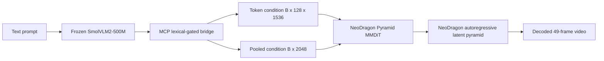
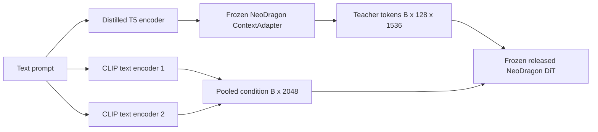
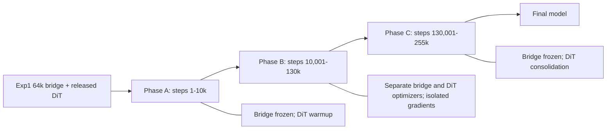

# Neo Mobile-OV with NeoDragon: Experiment Review and Exp5 Design

Last updated: 2026-07-21

## 1. Executive Summary

This document records the current Neo Mobile-OV training experiments, the
evidence collected from their checkpoints, the component-swap ablations used to
localize failure, and the resulting design of Experiment 5.

The most important result is not simply that Exp1 looks better than Exp2-4. The
important result is that the failure has been localized:

1. The 64k Exp1 bridge produces coherent videos with the released NeoDragon DiT.
2. Full Exp2, Exp3, and Exp4 checkpoints degrade or collapse after a plausible
   first frame.
3. The DiTs from Exp2, Exp3, and Exp4 recover when paired with the Exp1 bridge.
4. The bridges from Exp2, Exp3, and Exp4 still fail when paired with the released
   NeoDragon DiT.

Therefore, the dominant failure is bridge drift, not irreversible destruction of
the trained DiTs. This changes the correct next experiment. Exp5 should not train
bridge and DiT through one unrestricted joint loss. It should initialize from the
proven Exp1 bridge, isolate bridge gradients from flow matching, keep a direct
teacher representation constraint, keep a frozen-DiT functional constraint, and
train the DiT with flow plus output-level teacher preservation.

Exp5 implements that policy in one three-phase trainer. It does not change the
model architecture. It trains for 255,000 optimizer steps, approximately two
passes over the 1,019,957-sample OpenVid latent manifest at global batch 8. The
resumable latest checkpoint is updated every 5,000 steps and model-only archives
are retained every 20,000 steps.

## 2. Fixed Model Architecture

All five experiments use the same Mobile-OV-to-NeoDragon conditioning contract.
No context adapter, sequence translator, new mask head, LoRA branch, or additional
inference module is inserted between the bridge and NeoDragon for these runs.



The native teacher condition path is:



The student bridge is trained to replace the complete native text-conditioning
bundle at inference. It must reproduce both the post-ContextAdapter token contract
and the pooled CLIP contract. Matching only one branch is insufficient.

### 2.1 Why the first frame can look correct while the checkpoint is bad

NeoDragon uses a separately pretrained first-frame generation stage before its
autoregressive video continuation. A plausible first frame therefore does not
prove that the Mobile-OV bridge is a valid temporal condition. In the failed
checkpoints, the first frame can remain sharp and prompt-aligned while later
frames smear, change color, or lose the subject. The temporal continuation is
where bridge errors accumulate through the DiT.

This distinction is visible in the Exp2 contact sheet below. Frame 1 is plausible,
but subsequent frames collapse.


## 3. Shared Data and Training Contract

### 3.1 Video data

The joint DiT experiments use the offline NeoDragon VAE manifest:

```text
data/openvid_neodragon_2s_latents/latent_manifest.csv
```

The manifest contains approximately 1,019,957 OpenVid samples. Each sample was
prepared as a 49-frame, 24 FPS, 320 x 512 clip and encoded with the native
NeoDragon VAE. Training loads the precomputed scaled latent from `latent_path`;
it does not decode the source video or run the VAE online.

At batch size 1 per GPU on eight GPUs:

```text
global batch              = 8
optimizer steps per epoch = ceil(1,019,957 / 8) = 127,495
two epochs                = 254,990 steps
Exp5 planned steps        = 255,000
```

The extra ten sample slots caused by rounding are negligible.

### 3.2 Caption granularity

The latent manifest preserves three caption columns:

```text
caption_short
caption_medium
caption_long
```

Exp2-4 used a `5:4:1` short/medium/long sampling ratio. Exp5 uses `1:1:1`.
The equal mixture is deliberate:

- Short prompts preserve compatibility with concise generation benchmarks.
- Medium captions provide a stable subject-action-setting description.
- Long captions exercise the semantic capacity that motivated replacing the
  native text bundle with Mobile-OV.
- Equal sampling prevents the long-caption branch from receiving only 10 percent
  of training exposure.

Caption choice is sampled independently inside each dataset worker invocation.
With 255k steps and global batch 8, Exp5 processes approximately 2.04 million
caption-conditioned examples, or about 680k examples per granularity in
expectation.

### 3.3 Native NeoDragon flow target

For clean latent pyramid unit `x`, sampled Gaussian noise `epsilon`, and scheduler
noise level `sigma`, the training state is:

```text
x_sigma = sigma * epsilon + (1 - sigma) * x
v_target = epsilon - x
```

The native flow objective is:

```text
L_flow = MSE(D_student(x_sigma, condition, t), v_target)
```

The code samples a temporal unit from the 49-frame latent sequence and a pyramid
stage from the native NeoDragon scheduler. Previous clean latent units are passed
as teacher-forced history, matching the existing NeoDragon training path.

## 4. Loss Definitions

Let:

```text
B_tok, B_pool = Mobile-OV bridge conditions
T_tok, T_pool = native TextEncoderBundle + ContextAdapter conditions
D_s           = trainable NeoDragon DiT
D_t           = frozen released NeoDragon DiT
y              = native flow target
```

### 4.1 Bridge representation objective

The complete representation objective is:

```text
L_repr =
    0.25 * L_raw_token_mse
  + 1.00 * L_normalized_token_mse
  + 0.50 * L_token_cosine
  + 0.10 * L_token_norm
  + 0.25 * L_pooled_mse
  + 0.20 * L_pooled_cosine
  + 0.10 * L_relational
```

Each term has a distinct role:

- `L_raw_token_mse` preserves the absolute numerical contract consumed by
  NeoDragon attention projections.
- `L_normalized_token_mse` matches feature structure without allowing a large
  absolute scale to dominate training.
- `L_token_cosine` constrains direction, which is directly relevant to attention.
- `L_token_norm` prevents cosine alignment from hiding a magnitude mismatch.
- `L_pooled_mse` and `L_pooled_cosine` supervise the separate 2048-dimensional
  pooled CLIP branch.
- `L_relational` matches pairwise prompt geometry across the global distributed
  batch and discourages semantic collapse.

All token losses are masked by the native teacher attention mask.

### 4.2 Frozen-DiT bridge functional objective

Embedding proximity is not enough because the NeoDragon DiT is nonlinear. The
functional objective passes teacher and student conditions through the same
frozen released DiT at the same latent state:

```text
u_bridge  = D_t(x_sigma, B_tok, B_pool, t)
u_teacher = D_t(x_sigma, T_tok, T_pool, t)

L_bfunc = MSE(u_bridge, u_teacher)
        + 0.10 * cosine_distance(u_bridge, u_teacher)
```

The teacher DiT parameters are frozen, but autograd remains enabled with respect
to `B_tok` and `B_pool`. Consequently, this loss updates only the bridge and asks
the exact downstream question: does the bridge cause the original DiT to react
like the native text stack?

### 4.3 Student response distillation

The trainable DiT under the Mobile-OV condition is matched to the released DiT
under its native condition:

```text
u_student = D_s(x_sigma, stopgrad(B_tok), stopgrad(B_pool), t)
u_teacher = D_t(x_sigma, T_tok, T_pool, t)

L_distill = MSE(u_student, u_teacher)
          + 0.10 * cosine_distance(u_student, u_teacher)
```

This protects the released model's learned vector field while allowing OpenVid
adaptation.

### 4.4 Teacher-condition preservation

Output distillation under bridge conditions alone can allow the student DiT to
co-adapt to a drifting bridge. Preservation adds a fixed coordinate system:

```text
u_native_student = D_s(x_sigma, T_tok, T_pool, t)
u_native_teacher = D_t(x_sigma, T_tok, T_pool, t)

L_preserve = MSE(u_native_student, u_native_teacher)
           + 0.10 * cosine_distance(u_native_student, u_native_teacher)
```

This objective is evaluated every `k` steps and multiplied by `k` when active.
The frequency correction preserves the intended expected loss weight while
reducing compute.

### 4.5 Text-sensitivity diagnostics

Every 500 Exp5 steps, the trainer evaluates the same latent state with the
correct condition and a globally shuffled condition. It logs:

```text
diagnostic_correct_flow
diagnostic_shuffled_flow
diagnostic_text_sensitivity
diagnostic_offdiag_cos
```

These are diagnostics, not optimized losses. A healthy model should eventually
show a measurable penalty under shuffled text. A tiny correct-vs-shuffled gap is
a warning that the DiT is learning latent dynamics while ignoring semantics.

## 5. Experiments 1-4

### 5.1 Comparison matrix

| Experiment | Bridge init | DiT init | Bridge train signal | DiT train signal | Observed checkpoint |
| --- | --- | --- | --- | --- | --- |
| Exp1 | random | released, frozen | full representation + frozen-DiT functional | none | 64k |
| Exp2 | old 200k bridge | released | weak representation plus unrestricted joint gradient | flow + response distill + preservation | 40k |
| Exp3 | random | released | full representation + functional + unrestricted joint gradient | flow + response distill + preservation | 80k |
| Exp4 | random | released | flow gradient only | flow only | 100k |
| Exp5 | Exp1 64k | released | protected representation + functional in Phase B | flow + response distill + preservation in all phases | planned 255k |

The phrase `unrestricted joint gradient` matters. In Exp2-4, the bridge could be
updated by the same flow graph that updated the DiT. A lower joint loss could be
obtained by moving both modules toward a private co-adapted representation that
was no longer a faithful replacement for the native text condition.

### 5.2 Exp1: bridge-only functional distillation

Exp1 trains only the original Mobile-OV bridge. SmolVLM2, the native text stack,
and NeoDragon DiT are frozen.

```text
L_exp1 = L_repr + functional_scale * L_bfunc
```

The functional scale ramps over 2,000 steps. The successful run used:

```text
checkpoint step: 64,000
batch per GPU:   4
global batch:    32
learning rate:   5e-5
caption ratio:   1:1:1
prompt exposure: 2,048,000
functional exposure: approximately 512,000 examples
```

The last-100-log window from the checkpoint showed approximately:

```text
total loss:                 0.9824
raw token MSE:              0.4865
normalized token MSE:       0.5179
pooled MSE:                 0.5411
token cosine distance:      0.2591
pooled cosine distance:     0.3288
functional MSE:             0.00346
functional cosine distance: 0.00703
mask agreement:             0.786
```

These embedding values are not perfect, but the functional response is close and
inference is coherent:


### 5.3 Why Exp1 64k beat the old 200k bridge

The result is not evidence that fewer optimizer steps are inherently better.
Exp1 differed in several high-impact dimensions:

1. It used the complete multi-term token and pooled objective instead of a weak
   average embedding objective.
2. It added frozen-DiT functional distillation, which directly supervises the
   condition's downstream effect.
3. It used global batch 32 instead of global batch 8, so 64k steps still exposed
   the bridge to about 2.05M prompts. The old 200k run exposed about 1.6M prompts.
4. It used a lower `5e-5` learning rate rather than `1e-4`.
5. It sampled short, medium, and long captions equally.

Step count alone therefore understated Exp1's data exposure and supervision
quality.

### 5.4 Exp2: initialized bridge, joint bridge and DiT training

Exp2 initialized from the old 200k bridge, not the later successful Exp1 64k
bridge. Its objective was approximately:

```text
L_exp2 =
    0.30 * L_flow
  + 1.00 * L_distill_mse
  + 0.10 * L_distill_cosine
  + frequency_corrected(0.50 * L_preserve_mse + 0.05 * L_preserve_cosine)
  + 0.10 * L_repr_light
```

`L_repr_light` omitted raw-token and relational terms and did not include bridge
functional distillation. The bridge LR was `1e-5`, while the DiT LR was `3e-6`.
This gave the less-protected bridge a learning rate 3.3 times larger than the
full DiT.

At step 40k, Exp2 had seen only about 320k video-caption examples. Its full
checkpoint generated a plausible first frame followed by severe temporal
degradation.

### 5.5 Exp3: all objectives from a random bridge

Exp3 attempted the hardest one-pass problem: align a random bridge and adapt the
full pruned DiT simultaneously. It used flow, full representation, bridge
functional, response distillation, and preservation losses.

At step 80k, it had processed approximately 640k examples. Reported values near
that checkpoint included:

```text
total loss:               3.291
flow loss:                0.860
response distill MSE:     0.0327
bridge representation:    2.996
raw token MSE:            1.437
normalized token MSE:     1.738
token cosine distance:    0.869
pooled cosine distance:   0.878
correct flow diagnostic:  0.8596
shuffled flow diagnostic: 0.8650
text sensitivity:         0.0173
```

The cosine values imply very poor directional alignment, and the small shuffled
gap shows weak text dependence. Its video retains the initial subject briefly
but becomes blurred:


### 5.6 Exp4: flow-only from a random bridge

Exp4 is the clean flow-only baseline:

```text
L_exp4 = flow_weight * L_flow
```

Both bridge and DiT received this gradient. At step 100k, the observed flow loss
was approximately `0.427`, but the correct-vs-shuffled diagnostic differed by
only about `0.004`. This is consistent with learning video latent statistics
without learning a strong semantic condition. The result degrades despite a
reasonable scalar flow loss:


This is a central lesson: flow matching can decrease while conditional generation
remains poor. The latent history and noisy latent are strong predictors, so a
model can reduce average flow error while underusing text.

## 6. Component-Swap Ablation

### 6.1 Method

The ablation holds prompt, seed, resolution, frame count, scheduler, and first-
frame generator constant. It swaps only the bridge and DiT checkpoint sources.

The principal prompt was:

```text
A red fox walking through gentle snowfall, cinematic wildlife footage.
```

The tests used seed 1234, bf16, 49 frames, and 320 x 512 output. A golden
retriever prompt was also tested and showed the same directional conclusion.

### 6.2 Exp2 factorization

Full Exp2 fails, and Exp2 bridge with the released DiT also fails:


Replacing only the bridge with Exp1 while retaining the trained Exp2 DiT
restores coherent generation:


This isolates the major Exp2 failure to its bridge state.

### 6.3 Exp3 and Exp4 factorization

The same swap restores the Exp3 DiT:


It also restores the Exp4 DiT:


The evidence supports three conclusions:

1. The trained DiTs are not the primary source of catastrophic visual failure.
2. A bridge can achieve a numerically plausible training loss while becoming an
   invalid condition for autoregressive inference.
3. Protecting bridge semantics is more important than simply adding more joint
   training steps.

### 6.4 Limits of the ablation

This is strong component-localization evidence, but not a final benchmark. The
visual test currently uses two prompts and a fixed seed. Exp5 still requires a
larger prompt suite and VBench after training. The ablation establishes which
component to fix; it does not quantify final model quality.

## 7. Exp5: Protected Staged Joint Training

### 7.1 Design goals

Exp5 is designed to satisfy five requirements simultaneously:

1. Preserve the demonstrated semantic behavior of the Exp1 64k bridge.
2. Adapt the full released NeoDragon DiT to OpenVid and Mobile-OV conditions.
3. Avoid bridge-DiT co-adaptation through an unconstrained shared gradient.
4. Preserve the released pruned DiT behavior while introducing flow supervision.
5. Run all phases in one resumable job without architecture changes.

### 7.2 Initialization

```text
Bridge initialization:
  output/neo_exp1_bridge_functional/17108893/neodragon_text_bridge_latest.pt

Local fallback used for development:
  checkpoints/hf_mobile_ov/neo_exp1_bridge_functional/17108893/
  neodragon_text_bridge_latest.pt

Trainable DiT initialization:
  released NeoDragon DiT

Frozen teacher stack:
  released NeoDragon TextEncoderBundle
  released NeoDragon ContextAdapter
  released NeoDragon DiT
```

Exp5 intentionally does not initialize the DiT from Exp2-4. The ablation shows
those DiTs remain usable, but starting from the released DiT gives the cleanest
causal experiment and avoids inheriting undocumented optimizer history.

### 7.3 Three-phase state machine



#### Phase A: DiT warmup, steps 1-10,000

The Exp1 bridge is frozen. Only the DiT is trainable.

```text
L_A =
    w_flow(step) * L_flow
  + 1.00 * L_distill_mse
  + 0.10 * L_distill_cosine
  + frequency_corrected(0.50 * L_preserve_mse + 0.05 * L_preserve_cosine)
```

DiT LR warms from zero to `3e-6` during the first 2,000 steps. Flow weight rises
from `0.05` to `0.30` over the same interval. This lets the DiT see the proven
Mobile-OV condition before bridge parameters are allowed to move.

#### Phase B: protected joint refinement, steps 10,001-130,000

Both modules are trainable, but they use separate optimizers and separate loss
graphs.

The DiT receives:

```text
L_B_dit =
    0.30 * L_flow
  + 1.00 * L_distill_mse
  + 0.10 * L_distill_cosine
  + frequency_corrected(0.50 * L_preserve_mse + 0.05 * L_preserve_cosine)
```

The bridge receives:

```text
L_B_bridge =
    0.50 * L_repr
  + frequency_corrected(1.00 * L_bfunc_mse + 0.10 * L_bfunc_cosine)
```

The key implementation rule is:

```text
D_s input in the DiT graph = stopgrad(B_tok), stopgrad(B_pool)
```

Therefore, neither `L_flow` nor student response distillation can update the
bridge. The bridge is optimized only against fixed teacher targets and a frozen
teacher DiT. The DiT can adapt to the bridge, but the bridge cannot move merely
because doing so makes the current DiT's flow optimization easier.

Bridge LR is only `1e-6`, ten times lower than Exp2/3 bridge LR. It warms for
2,000 Phase-B steps and cools to zero during the final 10,000 Phase-B steps.
Functional loss runs every two steps with frequency correction. Across 120k
Phase-B steps and eight GPUs, this yields approximately 480k functional examples,
close to the successful Exp1 run's approximate 512k functional examples.

#### Phase C: DiT consolidation, steps 130,001-255,000

The refined bridge is frozen again. The DiT continues with the Phase-A objective.
This prevents late bridge drift while giving the DiT nearly one full epoch to
adapt to the fixed final condition.

During the last 20,000 steps:

```text
DiT LR scale: 1.0 -> 0.1
flow weight:  0.30 -> 0.10
```

Distillation and preservation weights remain fixed. The final cooldown therefore
reduces aggressive OpenVid fitting while retaining teacher anchoring.

### 7.4 Expected sample exposure

| Segment | Steps | Global examples | Approximate epochs | Bridge state |
| --- | ---: | ---: | ---: | --- |
| Phase A | 10,000 | 80,000 | 0.078 | frozen |
| Phase B | 120,000 | 960,000 | 0.941 | protected training |
| Phase C | 125,000 | 1,000,000 | 0.981 | frozen |
| Total | 255,000 | 2,040,000 | 2.000 | staged |

This budget is large enough to expose the DiT to approximately two epochs while
limiting bridge training to the explicitly protected middle phase.

### 7.5 Why these weights and learning rates

The choices are conservative because both starting components already work at
inference.

- `DiT LR = 3e-6` matches the stable scale used in Exp2-4 and is appropriate for
  full-weight adaptation of a pretrained pruned model.
- `Bridge LR = 1e-6` is intentionally much smaller than the previous `1e-5`.
  Exp5 is refinement, not bridge reconstruction.
- `L_distill_mse = 1.0` remains the largest DiT term so the student vector field
  stays close to the released model.
- `L_flow = 0.30` provides a meaningful OpenVid gradient without dominating
  teacher behavior.
- `L_preserve_mse = 0.50` is evaluated every two steps and frequency corrected.
  It fixes the DiT's native-condition coordinate system.
- `L_repr` is multiplied by `0.50`, but its internal normalized, directional,
  norm, pooled, and relational terms remain complete.
- `L_bfunc_mse = 1.0` directly protects downstream condition equivalence.

No untested margin loss, contrastive objective, rollout loss, or architecture
extension is added. Exp5 addresses the observed failure with the minimum set of
changes supported by current evidence.

## 8. Checkpointing and Exact Resume

Exp1-4 checkpoints contained model weights and history but not complete optimizer
state. Exp5 adds FSDP-aware optimizer consolidation and restore.

### 8.1 Latest checkpoint every 5k

```text
output/neo_exp5_staged/neodragon_exp5_latest.pt
```

The latest checkpoint contains:

```text
full DiT state
full bridge state
full DiT AdamW state
full bridge AdamW state
global step and phase
all per-rank Python, NumPy, CPU Torch, CUDA, and sampling-generator RNG states
schedule and loss configuration
history
```

It is written atomically through a temporary file and then renamed. On restart,
FSDP scatters each full optimizer state back into the current shards.

### 8.2 Model archive every 20k

```text
output/neo_exp5_staged/neodragon_exp5_step020000.pt
output/neo_exp5_staged/neodragon_exp5_step040000.pt
...
output/neo_exp5_staged/neodragon_exp5_step240000.pt
```

Archives intentionally omit optimizer and RNG states to limit storage growth.
They are suitable for inference and retrospective evaluation, not exact resume.

At step 255k the trainer writes:

```text
output/neo_exp5_staged/neodragon_exp5_final.pt
```

The latest checkpoint is also refreshed at the final step.

### 8.3 Resume safety

`--resume auto` discovers the stable latest path. Before loading optimizer state,
the trainer verifies the phase schedule, model/data configuration, learning
rates, loss weights, caption policy, batch size, seed, parallel backend, and
world size. A mismatched command fails instead of silently continuing a different
experiment under the same output directory.

Data sampling resumes at the corresponding epoch and per-rank sample offset.
Skipped samples are removed at the sampler level, so resuming does not reload
already-consumed latent files.

## 9. Running Exp5 on Berzelius

Submit from the repository root:

```bash
sbatch scripts/exp5_train_neodragon_staged_1node8gpu.sbatch
```

The script automatically prefers the Berzelius Exp1 checkpoint:

```text
output/neo_exp1_bridge_functional/17108893/neodragon_text_bridge_latest.pt
```

It uses the local downloaded fallback only when the Berzelius output path is not
present. The output root is stable rather than job-ID-specific, which is required
for automatic resume.

If the 72-hour allocation ends before step 255k, submit the same command again:

```bash
sbatch scripts/exp5_train_neodragon_staged_1node8gpu.sbatch
```

The next allocation reads `neodragon_exp5_latest.pt` and continues. At most 4,999
steps can be lost if the scheduler terminates the process between periodic saves.

Monitor with:

```bash
squeue --me
tail -f logs/neo-exp5-<JOBID>.out
```

## 10. Verification Strategy

### 10.1 Unit and static checks

The schedule tests cover:

- exact A/B/C boundaries;
- DiT warmup and final cooldown;
- bridge warmup, plateau, cooldown, and freezing;
- flow-weight interpolation;
- rejection of invalid overlapping phases.

The scripts are checked with Python compilation, Bash parsing, and `git diff
--check`.

### 10.2 Two-GPU FSDP smoke test

The dedicated smoke job:

```bash
sbatch scripts/smoke_exp5_2gpu.sbatch
```

performs the following end-to-end test:

1. Encode eight real OpenVid videos with the NeoDragon VAE on two GPUs.
2. Initialize the Exp1 bridge and released student/teacher DiTs.
3. Run two Phase-A steps and two Phase-B steps under FSDP.
4. Save full model, both sharded optimizer states, and all RNG states.
5. Exit cleanly.
6. Launch a new torchrun process group.
7. Auto-resume from step 4.
8. Run two Phase-C steps and write a final checkpoint at step 6.

This is intentionally more demanding than a forward-only smoke test. It checks
the real offline latent loader, all loss graphs, two independent optimizers,
phase transitions, FSDP collectives, checkpoint serialization, optimizer-state
scatter, RNG restore, and final output creation.

### 10.3 Verification status on 2026-07-21

The Python compilation checks, Bash parsing, Markdown asset validation, and 11
targeted unit tests pass. The two-GPU smoke test was submitted as local SLURM job
`2403`; at the time of this update it was pending because all eight H200 GPUs on
the node were allocated. A production training launch should wait for that job to
reach the final `Exp5 two-GPU FSDP train-and-resume smoke test passed` message.

## 11. Evaluation Plan After Training

The first evaluation should preserve the component-factorization methodology:

1. Exp5 bridge + Exp5 DiT.
2. Exp5 bridge + released DiT.
3. Exp1 bridge + Exp5 DiT.
4. Exp1 bridge + released DiT as the known-good reference.

Use identical prompts, seeds, 49-frame output, and 320 x 512 resolution. This
immediately reveals whether any regression belongs to bridge refinement or DiT
adaptation.

The minimum prompt suite should include:

- red fox in snowfall;
- golden retriever running through grass;
- a human action with one subject;
- a camera-motion prompt;
- an object interaction;
- short, medium, and long variants of the same semantics.

After component checks pass, run VBench and report both aggregate and per-
dimension scores. Particular attention should be paid to subject consistency,
motion smoothness, dynamic degree, imaging quality, and prompt-alignment-related
dimensions.

## 12. Remaining Risks

### 12.1 Teacher forcing versus autoregressive inference

Training uses ground-truth previous latent units, while inference feeds generated
history back into the model. Small condition errors can therefore compound over
time even when single-step flow loss is low. Exp5 reduces condition drift but
does not remove exposure bias.

### 12.2 Two epochs may still be insufficient for final quality

Two epochs are a principled first full run, not a guarantee of convergence. The
decision should be based on checkpoint inference and VBench trends, not training
loss alone.

### 12.3 Full optimizer checkpoints are large

The 5k latest save may temporarily require space for both the previous file and
the atomic temporary file. Model-only 20k archives are smaller, but disk usage
must still be monitored.

### 12.4 Visual ablations are diagnostic, not statistical

The existing cross-swap results are visually decisive for the tested prompts,
but they are not a substitute for a broad benchmark.

## 13. Final Rationale

Exp5 follows directly from the evidence:

```text
Exp1 bridge works
Exp2-4 full checkpoints fail
Exp1 bridge + Exp2-4 DiT works
Exp2-4 bridge + released DiT fails
```

The appropriate response is not to enlarge the bridge, add another adapter, or
discard the trained DiTs. It is to preserve the known-good bridge contract while
adapting the DiT, and to allow bridge refinement only under fixed teacher
objectives with an isolated optimizer.

That is the purpose of the three Exp5 phases:

```text
stabilize DiT against a frozen good bridge
-> refine bridge under fixed semantic and functional targets
-> freeze bridge and consolidate DiT for the final model
```

This design is the lowest-risk experiment that still trains both Mobile-OV and
the full NeoDragon DiT on the complete OpenVid latent dataset.
