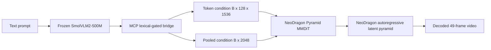
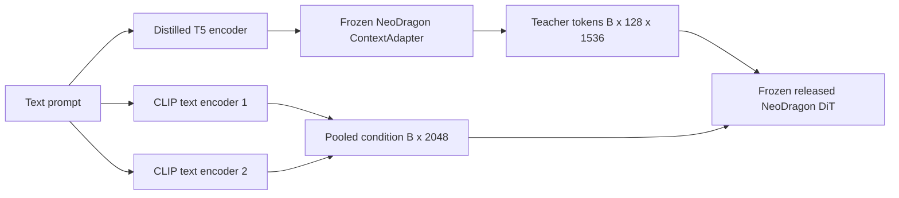
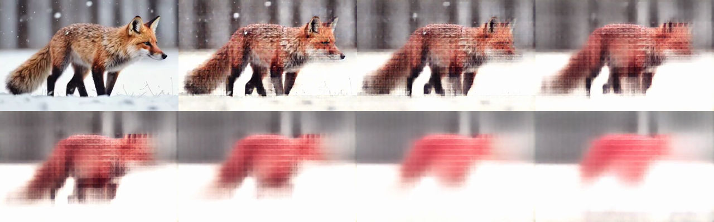
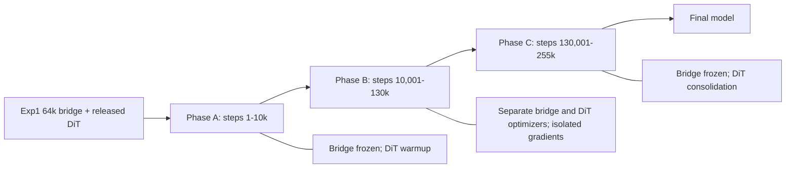
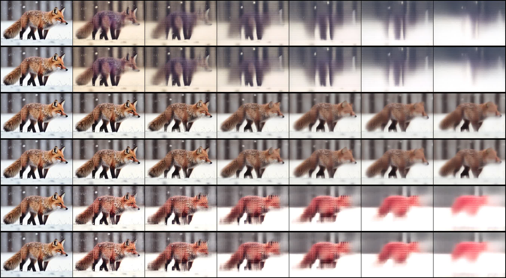
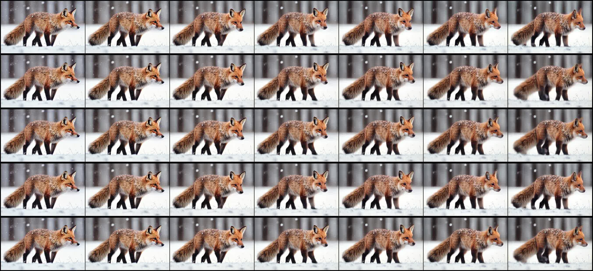

# Neo Mobile-OV with NeoDragon: Experiment Review and Exp5 Design

Last updated: 2026-07-23

## 1. Executive Summary

This document records the current Neo Mobile-OV training experiments, the
evidence collected from their checkpoints, the component-swap ablations used to
localize failure, and the resulting design of Experiment 5.

The most important result is not simply that Exp1 looks better than Exp2-4. The
important result is that the failure has been localized:

1. The 64k Exp1 bridge produces coherent videos with the released NeoDragon DiT.
2. Full Exp2, Exp3, and Exp4 checkpoints degrade or collapse after a plausible
   first frame.
3. The DiTs from Exp2, Exp3, and Exp4 recover when paired with the Exp1 bridge.
4. The bridges from Exp2, Exp3, and Exp4 still fail when paired with the released
   NeoDragon DiT.

Therefore, the dominant failure is bridge drift, not irreversible destruction of
the trained DiTs. This changes the correct next experiment. Exp5 should not train
bridge and DiT through one unrestricted joint loss. It should initialize from the
proven Exp1 bridge, isolate bridge gradients from flow matching, keep a direct
teacher representation constraint, keep a frozen-DiT functional constraint, and
train the DiT with flow plus output-level teacher preservation.

Exp5 implements that policy in one three-phase trainer. It does not change the
model architecture. It trains for 255,000 optimizer steps, approximately two
passes over the 1,019,957-sample OpenVid latent manifest at global batch 8. The
resumable latest checkpoint is updated every 5,000 steps and model-only archives
are retained every 20,000 steps.

Post-training evaluation on 2026-07-22 adds an important qualification. At 30k
Phase-B steps, Exp5 preserved a strong bridge and avoided the catastrophic
semantic collapse seen in Exp2-4, but its adapted DiT was softer and less
dynamic than the released NeoDragon DiT. A controlled follow-up at step 70k
reaches the same conclusion: the videos remain coherent, but the aggregate
motion and sharpness diagnostics are effectively unchanged from step 30k.
Component swaps continue to localize the remaining quality gap to the adapted
DiT rather than the bridge. Exp1-64k plus the released DiT therefore remains the
best current inference configuration. The evidence supports Exp1 as the correct
initialization for staged Exp5 training; it does not yet prove that the
unfinished Exp5 run will surpass Exp1.

The final Exp2, Exp3, and Exp4 checkpoints confirm that these runs are failed
experiments, not merely early checkpoints. Increasing Exp2 from 90k to 240k,
Exp3 from 120k to 200k, and Exp4 from 150k to 200k leaves their generated
trajectories and decoded failure patterns effectively unchanged. More
optimization steps do not repair the objective mismatch. The detailed
postmortem, including the exact loss audit and the NeoDragon
monolithic-versus-hybrid analysis, is in
[`NEODRAGON_EXP2_EXP3_EXP4_FAILURE_POSTMORTEM.md`](NEODRAGON_EXP2_EXP3_EXP4_FAILURE_POSTMORTEM.md).

## 2. Fixed Model Architecture

All five experiments use the same Mobile-OV-to-NeoDragon conditioning contract.
No context adapter, sequence translator, new mask head, LoRA branch, or additional
inference module is inserted between the bridge and NeoDragon for these runs.



The native teacher condition path is:



The student bridge is trained to replace the complete native text-conditioning
bundle at inference. It must reproduce both the post-ContextAdapter token contract
and the pooled CLIP contract. Matching only one branch is insufficient.

### 2.1 Why the first frame can look correct while the checkpoint is bad

NeoDragon uses a separately pretrained first-frame generation stage before its
autoregressive video continuation. A plausible first frame therefore does not
prove that the Mobile-OV bridge is a valid temporal condition. In the failed
checkpoints, the first frame can remain sharp and prompt-aligned while later
frames smear, change color, or lose the subject. The temporal continuation is
where bridge errors accumulate through the DiT.

This distinction is visible in the Exp2 contact sheet below. Frame 1 is plausible,
but subsequent frames collapse.


## 3. Shared Data and Training Contract

### 3.1 Video data

The joint DiT experiments use the offline NeoDragon VAE manifest:

```text
data/openvid_neodragon_2s_latents/latent_manifest.csv
```

The manifest contains approximately 1,019,957 OpenVid samples. Each sample was
prepared as a 49-frame, 24 FPS, 320 x 512 clip and encoded with the native
NeoDragon VAE. Training loads the precomputed scaled latent from `latent_path`;
it does not decode the source video or run the VAE online.

At batch size 1 per GPU on eight GPUs:

```text
global batch              = 8
optimizer steps per epoch = ceil(1,019,957 / 8) = 127,495
two epochs                = 254,990 steps
Exp5 planned steps        = 255,000
```

The extra ten sample slots caused by rounding are negligible.

### 3.2 Caption granularity

The latent manifest preserves three caption columns:

```text
caption_short
caption_medium
caption_long
```

Exp2-4 used a `5:4:1` short/medium/long sampling ratio. Exp5 uses `1:1:1`.
The equal mixture is deliberate:

- Short prompts preserve compatibility with concise generation benchmarks.
- Medium captions provide a stable subject-action-setting description.
- Long captions exercise the semantic capacity that motivated replacing the
  native text bundle with Mobile-OV.
- Equal sampling prevents the long-caption branch from receiving only 10 percent
  of training exposure.

Caption choice is sampled independently inside each dataset worker invocation.
With 255k steps and global batch 8, Exp5 processes approximately 2.04 million
caption-conditioned examples, or about 680k examples per granularity in
expectation.

### 3.3 Native NeoDragon flow target

For clean latent pyramid unit `x`, sampled Gaussian noise `epsilon`, and scheduler
noise level `sigma`, the training state is:

```text
x_sigma = sigma * epsilon + (1 - sigma) * x
v_target = epsilon - x
```

The native flow objective is:

```text
L_flow = MSE(D_student(x_sigma, condition, t), v_target)
```

The code samples a temporal unit from the 49-frame latent sequence and a pyramid
stage from the native NeoDragon scheduler. Previous clean latent units are passed
as teacher-forced history, matching the existing NeoDragon training path.

## 4. Loss Definitions

Let:

```text
B_tok, B_pool = Mobile-OV bridge conditions
T_tok, T_pool = native TextEncoderBundle + ContextAdapter conditions
D_s           = trainable NeoDragon DiT
D_t           = frozen released NeoDragon DiT
y              = native flow target
```

### 4.1 Bridge representation objective

The complete representation objective is:

```text
L_repr =
    0.25 * L_raw_token_mse
  + 1.00 * L_normalized_token_mse
  + 0.50 * L_token_cosine
  + 0.10 * L_token_norm
  + 0.25 * L_pooled_mse
  + 0.20 * L_pooled_cosine
  + 0.10 * L_relational
```

Each term has a distinct role:

- `L_raw_token_mse` preserves the absolute numerical contract consumed by
  NeoDragon attention projections.
- `L_normalized_token_mse` matches feature structure without allowing a large
  absolute scale to dominate training.
- `L_token_cosine` constrains direction, which is directly relevant to attention.
- `L_token_norm` prevents cosine alignment from hiding a magnitude mismatch.
- `L_pooled_mse` and `L_pooled_cosine` supervise the separate 2048-dimensional
  pooled CLIP branch.
- `L_relational` matches pairwise prompt geometry across the global distributed
  batch and discourages semantic collapse.

All token losses are masked by the native teacher attention mask.

### 4.2 Frozen-DiT bridge functional objective

Embedding proximity is not enough because the NeoDragon DiT is nonlinear. The
functional objective passes teacher and student conditions through the same
frozen released DiT at the same latent state:

```text
u_bridge  = D_t(x_sigma, B_tok, B_pool, t)
u_teacher = D_t(x_sigma, T_tok, T_pool, t)

L_bfunc = MSE(u_bridge, u_teacher)
        + 0.10 * cosine_distance(u_bridge, u_teacher)
```

The teacher DiT parameters are frozen, but autograd remains enabled with respect
to `B_tok` and `B_pool`. Consequently, this loss updates only the bridge and asks
the exact downstream question: does the bridge cause the original DiT to react
like the native text stack?

### 4.3 Student response distillation

The trainable DiT under the Mobile-OV condition is matched to the released DiT
under its native condition:

```text
u_student = D_s(x_sigma, stopgrad(B_tok), stopgrad(B_pool), t)
u_teacher = D_t(x_sigma, T_tok, T_pool, t)

L_distill = MSE(u_student, u_teacher)
          + 0.10 * cosine_distance(u_student, u_teacher)
```

This protects the released model's learned vector field while allowing OpenVid
adaptation.

### 4.4 Teacher-condition preservation

Output distillation under bridge conditions alone can allow the student DiT to
co-adapt to a drifting bridge. Preservation adds a fixed coordinate system:

```text
u_native_student = D_s(x_sigma, T_tok, T_pool, t)
u_native_teacher = D_t(x_sigma, T_tok, T_pool, t)

L_preserve = MSE(u_native_student, u_native_teacher)
           + 0.10 * cosine_distance(u_native_student, u_native_teacher)
```

This objective is evaluated every `k` steps and multiplied by `k` when active.
The frequency correction preserves the intended expected loss weight while
reducing compute.

### 4.5 Text-sensitivity diagnostics

Every 500 Exp5 steps, the trainer evaluates the same latent state with the
correct condition and a globally shuffled condition. It logs:

```text
diagnostic_correct_flow
diagnostic_shuffled_flow
diagnostic_text_sensitivity
diagnostic_offdiag_cos
```

These are diagnostics, not optimized losses. A healthy model should eventually
show a measurable penalty under shuffled text. A tiny correct-vs-shuffled gap is
a warning that the DiT is learning latent dynamics while ignoring semantics.

## 5. Experiments 1-4

### 5.1 Comparison matrix

| Experiment | Bridge init | DiT init | Bridge train signal | DiT train signal | Observed checkpoint |
| --- | --- | --- | --- | --- | --- |
| Exp1 | random | released, frozen | full representation + frozen-DiT functional | none | 64k |
| Exp2 | old 200k bridge | released | weak representation plus unrestricted joint gradient | flow + response distill + preservation | 40k |
| Exp3 | random | released | full representation + functional + unrestricted joint gradient | flow + response distill + preservation | 80k |
| Exp4 | random | released | flow gradient only | flow only | 100k |
| Exp5 | Exp1 64k | released | protected representation + functional in Phase B | flow + response distill + preservation in all phases | planned 255k |

The phrase `unrestricted joint gradient` matters. In Exp2-4, the bridge could be
updated by the same flow graph that updated the DiT. A lower joint loss could be
obtained by moving both modules toward a private co-adapted representation that
was no longer a faithful replacement for the native text condition.

### 5.2 Exp1: bridge-only functional distillation

Exp1 trains only the original Mobile-OV bridge. SmolVLM2, the native text stack,
and NeoDragon DiT are frozen.

```text
L_exp1 = L_repr + functional_scale * L_bfunc
```

The functional scale ramps over 2,000 steps. The successful run used:

```text
checkpoint step: 64,000
batch per GPU:   4
global batch:    32
learning rate:   5e-5
caption ratio:   1:1:1
prompt exposure: 2,048,000
functional exposure: approximately 512,000 examples
```

The last-100-log window from the checkpoint showed approximately:

```text
total loss:                 0.9824
raw token MSE:              0.4865
normalized token MSE:       0.5179
pooled MSE:                 0.5411
token cosine distance:      0.2591
pooled cosine distance:     0.3288
functional MSE:             0.00346
functional cosine distance: 0.00703
mask agreement:             0.786
```

These embedding values are not perfect, but the functional response is close and
inference is coherent:


### 5.3 Why Exp1 64k beat the old 200k bridge

The result is not evidence that fewer optimizer steps are inherently better.
Exp1 differed in several high-impact dimensions:

1. It used the complete multi-term token and pooled objective instead of a weak
   average embedding objective.
2. It added frozen-DiT functional distillation, which directly supervises the
   condition's downstream effect.
3. It used global batch 32 instead of global batch 8, so 64k steps still exposed
   the bridge to about 2.05M prompts. The old 200k run exposed about 1.6M prompts.
4. It used a lower `5e-5` learning rate rather than `1e-4`.
5. It sampled short, medium, and long captions equally.

Step count alone therefore understated Exp1's data exposure and supervision
quality.

#### 5.3.1 Durable lesson: why the 64k bridge succeeded

This result should be preserved as a design rule for future Mobile-OV text
bridges. The successful checkpoint was not produced by a new architecture. It
used the same original MCP lexical-gated bridge and pooled head as the failed
runs. Its advantage came from the training contract.

Direct checkpoint metadata gives the following controlled comparison:

| Checkpoint | Steps | Global batch | Prompt exposures | LR | Frozen-DiT functional exposures |
| --- | ---: | ---: | ---: | ---: | ---: |
| old bridge | 200k | 8 | 1.60M | `1e-4` | 0 |
| Exp1 early | 24k | 32 | 0.768M | `5e-5` | about 192k |
| Exp1 successful | 64k | 32 | 2.048M | `5e-5` | about 512k |

The old bridge optimized mostly raw token MSE, token cosine, and pooled MSE. It
actually reached superficially competitive embedding metrics: its final raw
token MSE was approximately `0.439`, compared with approximately `0.484` for
Exp1-64k. Nevertheless, the old checkpoint failed at inference. This is direct
evidence that average embedding distance is not a sufficient model-selection
criterion for replacing a nonlinear text-conditioning stack.

Exp1 succeeded because it combined four properties:

1. **Task-aware functional supervision.** The bridge was optimized so the same
   frozen released DiT produced the same vector field under bridge and native
   conditions. This constrains the behavior that generation actually consumes,
   rather than only the numerical distance between two embeddings.
2. **A stationary teacher coordinate system.** SmolVLM2, the native text bundle,
   and the released DiT were frozen. The bridge could not lower its loss through
   bridge-DiT co-adaptation or through a private condition representation.
3. **Better-conditioned optimization.** Global batch 32 reduced gradient noise,
   the learning rate was halved to `5e-5`, and the functional objective ramped
   over 2,000 steps instead of applying its full gradient to a random bridge at
   initialization.
4. **Enough downstream-state coverage.** The 64k run evaluated approximately
   512k randomly sampled DiT functional states. From 24k to 64k, functional MSE
   improved from about `0.00729` to `0.00516`, while functional cosine distance
   improved from about `0.02558` to `0.00802`. The much larger cosine improvement
   tracks the observed inference recovery better than the small change in total
   representation loss.

The three caption granularities were sampled equally in both the old merged-
caption 200k run and Exp1-64k. Multi-granularity captions remain useful for
prompt robustness, but they do not by themselves explain this controlled
quality difference. Likewise, the architecture, prompt modifier, teacher target
shape, and FSDP backend were not the differentiating factors.

The component-swap ablation makes the conclusion stronger: Exp2-4 DiTs recover
when paired with the Exp1 bridge, while Exp2-4 bridges still fail with the
released DiT. The dominant failure mode is therefore semantic and functional
bridge drift, not simply insufficient DiT capacity or a high scalar flow loss.

For future checkpoint selection, use the following priority order:

```text
held-out autoregressive inference
> frozen-DiT functional MSE/cosine
> correct-vs-shuffled text sensitivity
> complete representation metrics
> total scalar training loss
```

The operational lesson is: **preserve a fixed downstream functional contract,
measure sample and functional-state exposure rather than optimizer steps alone,
and never accept a low embedding or flow loss as proof that text conditioning is
valid.**

### 5.4 Exp2: initialized bridge, joint bridge and DiT training

Exp2 initialized from the old 200k bridge, not the later successful Exp1 64k
bridge. Its objective was approximately:

```text
L_exp2 =
    0.30 * L_flow
  + 1.00 * L_distill_mse
  + 0.10 * L_distill_cosine
  + frequency_corrected(0.50 * L_preserve_mse + 0.05 * L_preserve_cosine)
  + 0.10 * L_repr_light
```

`L_repr_light` omitted raw-token and relational terms and did not include bridge
functional distillation. The bridge LR was `1e-5`, while the DiT LR was `3e-6`.
This gave the less-protected bridge a learning rate 3.3 times larger than the
full DiT.

At step 40k, Exp2 had seen only about 320k video-caption examples. Its full
checkpoint generated a plausible first frame followed by severe temporal
degradation.

### 5.5 Exp3: all objectives from a random bridge

Exp3 attempted the hardest one-pass problem: align a random bridge and adapt the
full pruned DiT simultaneously. It used flow, full representation, bridge
functional, response distillation, and preservation losses.

At step 80k, it had processed approximately 640k examples. Reported values near
that checkpoint included:

```text
total loss:               3.291
flow loss:                0.860
response distill MSE:     0.0327
bridge representation:    2.996
raw token MSE:            1.437
normalized token MSE:     1.738
token cosine distance:    0.869
pooled cosine distance:   0.878
correct flow diagnostic:  0.8596
shuffled flow diagnostic: 0.8650
text sensitivity:         0.0173
```

The cosine values imply very poor directional alignment, and the small shuffled
gap shows weak text dependence. Its video retains the initial subject briefly
but becomes blurred:


#### 5.5.1 Correction: legacy Exp2 versus Exp3 does not isolate initialization

Exp2 and Exp3 share the same peak flow weight, response-distillation,
preservation, learning-rate, and caption families, but they are not a controlled
pair. Exp2 starts from the old 200k bridge, keeps only a `0.1` light
representation objective, disables frozen-DiT bridge-functional distillation,
starts flow at `0.3`, uses a 4k cooldown, and uses seed `0`. Exp3 starts
randomly, uses the full representation and frozen-DiT functional objectives,
ramps flow from `0.05`, uses a 10k cooldown, and uses seed `2026`.

The final six-prompt benchmark exposes an important association. Exp2 is
closer to native condition embeddings than Exp3 (`0.518` versus `0.100`
cosine), but its generated latent trajectory is farther from the released model
(`0.627` versus `0.752`), and its CLIP text-video score is lower (`0.256` versus
`0.306`). Exp3 learned a less poor private bridge-DiT interface; its bridge still
fails when paired with the released DiT.

These observations do not prove that pretrained initialization caused negative
transfer, because initialization, bridge supervision, flow schedule, and seed
all changed together. The old 200k bridge remains independently weaker than
Exp1-64k, and negative transfer is a plausible mechanism, but the causal test
must use Exp2-corrected.

The old 200k bridge had a lower raw token MSE than Exp1-64k (`0.435` versus
`0.486`) but had no frozen-DiT functional objective. Exp1 additionally used a
larger global batch, lower LR, more prompt exposures, normalized/norm/relational
terms, and about 512k frozen-DiT functional states. Therefore, old-200k was not a
more mature version of Exp1. It was an over-optimized solution to a weaker proxy
objective and is an unsafe initialization unless a controlled run demonstrates
otherwise.

The detailed comparison, exact confounds, and negative-transfer hypothesis are
documented in
[`NEODRAGON_EXP2_EXP3_EXP4_FAILURE_POSTMORTEM.md`](NEODRAGON_EXP2_EXP3_EXP4_FAILURE_POSTMORTEM.md#73-why-legacy-exp2-is-worse-than-exp3-and-why-this-does-not-isolate-initialization).

### 5.6 Exp4: flow-only from a random bridge

Exp4 is the clean flow-only baseline:

```text
L_exp4 = flow_weight * L_flow
```

Both bridge and DiT received this gradient. At step 100k, the observed flow loss
was approximately `0.427`, but the correct-vs-shuffled diagnostic differed by
only about `0.004`. This is consistent with learning video latent statistics
without learning a strong semantic condition. The result degrades despite a
reasonable scalar flow loss:



This is a central lesson: flow matching can decrease while conditional generation
remains poor. The latent history and noisy latent are strong predictors, so a
model can reduce average flow error while underusing text.

## 6. Component-Swap Ablation

### 6.1 Method

The ablation holds prompt, seed, resolution, frame count, scheduler, and first-
frame generator constant. It swaps only the bridge and DiT checkpoint sources.

The principal prompt was:

```text
A red fox walking through gentle snowfall, cinematic wildlife footage.
```

The tests used seed 1234, bf16, 49 frames, and 320 x 512 output. A golden
retriever prompt was also tested and showed the same directional conclusion.

### 6.2 Exp2 factorization

Full Exp2 fails, and Exp2 bridge with the released DiT also fails:


Replacing only the bridge with Exp1 while retaining the trained Exp2 DiT
restores coherent generation:


This isolates the major Exp2 failure to its bridge state.

### 6.3 Exp3 and Exp4 factorization

The same swap restores the Exp3 DiT:


It also restores the Exp4 DiT:


The evidence supports three conclusions:

1. The trained DiTs are not the primary source of catastrophic visual failure.
2. A bridge can achieve a numerically plausible training loss while becoming an
   invalid condition for autoregressive inference.
3. Protecting bridge semantics is more important than simply adding more joint
   training steps.

### 6.4 Limits of the ablation

This is strong component-localization evidence, but not a final benchmark. The
visual test currently uses two prompts and a fixed seed. Exp5 still requires a
larger prompt suite and VBench after training. The ablation establishes which
component to fix; it does not quantify final model quality.

## 7. Exp5: Protected Staged Joint Training

### 7.1 Design goals

Exp5 is designed to satisfy five requirements simultaneously:

1. Preserve the demonstrated semantic behavior of the Exp1 64k bridge.
2. Adapt the full released NeoDragon DiT to OpenVid and Mobile-OV conditions.
3. Avoid bridge-DiT co-adaptation through an unconstrained shared gradient.
4. Preserve the released pruned DiT behavior while introducing flow supervision.
5. Run all phases in one resumable job without architecture changes.

### 7.2 Initialization

```text
Bridge initialization:
  output/neo_exp1_bridge_functional/17108893/neodragon_text_bridge_latest.pt

Local fallback used for development:
  checkpoints/hf_mobile_ov/neo_exp1_bridge_functional/17108893/
  neodragon_text_bridge_latest.pt

Trainable DiT initialization:
  released NeoDragon DiT

Frozen teacher stack:
  released NeoDragon TextEncoderBundle
  released NeoDragon ContextAdapter
  released NeoDragon DiT
```

Exp5 intentionally does not initialize the DiT from Exp2-4. The ablation shows
those DiTs remain usable, but starting from the released DiT gives the cleanest
causal experiment and avoids inheriting undocumented optimizer history.

### 7.3 Three-phase state machine



#### Phase A: DiT warmup, steps 1-10,000

The Exp1 bridge is frozen. Only the DiT is trainable.

```text
L_A =
    w_flow(step) * L_flow
  + 1.00 * L_distill_mse
  + 0.10 * L_distill_cosine
  + frequency_corrected(0.50 * L_preserve_mse + 0.05 * L_preserve_cosine)
```

DiT LR warms from zero to `3e-6` during the first 2,000 steps. Flow weight rises
from `0.05` to `0.30` over the same interval. This lets the DiT see the proven
Mobile-OV condition before bridge parameters are allowed to move.

#### Phase B: protected joint refinement, steps 10,001-130,000

Both modules are trainable, but they use separate optimizers and separate loss
graphs.

The DiT receives:

```text
L_B_dit =
    0.30 * L_flow
  + 1.00 * L_distill_mse
  + 0.10 * L_distill_cosine
  + frequency_corrected(0.50 * L_preserve_mse + 0.05 * L_preserve_cosine)
```

The bridge receives:

```text
L_B_bridge =
    0.50 * L_repr
  + frequency_corrected(1.00 * L_bfunc_mse + 0.10 * L_bfunc_cosine)
```

The key implementation rule is:

```text
D_s input in the DiT graph = stopgrad(B_tok), stopgrad(B_pool)
```

Therefore, neither `L_flow` nor student response distillation can update the
bridge. The bridge is optimized only against fixed teacher targets and a frozen
teacher DiT. The DiT can adapt to the bridge, but the bridge cannot move merely
because doing so makes the current DiT's flow optimization easier.

Bridge LR is only `1e-6`, ten times lower than Exp2/3 bridge LR. It warms for
2,000 Phase-B steps and cools to zero during the final 10,000 Phase-B steps.
Functional loss runs every two steps with frequency correction. Across 120k
Phase-B steps and eight GPUs, this yields approximately 480k functional examples,
close to the successful Exp1 run's approximate 512k functional examples.

#### Phase C: DiT consolidation, steps 130,001-255,000

The refined bridge is frozen again. The DiT continues with the Phase-A objective.
This prevents late bridge drift while giving the DiT nearly one full epoch to
adapt to the fixed final condition.

During the last 20,000 steps:

```text
DiT LR scale: 1.0 -> 0.1
flow weight:  0.30 -> 0.10
```

Distillation and preservation weights remain fixed. The final cooldown therefore
reduces aggressive OpenVid fitting while retaining teacher anchoring.

### 7.4 Expected sample exposure

| Segment | Steps | Global examples | Approximate epochs | Bridge state |
| --- | ---: | ---: | ---: | --- |
| Phase A | 10,000 | 80,000 | 0.078 | frozen |
| Phase B | 120,000 | 960,000 | 0.941 | protected training |
| Phase C | 125,000 | 1,000,000 | 0.981 | frozen |
| Total | 255,000 | 2,040,000 | 2.000 | staged |

This budget is large enough to expose the DiT to approximately two epochs while
limiting bridge training to the explicitly protected middle phase.

### 7.5 Why these weights and learning rates

The choices are conservative because both starting components already work at
inference.

- `DiT LR = 3e-6` matches the stable scale used in Exp2-4 and is appropriate for
  full-weight adaptation of a pretrained pruned model.
- `Bridge LR = 1e-6` is intentionally much smaller than the previous `1e-5`.
  Exp5 is refinement, not bridge reconstruction.
- `L_distill_mse = 1.0` remains the largest DiT term so the student vector field
  stays close to the released model.
- `L_flow = 0.30` provides a meaningful OpenVid gradient without dominating
  teacher behavior.
- `L_preserve_mse = 0.50` is evaluated every two steps and frequency corrected.
  It fixes the DiT's native-condition coordinate system.
- `L_repr` is multiplied by `0.50`, but its internal normalized, directional,
  norm, pooled, and relational terms remain complete.
- `L_bfunc_mse = 1.0` directly protects downstream condition equivalence.

No untested margin loss, contrastive objective, rollout loss, or architecture
extension is added. Exp5 addresses the observed failure with the minimum set of
changes supported by current evidence.

## 8. Checkpointing and Exact Resume

Exp1-4 checkpoints contained model weights and history but not complete optimizer
state. Exp5 adds FSDP-aware optimizer consolidation and restore.

### 8.1 Latest checkpoint every 5k

```text
output/neo_exp5_staged/neodragon_exp5_latest.pt
```

The latest checkpoint contains:

```text
full DiT state
full bridge state
full DiT AdamW state
full bridge AdamW state
global step and phase
all per-rank Python, NumPy, CPU Torch, CUDA, and sampling-generator RNG states
schedule and loss configuration
history
```

It is written atomically through a temporary file and then renamed. On restart,
FSDP scatters each full optimizer state back into the current shards.

### 8.2 Model archive every 20k

```text
output/neo_exp5_staged/neodragon_exp5_step020000.pt
output/neo_exp5_staged/neodragon_exp5_step040000.pt
...
output/neo_exp5_staged/neodragon_exp5_step240000.pt
```

Archives intentionally omit optimizer and RNG states to limit storage growth.
They are suitable for inference and retrospective evaluation, not exact resume.

At step 255k the trainer writes:

```text
output/neo_exp5_staged/neodragon_exp5_final.pt
```

The latest checkpoint is also refreshed at the final step.

### 8.3 Resume safety

`--resume auto` discovers the stable latest path. Before loading optimizer state,
the trainer verifies the phase schedule, model/data configuration, learning
rates, loss weights, caption policy, batch size, seed, parallel backend, and
world size. A mismatched command fails instead of silently continuing a different
experiment under the same output directory.

Data sampling resumes at the corresponding epoch and per-rank sample offset.
Skipped samples are removed at the sampler level, so resuming does not reload
already-consumed latent files.

## 9. Running Exp5 on Berzelius

Submit from the repository root:

```bash
sbatch scripts/exp5_train_neodragon_staged_1node8gpu.sbatch
```

The script automatically prefers the Berzelius Exp1 checkpoint:

```text
output/neo_exp1_bridge_functional/17108893/neodragon_text_bridge_latest.pt
```

It uses the local downloaded fallback only when the Berzelius output path is not
present. The output root is stable rather than job-ID-specific, which is required
for automatic resume.

If the 72-hour allocation ends before step 255k, submit the same command again:

```bash
sbatch scripts/exp5_train_neodragon_staged_1node8gpu.sbatch
```

The next allocation reads `neodragon_exp5_latest.pt` and continues. At most 4,999
steps can be lost if the scheduler terminates the process between periodic saves.

Monitor with:

```bash
squeue --me
tail -f logs/neo-exp5-<JOBID>.out
```

## 10. Verification Strategy

### 10.1 Unit and static checks

The schedule tests cover:

- exact A/B/C boundaries;
- DiT warmup and final cooldown;
- bridge warmup, plateau, cooldown, and freezing;
- flow-weight interpolation;
- rejection of invalid overlapping phases.

The scripts are checked with Python compilation, Bash parsing, and `git diff
--check`.

### 10.2 Two-GPU FSDP smoke test

The dedicated smoke job:

```bash
sbatch scripts/smoke_exp5_2gpu.sbatch
```

performs the following end-to-end test:

1. Encode eight real OpenVid videos with the NeoDragon VAE on two GPUs.
2. Initialize the Exp1 bridge and released student/teacher DiTs.
3. Run two Phase-A steps and two Phase-B steps under FSDP.
4. Save full model, both sharded optimizer states, and all RNG states.
5. Exit cleanly.
6. Launch a new torchrun process group.
7. Auto-resume from step 4.
8. Run two Phase-C steps and write a final checkpoint at step 6.

This is intentionally more demanding than a forward-only smoke test. It checks
the real offline latent loader, all loss graphs, two independent optimizers,
phase transitions, FSDP collectives, checkpoint serialization, optimizer-state
scatter, RNG restore, and final output creation.

### 10.3 Verification status on 2026-07-21

The Python compilation checks, Bash parsing, Markdown asset validation, and 11
targeted unit tests pass. The two-GPU smoke test was submitted as local SLURM job
`2403`; at the time of this update it was pending because all eight H200 GPUs on
the node were allocated. A production training launch should wait for that job to
reach the final `Exp5 two-GPU FSDP train-and-resume smoke test passed` message.

## 11. Evaluation Plan After Training

The first evaluation should preserve the component-factorization methodology:

1. Exp5 bridge + Exp5 DiT.
2. Exp5 bridge + released DiT.
3. Exp1 bridge + Exp5 DiT.
4. Exp1 bridge + released DiT as the known-good reference.

Use identical prompts, seeds, 49-frame output, and 320 x 512 resolution. This
immediately reveals whether any regression belongs to bridge refinement or DiT
adaptation.

The minimum prompt suite should include:

- red fox in snowfall;
- golden retriever running through grass;
- a human action with one subject;
- a camera-motion prompt;
- an object interaction;
- short, medium, and long variants of the same semantics.

After component checks pass, run VBench and report both aggregate and per-
dimension scores. Particular attention should be paid to subject consistency,
motion smoothness, dynamic degree, imaging quality, and prompt-alignment-related
dimensions.

## 12. Remaining Risks

### 12.1 Teacher forcing versus autoregressive inference

Training uses ground-truth previous latent units, while inference feeds generated
history back into the model. Small condition errors can therefore compound over
time even when single-step flow loss is low. Exp5 reduces condition drift but
does not remove exposure bias.

### 12.2 Two epochs may still be insufficient for final quality

Two epochs are a principled first full run, not a guarantee of convergence. The
decision should be based on checkpoint inference and VBench trends, not training
loss alone.

### 12.3 Full optimizer checkpoints are large

The 5k latest save may temporarily require space for both the previous file and
the atomic temporary file. Model-only 20k archives are smaller, but disk usage
must still be monitored.

### 12.4 Visual ablations are diagnostic, not statistical

The existing cross-swap results are visually decisive for the tested prompts,
but they are not a substitute for a broad benchmark.

## 13. Design Rationale Before Checkpoint Evaluation

Exp5 follows directly from the evidence:

```text
Exp1 bridge works
Exp2-4 full checkpoints fail
Exp1 bridge + Exp2-4 DiT works
Exp2-4 bridge + released DiT fails
```

The appropriate response is not to enlarge the bridge, add another adapter, or
discard the trained DiTs. It is to preserve the known-good bridge contract while
adapting the DiT, and to allow bridge refinement only under fixed teacher
objectives with an isolated optimizer.

That is the purpose of the three Exp5 phases:

```text
stabilize DiT against a frozen good bridge
-> refine bridge under fixed semantic and functional targets
-> freeze bridge and consolidate DiT for the final model
```

This design is the lowest-risk experiment that still trains both Mobile-OV and
the full NeoDragon DiT on the complete OpenVid latent dataset.

## 14. Post-Training Checkpoint Evaluation on 2026-07-22

This section records the first controlled evaluation after Exp5 entered Phase B
and after Exp2-4 produced later checkpoints. It separates three questions that
must not be conflated:

1. Does the bridge preserve prompt semantics across caption lengths?
2. Does adapting the NeoDragon DiT improve or damage autoregressive video
   quality?
3. Do additional steps rescue the older Exp2-4 strategies?

### 14.1 Checkpoints and controlled inference protocol

| Experiment | Earlier checkpoint | New checkpoint | Inference composition |
| --- | ---: | ---: | --- |
| Exp1 | n/a | 64k | Exp1 bridge + released NeoDragon DiT |
| Exp2 | 40k | 90k | Exp2 bridge + Exp2 DiT |
| Exp3 | 80k | 120k | Exp3 bridge + Exp3 DiT |
| Exp4 | 100k | 150k | Exp4 bridge + Exp4 DiT |
| Exp5 | n/a | 30k | Exp5 bridge + Exp5 DiT, Phase B |

All paired comparisons use the same model configuration, bf16 precision,
49-frame output, 320 x 512 resolution, first-frame generator, prompt modifier,
and seed. The old-to-new Exp2-4 comparison uses the fox prompt with seed 1234.
The Exp1-to-Exp5 comparison uses six prompts with the same seed assigned to each
model.

The Exp5 checkpoint is not a final checkpoint. It contains 10k Phase-A warmup
steps and 20k Phase-B steps, only 11.8 percent of the planned 255k schedule.
Results should therefore be interpreted as an early trajectory check rather
than a final model ranking.

### 14.2 Multi-granularity Exp1 versus Exp5 prompt suite

| ID | Granularity | Seed | Prompt |
| --- | --- | ---: | --- |
| 1 | short | 1234 | `A red panda eating bamboo.` |
| 2 | short | 1235 | `A surfer riding a wave.` |
| 3 | medium | 1236 | `A golden retriever runs through a sunlit field of wildflowers.` |
| 4 | medium | 1237 | `A young woman in a red dress dances alone on a tropical beach at sunset.` |
| 5 | long | 1238 | `A cinematic tracking shot follows an astronaut walking through tall grass beneath a giant moon as wind ripples the field during blue hour.` |
| 6 | long | 1239 | `In a bright modern kitchen, a chef carefully flips colorful vegetables in a pan while steam rises and warm window light fills the room.` |

Each contact sheet samples frames 0, 8, 16, 24, 32, 40, and 48. The top row is
Exp1-64k with the released DiT; the bottom row is Exp5-30k with its adapted DiT.

#### Short caption example

Both models preserve the red panda, bamboo, framing, and color palette. Exp5 is
coherent but changes less over time and becomes slightly softer.


#### Medium caption example

Both models satisfy the retriever, sunlit field, and wildflower semantics. Exp5
shows comparable or slightly larger measured motion on this sample, but its
last frames lose substantially more high-frequency detail.


#### Long caption example

Both models preserve the chef and kitchen scene. The main nouns and setting are
correct, but neither video fully demonstrates every fine-grained instruction,
such as a clearly visible pan flip and rising steam. Exp5 again remains coherent
while becoming softer than Exp1 toward the end.


### 14.3 Quantitative temporal diagnostics

The following measurements are inexpensive diagnostics, not perceptual quality
scores:

- `adjacent MAE` measures average pixel change between neighboring frames.
- `first-last MAE` measures cumulative visual change over the clip.
- `optical flow` estimates motion magnitude with Farneback flow.
- `sharpness` is the variance of the grayscale Laplacian.

A larger motion metric is not automatically better: flicker, smearing, and
collapse can also increase pixel change. A larger sharpness value is similarly
not a semantic score. The metrics are used only together with the contact sheets.

| Metric, mean over six prompts | Exp1-64k | Exp5-30k | Exp5 relative change |
| --- | ---: | ---: | ---: |
| Adjacent-frame MAE | 2.873 | 2.185 | -23.9% |
| First-to-last MAE | 25.065 | 23.506 | -6.2% |
| Optical flow | 0.267 | 0.230 | -13.9% |
| Mean sharpness | 205.7 | 195.7 | -4.9% |
| Last-frame sharpness | 168.0 | 135.4 | -19.4% |

The caption-length breakdown is more informative than the aggregate:

| Caption length | Exp1 flow | Exp5 flow | Exp1 last sharpness | Exp5 last sharpness |
| --- | ---: | ---: | ---: | ---: |
| Short | 0.241 | 0.152 | 166.2 | 165.0 |
| Medium | 0.335 | 0.369 | 100.0 | 66.9 |
| Long | 0.225 | 0.169 | 237.8 | 174.3 |

The medium prompts show why one scalar is insufficient: Exp5 produces slightly
more estimated motion but loses considerably more detail. On the long prompts,
Exp5 is both less dynamic and less sharp. There is no evidence of semantic
collapse caused by longer captions; the main limitation is incomplete execution
of fine-grained action and camera instructions.

### 14.4 Per-prompt visual interpretation

| Prompt | Shared result | Exp1 versus Exp5 |
| --- | --- | --- |
| Red panda | Correct subject and bamboo in both | Exp1 has more motion and slightly better late detail |
| Surfer | Correct surfer and wave in both | Exp5 is slightly sharper at the final frame but less dynamic |
| Golden retriever | Correct dog, field, and lighting | Exp5 has more flow but substantially softer late frames |
| Woman dancing | Correct single subject, dress, beach, and sunset | Exp5 moves slightly more but remains softer |
| Astronaut | Correct astronaut, grass, moon, and blue-hour scene | Both are relatively static; Exp1 preserves more detail |
| Chef | Correct chef, vegetables, kitchen, and warm light | Exp1 preserves motion and detail; both miss some fine action cues |

Across all six prompts, both bridges produce prompt-specific scenes. This is
strong evidence that the Exp5 bridge did not collapse during its first 30k
steps. It is not evidence that the adapted Exp5 DiT has surpassed the released
DiT.

### 14.5 Exp5 component attribution

The fox component-swap ablation isolates the current Exp5 quality gap. The table
reports last-frame Laplacian sharpness under identical prompt and seed settings.

| Bridge | DiT | Last-frame sharpness | Interpretation |
| --- | --- | ---: | --- |
| Exp1-64k | released | 186.0 | Known-good reference |
| Exp5-30k | Exp5-30k | 104.8 | Coherent but softer full Exp5 |
| Exp5-30k | released | 196.8 | Exp5 bridge remains strong |
| Exp1-64k | Exp5-30k | 105.7 | Softness follows the Exp5 DiT |

This is the inverse of the earlier Exp2-4 full-checkpoint failure localization.
For Exp2-4, swapping in the Exp1 bridge rescued the trained DiT, showing that
bridge drift was the dominant catastrophic error. For Exp5-30k, both Exp1 and
Exp5 bridges behave well with the released DiT, while either bridge becomes
softer with the Exp5 DiT. Exp5 has successfully protected the bridge; its current
bottleneck is learning how to adapt the DiT without sacrificing the released
model's visual quality.

### 14.6 Intermediate Exp2-4 checkpoint evidence

The old and new checkpoints were evaluated with the same fox prompt and seed
1234. In the combined figure, each experiment occupies two rows: old checkpoint
on top and new checkpoint below. The three panels from top to bottom are Exp2,
Exp3, and Exp4.



| Experiment | Steps | Mean sharpness old -> new | Last sharpness old -> new | Flow old -> new | Assessment |
| --- | ---: | ---: | ---: | ---: | --- |
| Exp2 | 40k -> 90k | 96.1 -> 95.7 | 13.3 -> 17.0 | 0.393 -> 0.399 | No meaningful recovery; severe late collapse remains |
| Exp3 | 80k -> 120k | 109.4 -> 111.3 | 35.8 -> 36.7 | 0.285 -> 0.266 | Tiny sharpness gain, less motion, visually almost unchanged |
| Exp4 | 100k -> 150k | 82.4 -> 82.7 | 4.61 -> 4.23 | 0.151 -> 0.147 | No recovery; final-frame quality is slightly worse |

The small numerical changes do not alter the qualitative ranking or failure
mode. Exp2 still dissolves into a bright blurred background, Exp3 retains the
subject but becomes soft, and Exp4 still exhibits severe ghosting and loss of
structure. The pooled bridge norms also remain nearly unchanged between the old
and new checkpoints for this prompt:

```text
Exp2: 25.8429 -> 25.8422
Exp3: 24.1414 -> 24.1404
Exp4: 27.1252 -> 27.1252
```

This comparison is controlled but sample-limited: it uses one identical prompt
and seed. It is sufficient to reject a visually obvious recovery on that case,
but it is not a replacement for a multi-prompt benchmark. The evidence currently
supports early stopping these strategies rather than spending more compute on
the assumption that additional steps alone will repair them.

#### Final Exp2-4 decision on 2026-07-23

A later paired benchmark replaced this one-prompt intermediate check with six
prompts, shared SSD first frames, identical noise, and traces for every
autoregressive unit and pyramid stage. It evaluated Exp2 at 240k, Exp3 at 200k,
and Exp4 at 200k.

| Experiment | Additional training | Generated latent cosine old -> final | Unit6/stage2 cosine old -> final | Decision |
| --- | ---: | ---: | ---: | --- |
| Exp2 | 90k -> 240k | `0.62682 -> 0.62666` | `0.56759 -> 0.56712` | Failed; no recovery |
| Exp3 | 120k -> 200k | `0.75303 -> 0.75176` | `0.65609 -> 0.65693` | Failed; semantic score regressed |
| Exp4 | 150k -> 200k | `0.66905 -> 0.66870` | `0.58822 -> 0.58978` | Failed; sharpness regressed |

This final evaluation confirms that Exp2-4 converged to poor solutions rather
than stopping too early. The full technical postmortem is
[`NEODRAGON_EXP2_EXP3_EXP4_FAILURE_POSTMORTEM.md`](NEODRAGON_EXP2_EXP3_EXP4_FAILURE_POSTMORTEM.md).

### 14.7 Why the Exp5 latest checkpoint is approximately 10 GB

The 30k Exp5 `latest` file is an exact-resume checkpoint, not a model-only
inference archive. Its approximate 9.53 GiB composition is:

| Payload | Approximate size |
| --- | ---: |
| DiT weights | 2.92 GiB |
| Bridge weights | 0.96 GiB |
| DiT AdamW state | 5.63 GiB |
| Bridge AdamW state | 0.02 GiB |

The AdamW moments account for most of the extra size. Model-only archives saved
every 20k steps omit optimizer and RNG state and are approximately 3.9 GB. Use a
model-only archive for distribution and inference; retain `latest` for exact
training resume.

## 15. Updated Conclusions and Decision Rules

### 15.1 What the evidence confirms

1. **Exp1-64k plus the released NeoDragon DiT is the best current inference
   configuration.** It has the strongest overall temporal detail and motion in
   the six-prompt pilot.
2. **The Exp1 bridge is the correct initialization for joint adaptation.** Exp5
   preserves semantic conditioning and avoids the bridge collapse seen in
   Exp2-4.
3. **Exp5 is directionally better than the earlier joint strategies.** Its full
   output remains coherent, whereas Exp2 and Exp4 collapse severely.
4. **The remaining Exp5-30k gap follows the adapted DiT.** Component swaps show
   that the Exp5 bridge remains compatible with the released DiT.
5. **Exp2, Exp3, and Exp4 are confirmed failed strategies.** Their final
   200k-240k checkpoints preserve essentially the same failure modes after an
   additional 50k-150k optimizer steps.

### 15.2 What is not yet confirmed

1. The unfinished Exp5 run has not yet surpassed Exp1 plus the released DiT.
2. Six prompts are not enough to claim benchmark-level generalization.
3. The final Exp2-4 decision uses six controlled prompts and trajectory traces,
   but it is still a diagnostic suite rather than a full VBench population
   estimate.
4. Lower optical flow does not prove worse motion quality, and higher sharpness
   does not prove better semantics; broad evaluation still requires VBench and
   human inspection.

### 15.3 Recommended training and model-selection strategy

The best-supported training sequence is:

```text
train Exp1 bridge against fixed native representations and frozen-DiT responses
-> select the bridge by held-out autoregressive generation
-> initialize Exp5 from that bridge and the released DiT
-> keep flow gradients detached from the bridge
-> adapt the DiT with low LR, response distillation, and native-condition preservation
-> evaluate model-only checkpoints frequently and stop before visual quality regresses
```

This is a recommendation for the next training trajectory, not a claim that the
current Exp5 checkpoint is already the best model. If immediate deployment is
the goal, use Exp1-64k with the released DiT. If full Mobile-OV/NeoDragon joint
adaptation is required, continue staged Exp5 while treating Exp1 as a permanent
quality baseline.

The next Exp5 checkpoints should pass all of the following gates before being
considered an improvement:

1. Match or exceed Exp1 on the fixed six-prompt contact-sheet suite.
2. Preserve the Exp5-bridge-plus-released-DiT semantic behavior.
3. Reduce the gap between Exp5-DiT and released-DiT component swaps.
4. Show a non-trivial correct-versus-shuffled text-sensitivity gap.
5. Improve VBench without sacrificing subject consistency, motion smoothness,
   imaging quality, or prompt adherence.

If late-frame sharpness continues to decline while flow loss improves, the next
intervention should target DiT optimization rather than the bridge: reduce DiT
LR, strengthen response/native preservation, lengthen the frozen-bridge warmup,
or early-stop at the best model-only archive. Reintroducing unrestricted flow
gradients into the bridge would contradict the strongest evidence collected so
far.

## 16. Exp5 Step-70k Phase-B Follow-Up on 2026-07-22

This follow-up answers whether the additional 40,000 optimizer steps between
the evaluated Exp5-30k and Exp5-70k checkpoints produced a visible recovery.
The experiment repeats the exact six-prompt protocol from Section 14 and adds a
new component-swap ablation. The purpose is attribution, not benchmark ranking:

1. Check whether prompt semantics remain intact at step 70k.
2. Measure whether temporal motion and late-frame detail improve from 30k.
3. Separate bridge quality from DiT quality by exchanging one component at a
   time.
4. Compare visual results against internal text-conditioning diagnostics.

### 16.1 Checkpoint identity and integrity

The evaluated checkpoint is:

```text
Hugging Face path:
neo_exp5_staged/17112635/neodragon_exp5_latest.pt

SHA256:
a855100c18a74092026783f7dd7f2fa6265c0c7c274c63d8b65ed75977d06351

optimizer step: 70,000
phase: B_joint_refinement
```

The checkpoint loaded with zero missing and zero unexpected keys for both the
bridge and DiT. It contains 10,000 Phase-A warmup steps followed by 60,000
Phase-B joint-refinement steps. It is still an intermediate checkpoint: Phase B
ends at step 130,000 and the complete Exp5 schedule ends at step 255,000.

The latest history record stored in the checkpoint reports:

| Diagnostic | Step-70k value | Interpretation |
| --- | ---: | --- |
| Bridge functional MSE | 0.00404 | Low frozen-DiT response mismatch |
| Bridge functional cosine distance | 0.00715 | Teacher and bridge responses remain directionally close |
| DiT response-distillation MSE | 0.00650 | Student response remains numerically close to teacher response |
| Native-condition preservation MSE | 0.00454 | Released-condition behavior is still constrained |
| Correct-condition flow loss | 0.76131 | Diagnostic flow objective on the sampled state |
| Shuffled-condition flow loss | 0.77291 | Only slightly worse than the correct condition |
| Text sensitivity | 0.00308 | DiT response changes very little when condition is shuffled |
| Off-diagonal condition cosine | 0.96836 | Conditions for different prompts remain highly similar |

The first four numbers show that the explicit teacher constraints are active.
The last four reveal the remaining problem: low alignment losses do not by
themselves prove that the adapted DiT uses prompt differences strongly. The
small correct-versus-shuffled gap and high off-diagonal cosine are warning
signals for text under-utilization or weak semantic separation.

### 16.2 Controlled prompt suite

The same prompts, seeds, first-frame generator, 49-frame output, 320 x 512
resolution, bf16 precision, and inference configuration are used for all three
models:

```text
Exp1-64k bridge + released DiT
Exp5-30k bridge + Exp5-30k DiT
Exp5-70k bridge + Exp5-70k DiT
```

The six prompts contain two short, two medium, and two long captions. Because
each prompt uses an identical seed across checkpoints, differences are caused
by checkpoint state rather than a different initial noise realization.

Each figure below samples frames 0, 8, 16, 24, 32, 40, and 48. The row order is:

```text
top:    Exp1-64k + released DiT
middle: Exp5-30k full model
bottom: Exp5-70k full model
```

#### Short prompt: red panda

All three configurations generate the requested red panda and bamboo. Exp5-70k
remains coherent but is visually almost indistinguishable from Exp5-30k.


#### Medium prompt: golden retriever

All configurations preserve the dog, field, wildflowers, and warm lighting.
The two Exp5 trajectories remain softer toward the end than Exp1, with no clear
70k recovery.


#### Long prompt: chef in a kitchen

The subject and setting remain correct for all three checkpoints. Exp5-70k does
not show a clear gain in executing the detailed action, and it remains visually
close to Exp5-30k.


### 16.3 Six-prompt temporal diagnostics

The metrics use the definitions and limitations in Section 14.3. Optical flow
is a motion-magnitude proxy, and Laplacian variance is a detail proxy. Neither
metric should be interpreted as a standalone semantic or perceptual score.

| Mean over six prompts | Exp1-64k | Exp5-30k | Exp5-70k |
| --- | ---: | ---: | ---: |
| Adjacent-frame MAE | 2.8731 | 2.1845 | 2.1779 |
| First-to-last MAE | 25.0655 | 23.5061 | 23.3662 |
| Optical flow | 0.2671 | 0.2302 | 0.2295 |
| Mean sharpness | 205.7357 | 195.7009 | 195.5415 |
| Last-frame sharpness | 167.9947 | 135.3782 | 135.0315 |

The 30k-to-70k changes are all below one percent. Exp5-70k has 18.9 percent
lower adjacent-frame change, 14.1 percent lower optical flow, and 19.6 percent
lower last-frame sharpness than Exp1-64k. More Phase-B steps have therefore not
yet closed the visual-quality gap.

A direct frame-paired comparison between Exp5-30k and Exp5-70k gives:

```text
mean pixel MAE = 2.1562
mean PSNR      = 37.166 dB
```

These videos are not bit-identical, but the high PSNR and small metric changes
confirm that step 70k remains very close to the step-30k trajectory under the
controlled seeds.

### 16.4 Step-70k component-swap ablation

The fox prompt uses seed 1234 for every row. The figure row order is:

```text
1. Exp1-64k bridge + released DiT
2. Exp5-30k bridge + Exp5-30k DiT
3. Exp5-70k bridge + Exp5-70k DiT
4. Exp5-70k bridge + released DiT
5. Exp1-64k bridge + Exp5-70k DiT
```



| Bridge | DiT | Optical flow | Mean sharpness | Last-frame sharpness |
| --- | --- | ---: | ---: | ---: |
| Exp1-64k | released | 0.3111 | 176.50 | 185.96 |
| Exp5-30k | Exp5-30k | 0.3451 | 144.59 | 104.75 |
| Exp5-70k | Exp5-70k | 0.3353 | 146.14 | 108.19 |
| Exp5-70k | released | 0.3110 | 178.03 | 194.30 |
| Exp1-64k | Exp5-70k | 0.3354 | 146.01 | 110.74 |

The two decisive rows are the last two:

- Exp5-70k bridge plus released DiT restores strong late-frame detail and
  reaches a last-frame sharpness of 194.30.
- Exp1-64k bridge plus Exp5-70k DiT remains soft and reaches only 110.74.

The quality gap follows the Exp5 DiT when the bridge is exchanged. Conversely,
the Exp5 bridge remains compatible with the released DiT. This is strong
component-level evidence that the current Phase-B bottleneck is DiT adaptation,
not catastrophic bridge drift.

### 16.5 Findings and limitations

The step-70k evaluation supports the following findings:

1. **Prompt-level scene semantics remain coherent.** All six short, medium, and
   long prompts produce distinct requested subjects and settings.
2. **Step 70k is not a clear visual improvement over step 30k.** Aggregate
   motion and sharpness diagnostics are effectively flat.
3. **The Exp5 bridge remains the stronger component.** It performs well when
   paired with the released DiT and keeps low teacher-response mismatch.
4. **The adapted DiT is the current quality bottleneck.** Softness follows the
   Exp5 DiT under both Exp1 and Exp5 bridge conditions.
5. **Low distillation loss is not sufficient evidence of strong conditioning.**
   The very small text-sensitivity value and high off-diagonal condition cosine
   indicate that prompt distinctions may have weak influence on the DiT output.

There are also important limitations:

- This is a six-prompt pilot rather than a VBench-scale evaluation.
- Pixel motion can increase because of desired motion, blur, or flicker.
- Laplacian variance measures local detail, not semantic correctness.
- NeoDragon's separate first-frame generator can establish the correct subject
  before temporal continuation. Correct first-frame semantics therefore do not
  prove that the adapted DiT uses bridge conditions strongly.
- The component swap localizes the visual-quality gap, but does not by itself
  measure editing or image-to-video capability.

### 16.6 Model-selection decision

Exp5 remains the appropriate development path because the final project requires
a trainable DiT for video/image editing and image-to-video extension. Exp1 alone
cannot provide those new capabilities. However, the current Exp5-70k checkpoint
must not replace Exp1-64k plus the released DiT as the quality reference.

The supported policy is:

```text
continue Exp5 as the joint-adaptation experiment
keep Exp1-64k + released DiT as the permanent quality anchor
evaluate each Exp5 archive with the same six-prompt and component-swap suite
require a meaningful correct-vs-shuffled conditioning gap
select or early-stop by decoded video quality, not training loss alone
```

If the DiT gap remains flat through the end of Phase B, the next intervention
should target DiT optimization: lower the DiT learning rate, increase response
and native-condition preservation, or stop at the best decoded checkpoint. The
evidence does not support weakening bridge protection or sending unrestricted
flow gradients into the bridge.
