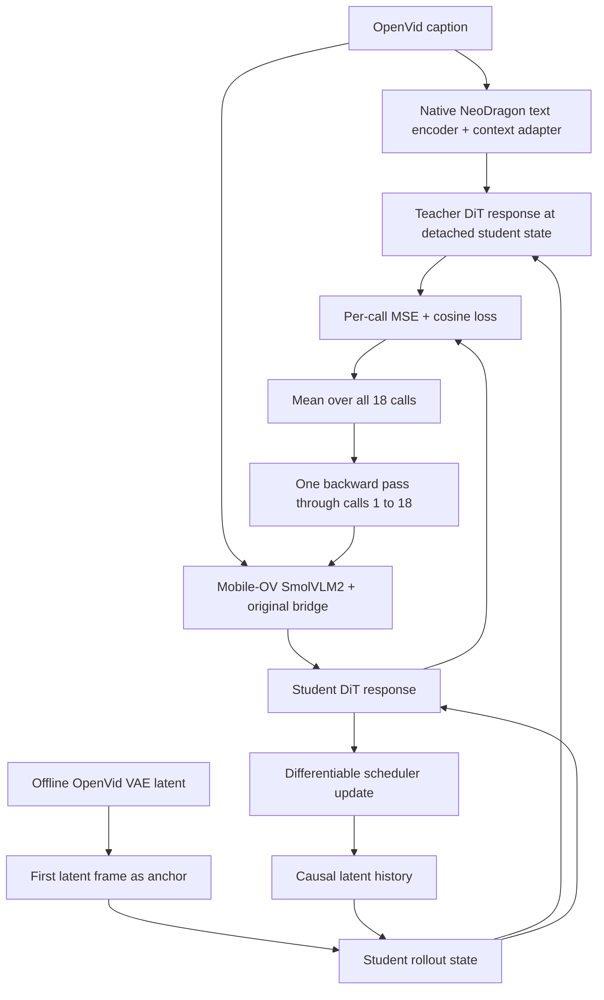

# NeoDragon Full-Rollout Bridge Distillation

## Executive Summary

The strongest Mobile-OV + NeoDragon checkpoint observed so far is the Exp1
bridge at step 64k. Extending the same bridge to step 200k did not produce a
meaningful quality gain. A direct weight comparison later showed that this
continuation was almost a no-op: the trainable bridge remained in BF16 while
using a small `1e-5` learning rate, so most optimizer updates were below the
representable BF16 increment.

The 64k result also exposed a second, independent limitation. Exp1's functional
loss evaluated only one randomly selected NeoDragon call per optimizer step,
whereas native hybrid inference is a causal sequence of:

```text
6 generated units x 3 pyramid stages = 18 DiT calls
```

Matching one isolated call does not teach the bridge how conditioning errors
propagate through the complete trajectory. The next experiment therefore keeps
the successful Exp1 architecture and representation losses, initializes from
the 64k checkpoint, and distills all 18 calls with one differentiable rollout.
Only the bridge is trained. The released hybrid NeoDragon DiT remains frozen.

## What Was Learned from 64k and 200k

### Exp1 at 64k

The 64k Exp1 checkpoint used the original direct Mobile-OV-to-NeoDragon
conditioning contract. It did not add a new context adapter or change the
generation architecture.

Its important training properties were:

| Property | Exp1-64k |
|---|---:|
| GPUs | 8 |
| Batch per GPU | 4 |
| Global batch | 32 |
| Optimizer steps | 64,000 |
| Prompt exposures | 2,048,000 |
| Caption sampling | short / medium / long = 1 / 1 / 1 |
| Base learning rate | `5e-5` |
| DiT | frozen released hybrid NeoDragon |
| Trainable model | original Mobile-OV bridge |
| Functional supervision | one random unit-stage call per step |

Its bridge objective combined:

```text
0.25 * raw token MSE
+ 1.00 * normalized token MSE
+ 0.50 * token cosine distance
+ 0.10 * token norm loss
+ 0.25 * pooled embedding MSE
+ 0.20 * pooled embedding cosine distance
+ 0.10 * relational loss
+ 1.00 * single-call DiT response MSE
+ 0.10 * single-call DiT response cosine distance
```

The complete representation objective, balanced caption sampling, larger
effective batch, and functional response supervision made this run visibly
better than the earlier 200k bridge-only distillation. The key lesson is that
step count alone did not explain quality. The target, optimization precision,
data exposure, and conditioning behavior mattered more.

### The 64k-to-200k continuation

The later continuation used a `1e-5` learning rate while the trainable bridge
parameters themselves were stored and optimized directly in BF16. Comparing
the resulting 200k and 64k bridge tensors measured:

| Measurement | Result |
|---|---:|
| Parameter cosine similarity | approximately `0.9999999983` |
| Relative parameter L2 change | approximately `5.86e-5` |
| Elements that changed | approximately `0.017%` |

This explains why inference at 200k looked almost identical to 64k. The result
does **not** show that another 136k useful updates failed to improve a converged
bridge. It shows that most intended updates were too small to modify the BF16
master weights.

The new trainer fixes this by retaining frozen inference modules in BF16 while
promoting all optimizer-owned bridge parameters to FP32. Autocast still
provides BF16 execution where appropriate, but AdamW updates are applied to
FP32 master parameters.

## Why One Functional Call Is Not Enough

NeoDragon hybrid inference is autoregressive. A later call does not receive an
independent random state. Its input contains latents produced by previous calls:

```text
call 1 -> scheduler update -> call 2 -> ... -> call 18
```

If only call `k` is matched, its loss updates the bridge response at one sampled
state, but it does not train how calls `1..k-1` construct that state. Small
conditioning errors can therefore accumulate across units and pyramid stages
even when the isolated-call loss is low.

This is consistent with the qualitative comparison:

- Exp1-64k can produce semantically correct videos.
- Increasing to 200k with nearly unchanged weights does not improve motion.
- Native NeoDragon still produces more natural motion on several prompts.
- A low one-call functional loss is therefore not sufficient evidence that the
  full generation trajectory is aligned.

## New Experiment: Full 18-Call BPTT

The experiment uses a native NeoDragon condition as the teacher and the
Mobile-OV bridge condition as the student. Both paths evaluate the same
on-policy state generated by the student. Teacher evaluation is detached and
uses no gradient; the student path remains differentiable through every
scheduler update and causal-history dependency.



For call `i`, the functional objective is:

```text
L_i = MSE(v_student_i, stopgrad(v_teacher_i))
    + 0.1 * cosine_distance(v_student_i, stopgrad(v_teacher_i))
```

The rollout objective is averaged rather than summed:

```text
L_rollout = mean(L_1, ..., L_18)
```

Averaging prevents the gradient scale from increasing by approximately 18x.
The final objective preserves all successful Exp1 representation terms:

```text
L_total = L_Exp1_representation + ramp(step) * L_rollout
```

The rollout coefficient ramps from zero to one over the first 2,000 additional
steps. This avoids an abrupt objective change at the 64k initialization.

## Memory Feasibility Measurement

Before implementing the production job, the differentiable rollout was
measured on one H200 NVL with 139.8 GiB VRAM. The measurement included forward,
backward, bridge gradients, and an AdamW optimizer step. The DiT was frozen and
the bridge was trainable, matching the proposed experiment.

| Differentiable calls | Activation checkpointing | Native text teacher resident | Peak allocated VRAM |
|---:|---|---|---:|
| 1 | no | no | 6.89 GiB |
| 3 | no | no | 8.57 GiB |
| 6 | no | no | 12.95 GiB |
| 18 | no | no | 28.21 GiB |
| 18 | last 40% | no | 18.06 GiB |
| 18 | all calls | no | 5.09 GiB |
| 18 | no | yes | 30.22 GiB |
| 18 | all calls | yes | 7.10 GiB |

The production path uses one rollout sample per GPU and a representation batch
of four prompts per GPU. Full 18-call training therefore fits comfortably on
H200 and should also fit within an 80 GiB A100 allocation. Activation
checkpointing is not enabled by default because the measured headroom is large;
it remains a fallback if a different software stack increases memory use.

The benchmark is reproducible with:

```bash
sbatch scripts/benchmark_neodragon_rollout_bptt_h200.sbatch
```

## Production Configuration

| Setting | Value |
|---|---:|
| Initialization | validated Exp1 checkpoint at step 64,000 |
| Final target | step 100,000 |
| New optimizer steps | 36,000 |
| GPUs | 8 |
| Representation batch per GPU | 4 |
| Representation global batch | 32 |
| Rollout batch per GPU | 1 |
| Functional trajectories per step | 8 |
| DiT calls per trajectory | 18 |
| Functional call targets per step | 144 |
| Additional prompt exposures | 1,152,000 |
| Additional rollout trajectories | 288,000 |
| Additional supervised DiT calls | 5,184,000 |
| Base LR | `1e-5` with FP32 master parameters |
| LR schedule | 500-step warmup, cosine decay to `1e-6` |
| DiT | frozen released hybrid NeoDragon |
| Caption variants | short / medium / long = 1 / 1 / 1 |

This run stops at 100k instead of continuing directly to 200k. It starts from
the empirically strongest checkpoint, limits unnecessary exposure, and creates
frequent checkpoints for direct inference comparison.

### Checkpoint schedule

`latest` is overwritten every 5,000 global steps:

```text
65k, 70k, 75k, 80k, 85k, 90k, 95k, 100k
```

Archived checkpoints are retained every 10,000 steps starting at 70k:

```text
70k, 80k, 90k, 100k
```

Expected files:

```text
output/neo_exp1_rollout_64k_to100k/
  neodragon_rollout_bridge_latest.pt
  neodragon_rollout_bridge_step070000.pt
  neodragon_rollout_bridge_step080000.pt
  neodragon_rollout_bridge_step090000.pt
  neodragon_rollout_bridge_step100000.pt
  history.json
```

The latest checkpoint includes bridge weights, FP32 AdamW optimizer state,
current global step, initialization metadata, complete arguments, and logged
history. Re-submitting the same script resumes automatically from
`neodragon_rollout_bridge_latest.pt`.

## Running on Berzelius

From the repository root:

```bash
sbatch scripts/exp1_rollout_distill_64k_to100k_1node8gpu.sbatch
```

The script uses the Berzelius account, CUDA module, private `neo_mobileov`
environment, shared cache paths, one node, and eight GPUs. It first searches for
the 64k checkpoint at:

```text
output/neo_exp1_bridge_functional/17108893/neodragon_text_bridge_latest.pt
```

It expects the prepared OpenVid latent manifest at:

```text
data/openvid_neodragon_2s_latents/latent_manifest.csv
```

Useful monitoring commands are:

```bash
squeue --me
tail -f logs/neo-exp1-rollout-<JOBID>.out
```

## Distributed Verification

The production trainer was exercised with a two-GPU H200 DDP smoke test rather
than only being syntax-checked. The test performed two real optimizer steps,
with 18 differentiable student calls per step, and verified the resulting
checkpoint payload. A second job then resumed from `latest` and completed one
more step. A final smoke used the production representation micro-batch of four
per GPU and measured `30.29 GiB` peak allocated memory per H200.

Verified behavior:

```text
2 NCCL ranks initialized
DDP bridge synchronization completed
native text teacher loaded on both GPUs
released hybrid DiT loaded and remained frozen
18-call forward and backward completed
bridge gradients and AdamW update completed
production batch-per-GPU=4 completed at 30.29 GiB peak allocated VRAM
latest and archive checkpoints were readable
resume restored step 64002 and continued to step 64003
history grew from 2 to 3 records
```

The local cluster required:

```text
NCCL_P2P_DISABLE=1
NCCL_IB_DISABLE=1
```

Without these settings, both ranks initialized but hung at their first NCCL
barrier. The Berzelius production script exports the same known-safe settings,
consistent with the repository's previous distributed jobs.

## Logged Evidence

Every log record reports:

- total and representation losses;
- all original Exp1 representation components;
- mean 18-call rollout MSE and cosine distance;
- stage 0, 1, and 2 rollout MSE;
- first-unit and last-unit rollout MSE;
- rollout ramp coefficient;
- learning rate and gradient norm;
- student and teacher condition norms;
- mask agreement;
- per-GPU peak allocated VRAM.

The first-versus-last unit comparison is especially important. If unit 0
improves but unit 5 remains poor, conditioning error is still accumulating
through the causal trajectory.

## Evaluation Decision

Checkpoints at 70k, 80k, 90k, and 100k should be compared against both native
NeoDragon and Exp1-64k using the same short, medium, and long prompts, seeds,
resolution, frame count, and inference schedule.

The experiment is successful only if it improves more than embedding metrics:

1. Semantic prompt fidelity remains at least as strong as Exp1-64k.
2. Motion naturalness moves closer to native NeoDragon.
3. Later generated units improve instead of degrading through the rollout.
4. No new flicker, color drift, or semantic collapse appears.
5. The 100k checkpoint is not selected automatically; an earlier archive can
   be the final checkpoint if qualitative quality peaks sooner.

This experiment deliberately does not unfreeze or flow-train the pruned
1-1-1 NeoDragon DiT. Its purpose is to answer one controlled question first:
whether full causal-response distillation can close the remaining behavior gap
while preserving the released hybrid generator.
