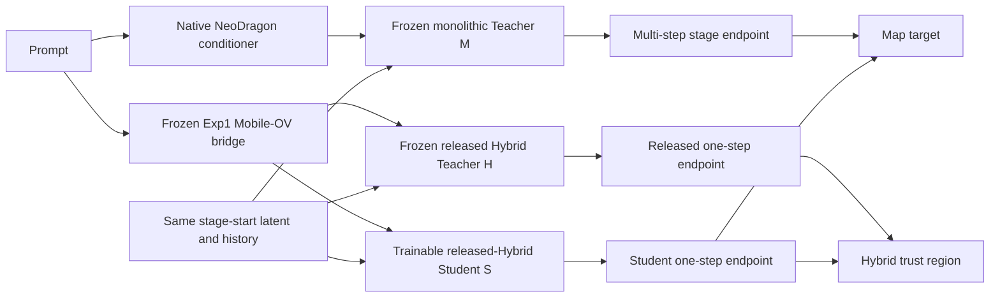
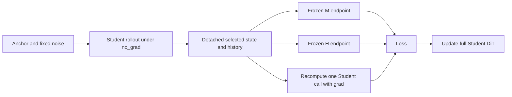

# Exp6: NeoDragon Hybrid Transition-Map Recovery

## Executive summary

Exp6 is a conservative full-DiT post-training experiment for the released
NeoDragon Hybrid model. It does not treat the Hybrid model as a generic
continuous flow field. Instead, it trains the exact inference program that the
released model executes:

```text
6 autoregressive latent units x 3 pyramid stages = 18 one-step maps
```

The Student starts from the released Hybrid DiT. A frozen monolithic
multi-step NeoDragon model supplies improved local stage endpoints, while a
second frozen copy of the released Hybrid model defines a behavior trust
region. The certified Exp1 Mobile-OV bridge is frozen and supplies the
Student/Hybrid text condition.

This is a 20K-step feasibility run. It tests whether the Hybrid DiT can improve
late-unit and high-resolution transitions without destroying its released
1-1-1 behavior. It is not yet a reproduction of NeoDragon's full DMD training.

## Why this experiment exists

Exp2, Exp3, Exp4, and Exp5 showed that low flow-matching loss is not sufficient
to preserve the released Hybrid generator. The released Hybrid checkpoint has
already been pruned and step-distilled. Its useful behavior is encoded in the
specific state distribution, causal history, pyramid stage, and sigma interval
used by the 1-1-1 inference schedule.

Random dense flow matching changes a different object:

```text
generic noisy latent + random continuous timestep -> velocity
```

The deployed Hybrid model instead executes:

```text
stage-start latent + causal generated history + one certified timestep
    -> stage endpoint
```

Exp6 therefore optimizes the second mapping directly.

## Model roles



### Teacher M

- Frozen monolithic NeoDragon DiT.
- Frozen native NeoDragon text encoder bundle and multistep context adapter.
- Ten denoising steps per selected pyramid stage.
- Native classifier-free guidance with scale 5.
- Produces a higher-compute endpoint from the exact state being supervised.

### Teacher H

- Frozen released Hybrid 1-1-1 DiT.
- Uses the same frozen Exp1 Mobile-OV bridge condition as the Student.
- Supplies the local baseline endpoint used by the trust loss.
- Does not define the improvement target because it cannot teach behavior
  better than itself.

### Student S

- Initialized from the released Hybrid checkpoint, not from random weights.
- All 18 DiT blocks are trainable.
- Keeps the released 1-1-1 inference schedule.
- Uses BF16 forward, FP32 trainable parameters, and gradient checkpointing.

The bridge, SmolVLM2, text conditions, VAE, and both teachers remain frozen.

## Exact transition state

For unit `u` and pyramid stage `s`, the trainer constructs:

```text
x_start[u,s]   stage-start latent
h[u,s]         causal latent history at the same pyramid resolution
c_mobile       Exp1 bridge condition
c_native       native NeoDragon condition
```

All three DiTs receive the same `x_start` and `h`. The conditions intentionally
differ:

```text
Student S and Teacher H: c_mobile
Teacher M:               c_native
```

The monolithic endpoint is:

```text
z_M = RolloutStage(M, x_start, h, c_native, 10 steps, native CFG)
```

The Hybrid and Student endpoints are:

```text
z_H = OneStepStage(H, x_start, h, c_mobile)
z_S = OneStepStage(S, x_start, h, c_mobile)
```

The stage scheduler, sigma endpoints, inter-stage upsampling, and corrective
noise are taken from the released NeoDragon implementation. The trainer does
not invent a replacement scheduler.

## Curriculum

All distributed ranks select the same mode and the same `(unit, stage)` at a
given optimizer step. This guarantees identical DDP forward counts while each
rank still reads different data.

The 18 positions are visited in a balanced cycle:

```text
(0,0), (0,1), (0,2), (1,0), ... (5,2), repeat
```

### Steps 1-500: Hybrid parity

```text
state actor: frozen Hybrid H
target:      frozen Hybrid H endpoint
```

Purpose:

- verify that the initialized Student reproduces the released model;
- warm the optimizer without immediately applying a large teacher shift;
- expose implementation errors before the model is allowed to move.

### Steps 501-5K: map initialization

```text
70% teacher_map
20% hybrid_replay
10% real_endpoint
```

`teacher_map` uses monolithic rollout states and monolithic stage endpoints.

`hybrid_replay` reaches the selected state with the released Hybrid actor, then
asks the monolithic teacher for the endpoint from that exact Hybrid state.

`real_endpoint` uses real OpenVid latent history and the clean pyramid latent as
a low-weight endpoint anchor.

### Steps 5K-20K: on-policy recovery

```text
45% teacher_map
30% student_replay
15% noisy_history
10% real_endpoint
```

`student_replay` rolls the Student under `no_grad`, detaches the selected state
and history, evaluates the monolithic teacher from that state, and recomputes
only the selected Student call with gradients.

`noisy_history` uses the same on-policy procedure and adds mild Gaussian
history corruption with strength sampled in `[0, 1/3]`.

This is replayed backpropagation:



It avoids retaining a graph through all preceding autoregressive calls while
still training on states the Student creates at inference time.

## Losses

### 1. Stage-unit normalized endpoint map

The primary loss is normalized Charbonnier:

```text
L_map = mean(sqrt(((z_S - z_target) / q[u,s])^2 + epsilon^2))
```

`q[u,s]` is a clamped EMA of the target transition RMS for each of the 18
positions. Per-position normalization is required because transition
magnitudes differ strongly across units and pyramid resolutions.

For normal map modes:

```text
z_target = z_M
```

For parity:

```text
z_target = z_H
```

For the real endpoint anchor:

```text
z_target = clean OpenVid pyramid endpoint
```

### 2. Endpoint cosine

```text
L_cos = 1 - cosine(flatten(z_S), flatten(z_target))
```

This preserves update direction when endpoint scale differs. Its default
weight is `0.05`; it supplements rather than replaces the endpoint loss.

### 3. Adaptive Hybrid trust region

The local teacher disagreement determines how far the Student may move:

```text
gap_MH = relative_l2(z_M, z_H; x_start)
margin = clamp(gap_MH, 0.02, 0.50)
gap_SH = relative_l2(z_S, z_H; x_start)
L_trust = relu(gap_SH - margin)^2
```

When M and H already agree, the Student receives little freedom to change.
When M clearly improves a difficult transition, the Student may move farther
before the trust penalty activates. The default trust weight is `0.15`.

### 4. Light real-data endpoint anchor

The real endpoint branch has weight `0.05`. It is intentionally not random
continuous flow matching. It uses the exact Hybrid stage-start schedule and
clean OpenVid causal history.

This preserves a weak connection to real data without making the failed
Exp2-5 objective dominant again.

### Total

```text
L = w_map * L_map + 0.05 * L_cos + 0.15 * L_trust
```

where `w_map=1.0` normally and `w_map=0.05` for `real_endpoint`.

## Optimization

The released 18-block DiT is split into conservative parameter groups:

| Parameters | Learning rate |
| --- | ---: |
| Middle 12 transformer blocks | `1e-6` |
| First 3 and last 3 blocks | `2.5e-7` |
| Input/output projections and modulation | `5e-7` |

The optimizer is AdamW with betas `(0.9, 0.95)`, zero weight decay, cosine
decay, 500 warmup steps, and gradient clipping at 1.0.

Lower edge-block learning rates are a trust-region choice. The first and last
blocks are especially sensitive to changing the representation accepted and
emitted by the distilled inference program.

## Deliberately deferred objectives

### Full Self-Forcing DMD

The released NeoDragon repository does not expose a complete fake-model
training contract for reproducing the paper's Pyramidal DMD objective. Exp6 v1
therefore does not pretend that endpoint regression is DMD.

The checkpoint metadata records:

```text
full_dmd_fake_model = false
```

A trainable fake model should be added only after the transition-recovery
pilot proves that late maps improve without baseline regression.

### Midpoint self-consistency

The released Hybrid checkpoint is certified at one stage-start transition per
stage. A generic direct `t_start -> t_end` versus composed
`t_start -> t_mid -> t_end` operator is not available for this one-step model.
Implementing it without validating intermediate-time semantics would create an
uncontrolled objective.

The checkpoint metadata therefore records:

```text
midpoint_self_consistency = false
```

### EMA Student

EMA is not enabled in the first pilot. A full FP32 EMA copy adds approximately
6 GB per GPU and another model-sized checkpoint payload. It should be evaluated
only after v1 establishes that the update objective is directionally correct.

## Data contract

The default Berzelius manifest is:

```text
data/openvid_neodragon_2s_latents/latent_manifest.csv
```

Each row must contain a precomputed latent path. The expected latent layout is:

```text
[C=16, T=7, H=40, W=64]
```

`T=7` means one first-frame anchor plus six generated latent units. Short,
medium, and long captions are sampled with equal weight.

The v1 implementation computes teacher trajectories online. It does not yet
cache an 18-transition teacher bank. Online computation is slower, but it
prevents stale-state or scheduler mismatches during feasibility testing.

## Distributed and memory design

Exp6 v1 uses DDP rather than FSDP:

- every H200/A100 holds the trainable Student and frozen teachers;
- ranks receive distinct data through `DistributedSampler`;
- all ranks execute the same mode and selected transition;
- replayed backprop retains a graph only for one Student call;
- DDP checkpoint and resume semantics stay simple.

The default global batch on Berzelius is:

```text
8 GPUs x batch 1/GPU = 8
```

The main checkpoint optionally includes Adam state for exact resume. Because
the Student has 1.512B FP32 trainable parameters:

```text
model-only archive: approximately 6 GB
latest with Adam state: approximately 18 GB
```

Model-only archives are saved separately to avoid tripling every archived
checkpoint.

## Local validation

The implementation was validated on two H200 GPUs.

### Static tests

```text
7 unit tests passed
Python compilation passed
Bash syntax checks passed
git diff whitespace checks passed
```

The unit tests cover:

- balanced coverage of all 18 positions;
- curriculum probability normalization;
- exact scheduler endpoint integration;
- rollout stopping before the selected call;
- endpoint normalization and adaptive trust margin;
- real-history teacher forcing;
- stage-unit EMA state restoration.

### Two-GPU branch smoke

Job `2897` completed successfully and exercised:

```text
hybrid_parity
teacher_map at stages 1 and 2
Student on-policy noisy_history
real_endpoint with real causal history
```

Observed examples:

```text
parity Student/H relative L2:     0.006
teacher-map Student/M relative L2: 0.313 at unit 0, stage 1
Hybrid/M relative L2:              0.313 at the same state
Student/Hybrid gap:                0.008
trust penalty:                     0
```

The near-zero Student/Hybrid gap confirms correct released-Hybrid
initialization. The nonzero M/H gap confirms that the monolithic target is not
trivially identical to the Hybrid target.

The first smoke run observed approximately `35.3 GiB/GPU` peak allocated
memory.

Job `2898` forced `noisy_history` at `(unit=5, stage=2)`. The Student replayed
all 17 preceding calls under `no_grad`, then recomputed call 18 with gradients.
It completed successfully with:

```text
Student/M relative L2: 0.283
Hybrid/M relative L2:  0.283
Student/Hybrid gap:    0.009
trust margin:          0.256
trust penalty:         0
peak allocated memory: 31.5 GiB/GPU
```

This covers the maximum causal-history position and confirms that replayed
backpropagation stays well below an 80 GB Berzelius GPU.

## Berzelius usage

Submit from the repository root:

```bash
sbatch scripts/exp6_train_neodragon_hybrid_recovery_1node8gpu.sbatch
```

Inspect status and the last 20 log lines:

```bash
squeue --me
tail -n 20 logs/neo-exp6-map-<JOBID>.out
```

Override a setting without editing the script:

```bash
STEPS=20000 BATCH_SIZE=1 sbatch scripts/exp6_train_neodragon_hybrid_recovery_1node8gpu.sbatch
```

The script resumes automatically from:

```text
output/neo_exp6_hybrid_recovery/<JOBID>/neodragon_exp6_latest.pt
```

To resume into a new job/output directory, provide the checkpoint explicitly:

```bash
RESUME=/absolute/path/neodragon_exp6_latest.pt \
OUT=output/neo_exp6_hybrid_recovery/resumed \
sbatch scripts/exp6_train_neodragon_hybrid_recovery_1node8gpu.sbatch
```

## Go/no-go criteria

Training loss alone must not select the checkpoint. Evaluation must use the
same prompts, seeds, first-frame anchors, and initial noise for M, H, and S.

Proceed beyond v1 only if:

- Student/M relative L2 becomes lower than Hybrid/M relative L2;
- the largest gain occurs at stages 1-2 and units 3-5;
- early transitions do not regress;
- motion and structure improve over released Hybrid;
- semantic adherence and color saturation do not degrade;
- inference remains the original 1-1-1 schedule.

Stop or reduce LR if:

- parity error grows before teacher-map improvement appears;
- trust loss activates persistently across easy transitions;
- Student/Hybrid distance grows while Student/M distance does not fall;
- videos become saturated, soft, unstable, or semantically weaker.

## Source references

- NeoDragon: <https://arxiv.org/html/2511.06055v1>
- Causal Forcing: <https://arxiv.org/abs/2602.02214>
- Causal-rCM: <https://arxiv.org/html/2606.25473v1>
- Salt: <https://arxiv.org/html/2604.03118v2>
- Pyramidal Flow Matching: <https://arxiv.org/html/2410.05954v2>
