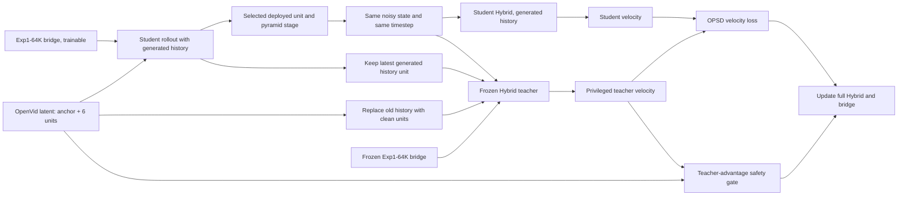

# OPSD-Neo Joint Fine-Tuning

## Decision

This experiment adapts the central idea of OPSD-V to NeoDragon without copying
its implementation mechanically. The released NeoDragon Hybrid and the
Exp1-64K Mobile-OV text bridge are both trainable, while frozen copies define a
safe reference policy.

The objective is not generic flow matching and does not reconstruct an OpenVid
latent directly. It teaches the deployed Hybrid transition map how its velocity
would change if old autoregressive context were cleaner.

The implementation is intentionally narrow:

- No new inference module or architecture is introduced.
- The deployed Hybrid `1-1-1` schedule remains unchanged.
- The Exp1-64K bridge architecture remains unchanged.
- Training uses the existing 49-frame OpenVid NeoDragon VAE latents.
- One deployed stage/unit call is differentiated per optimizer step.

The method is informed by the [OPSD-V paper](https://arxiv.org/html/2607.08766v1)
and its [official implementation](https://github.com/MeiGen-AI/OPSD-V), but the
conditioning mechanism is adapted to NeoDragon's raw multiscale latent history.

## Why Direct OPSD-V Is Not Correct

OPSD-V was designed around a causal diffusion transformer with a persistent KV
cache. Its student follows generated KV history, while its teacher replaces old
cache entries with ground-truth context and keeps the latest generated context.
Both predict velocity at the same student-visited noisy state and timestep.

NeoDragon differs in three important ways:

1. NeoDragon does not expose the same persistent KV-cache interface. Each DiT
   call receives a list of previous video latent units, transformed to the
   current pyramid resolution.
2. The released Hybrid executes one denoising call at each of three pyramid
   stages. With 49 decoded frames, the VAE produces seven temporal latent units:
   one anchor and six generated units. Deployment therefore contains 18
   transition maps, not a conventional multi-step diffusion trajectory.
3. The Hybrid has already been pruned and distilled for this `1-1-1` schedule.
   Random-timestep flow matching can move its weights away from the specialized
   transition maps that make it fast and usable.

Therefore, OPSD-Neo changes the teacher's latent history rather than a KV cache,
and matches the local velocity of the exact deployed call.

## Training Graph



## Exact State Construction

For a selected unit `u` and pyramid stage `s`:

1. Start from the real first latent unit as NeoDragon's anchor.
2. Run the current student under `torch.no_grad()` using the exact Hybrid
   `1-1-1` rollout until `(u, s)`.
3. Save the current stage-start latent `x`, generated history `H_gen`, and the
   scheduler timestep `t`.
4. Construct `H_priv` by replacing old generated units with matching OpenVid
   latent units while retaining the most recent generated unit.
5. Evaluate the frozen teacher twice at the same `(x, t)`:
   once with `H_gen` and once with `H_priv`.
6. Re-evaluate the trainable student once at `(x, t, H_gen)` with gradients.

Only the final target call keeps a graph. Earlier calls are still generated by
the current student, but are detached. This is truncated on-policy training: it
preserves deployment-state coverage without storing all 18 DiT graphs.

Units 0 and 1 have no older generated context that can be replaced meaningfully.
They therefore use frozen-Hybrid preservation rather than OPSD supervision.
Units 2-5 use privileged-history OPSD. All 18 deployed calls are visited in a
fixed balanced cycle shared by every distributed rank, preventing full-weight
updates on later units from silently degrading the six early transition maps.

## Losses

### Privileged velocity matching

Let `v_s` be the trainable Student velocity and `v_p` the frozen teacher
velocity under privileged history. For each stage/unit position, an EMA of the
teacher velocity RMS provides scale `r`:

```text
L_opsd = mean(((v_s - v_p) / r)^2)
```

This matches the model output used by NeoDragon's scheduler. It does not regress
the student endpoint directly to the clean OpenVid latent.

### Velocity direction

```text
L_cos = 1 - cosine(v_s, v_p)
```

This small auxiliary term prevents a low-magnitude solution from matching MSE
while moving in the wrong direction.

### Adaptive base trust region

The frozen Hybrid is also evaluated with generated history, producing `v_b`.
The privileged-vs-base difference defines how much change is justified. The
student is penalized only if its departure from `v_b` exceeds that allowance.

```text
allowed = clamp(||v_p - v_b|| / r, min_margin, max_margin)
L_trust = relu(||v_s - v_b|| / r - allowed)^2
```

This protects the released one-step transition maps when privileged context has
little useful information.

### Exp1 bridge anchor

The trainable bridge is weakly anchored to a frozen Exp1-64K bridge using
normalized-token MSE, token cosine, token norm, and pooled cosine losses.

```text
L_anchor = L_token_normed + 0.5 L_token_cos
         + 0.1 L_token_norm + 0.2 L_pooled_cos
```

The anchor weight is deliberately small. It prevents abrupt semantic drift but
still allows the DiT velocity objective to adjust the bridge where useful.

### Early-call preservation

For units 0 and 1, the Student matches the frozen Hybrid velocity under the same
generated state and fixed Exp1 condition:

```text
L_early = mean(((v_s - v_b) / r)^2)
```

This is a preservation constraint, not a new teacher or task. It protects the
six early stage/unit calls that have no privileged-history correction target.

### Teacher-advantage gate

Cleaner history is not guaranteed to improve every pruned one-step map. Before
using `v_p` as a target, both frozen teacher outputs are advanced through the
same scheduler step and compared with the corresponding clean latent endpoint.

```text
relative_gain = (error_base - error_privileged) / error_base
gate = clamp((relative_gain - margin) / ramp, 0, 1)
```

The clean endpoint only determines whether the privileged teacher is reliable;
it is not a regression target. The final objective is:

```text
OPSD positions:
  L = gate * (1.0 L_opsd + 0.05 L_cos)
    + 0.25 L_trust + 0.02 L_anchor

Early preservation positions:
  L = 0.10 L_early + 0.25 L_trust + 0.02 L_anchor
```

At step 120, training aborts if fewer than 10% of examples have a positive
teacher gate. This prevents spending a full Berzelius allocation on an invalid
teacher assumption.

## Optimization

| Component | Initialization | Precision | Learning rate |
|---|---|---:|---:|
| Hybrid middle blocks | Released Hybrid | FP32 master, BF16 forward | `2e-7` |
| Hybrid edge blocks | Released Hybrid | FP32 master, BF16 forward | `5e-8` |
| Hybrid input/output modules | Released Hybrid | FP32 master, BF16 forward | `1e-7` |
| Mobile-OV bridge | Exp1-64K | FP32 master, BF16 forward | `2e-6` |
| Frozen Hybrid teacher | Released Hybrid | BF16 | frozen |
| Frozen bridge teacher | Exp1-64K | BF16 | frozen |

The bridge LR is zero for the first 1,000 steps and ramps over the next 2,000
steps. This lets the DiT learn the new context correction before text
conditioning is allowed to move. All learning rates use warmup followed by
cosine decay to 20% of the initial value.

The default run uses 20,000 optimizer steps, eight GPUs, batch size one per GPU,
and all three caption granularities with equal probability. This corresponds to
160,000 sample exposures. It is a controlled adaptation run, not pretraining.

## Why DDP Instead of FSDP

Exp6 established that a trainable Hybrid plus a frozen teacher fits an 80 GB
A100. OPSD-Neo keeps only one differentiated DiT call, and the 2-GPU H200 smoke
peaked at approximately 30.6 GiB per GPU. DDP is therefore simpler and avoids
the FSDP state-dict and collective failure modes encountered in earlier work.

The full trainable Hybrid remains replicated. If Berzelius reports materially
higher memory on A100, gradient checkpointing is already enabled and batch size
must remain one; FSDP should be considered only after measuring an actual OOM.

## Failure Modes and Safeguards

| Risk | Consequence | Safeguard |
|---|---|---|
| Privileged history hurts a transition | Student learns a worse teacher | Per-sample teacher-advantage gate and step-120 abort |
| Training sees teacher states instead of deployment states | Inference mismatch | Current state always comes from the Student rollout |
| Full 18-call backpropagation exceeds memory | OOM and impractical runtime | One balanced target call per step; earlier calls detached |
| Random flow matching destroys Hybrid maps | VBench and motion regress | Match only the deployed stage timestep and velocity |
| Bridge drifts before DiT adapts | Semantic collapse | Frozen Exp1 teacher, bridge hold/ramp, anchor loss |
| Early Hybrid calls drift without OPSD targets | Initial motion maps regress | Frozen-Hybrid preservation on units 0-1 |
| One stage dominates scale | Unbalanced gradients | Per-unit/per-stage velocity RMS EMA |
| A wrong bridge checkpoint is selected | Invalid comparison | Hard step-64000 check and SHA256 provenance |
| Job interruption loses optimizer state | Resume changes trajectory | Latest checkpoint includes optimizer and EMA state |

## Metrics to Watch

`history_relative_l2` must be nonzero. If it is zero, privileged and generated
histories are accidentally identical.

`teacher_context_signal` measures the frozen teacher's velocity change between
generated and privileged histories. It should be nontrivial but not explosive.

`teacher_relative_gain` and `teacher_gate` are the critical validity metrics.
The running active fraction must pass the 10% safety threshold at step 120.

`opsd_velocity_mse` and `student_target_relative_l2` should decrease within each
stage/unit position. Compare positions separately because their scales differ.

`early_preserve_loss` should stay near zero for units 0-1. A rise means joint
fine-tuning is changing transition maps that OPSD cannot directly improve.

`student_base_gap` should normally stay within `trust_margin`. Persistent
`trust_loss` growth means the Student is leaving the released Hybrid too fast.

`bridge_anchor`, `bridge_token_cosine`, and `bridge_pooled_cosine` should remain
small. A rapid rise indicates semantic bridge degradation.

`teacher_gt_gain_diagnostic` is diagnostic only. A positive value means clean
history improved the frozen teacher endpoint for that sample.

## Validation Before Scaling

The code has passed the following checks:

- Python and shell syntax validation.
- Five CPU unit tests for full/OPSD position balancing, history replacement,
  trust margin, and teacher-gate behavior.
- A real-shape 2-GPU DDP smoke test using `[16, 7, 40, 64]` latents and all
  18 deployed stage/unit positions.
- Both ranks completed forward, backward, optimizer step, and NCCL collectives.
- The ungated smoke used approximately 30.6 GiB peak allocated VRAM per H200.
- Generated and privileged histories differed at OPSD positions
  (`history_relative_l2` approximately `0.45-0.75`).
- Early preservation and OPSD branches both delivered bridge gradients; the
  maximum early preservation loss was below `8e-5` in the smoke.

The synthetic smoke latents are generated outputs rather than true OpenVid
targets, so their teacher gain is not a quality result. The step-120 safety
check on the real OpenVid manifest is the first meaningful feasibility gate.

## Berzelius Commands

Submit:

```bash
sbatch scripts/exp7_train_neodragon_opsd_joint_1node8gpu.sbatch
```

Use a stable run name so a resubmission resumes the same directory:

```bash
RUN_NAME=opsd_neo_v1 sbatch scripts/exp7_train_neodragon_opsd_joint_1node8gpu.sbatch
```

Inspect the log:

```bash
tail -n 20 logs/neo-opsd-<JOBID>.out
```

Resume after timeout:

```bash
RUN_NAME=opsd_neo_v1 RESUME=auto sbatch scripts/exp7_train_neodragon_opsd_joint_1node8gpu.sbatch
```

The latest checkpoint is:

```text
output/neo_opsd_joint/opsd_neo_v1/neodragon_opsd_joint_latest.pt
```

Model-only archive checkpoints are written every 5,000 steps. The latest file
also contains optimizer state so it is larger but fully resumable.

The combined checkpoint already uses the existing inference format: it contains
both `bridge` and `dit`. A fixed-seed smoke inference can load both with one
argument:

```bash
python tools/infer_mobile_ov_neodragon.py \
  --condition-source bridge \
  --bridge-ckpt output/neo_opsd_joint/opsd_neo_v1/neodragon_opsd_joint_step005000.pt \
  --prompt "A red fox walking through gentle snowfall." \
  --seed 0 \
  --output-dir output/neo_opsd_joint_eval/step005000
```

## Go/No-Go Criteria

Continue beyond the first diagnostic window only if:

1. The teacher active fraction is at least 10%.
2. `history_relative_l2` is consistently nonzero.
3. The bridge anchor metrics do not trend upward sharply.
4. No stage/unit position shows exploding normalized velocity loss.
5. Short fixed-seed inference preserves Exp1-64K semantics and native Hybrid
   motion before a full VBench run is launched.

OPSD-Neo should be judged by fixed-seed video and VBench comparisons against
native NeoDragon and Exp1-64K. A lower training loss alone is not evidence that
the deployed 18-call trajectory improved.
