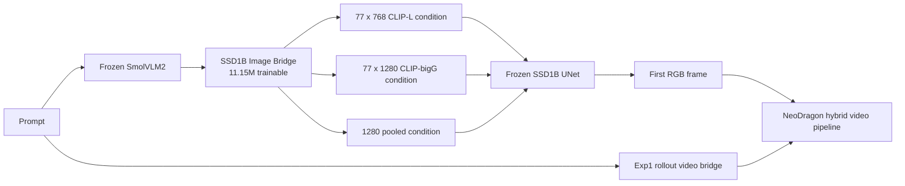
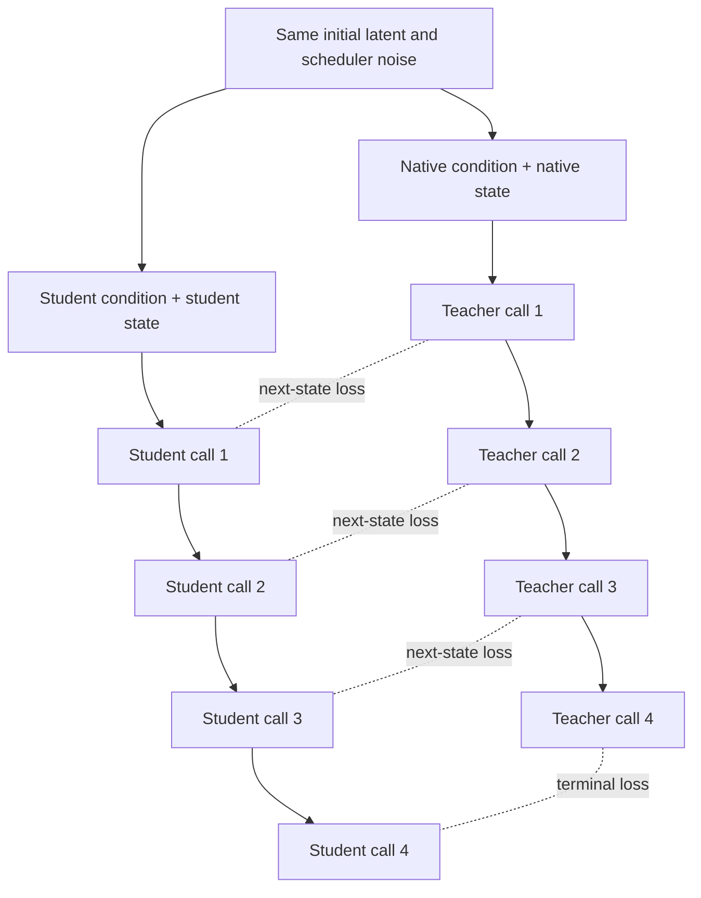

# SSD1B Image Bridge: 100K Evaluation and V2 Training Design

**Date:** 2026-07-29

**Checkpoint:** `ssd1b_image_bridge_step100000.pt`

**Checkpoint SHA256:** `7abb9217c3212b176f3bc6dfede58f4e984480fb6da2529420940b17752b29b1`

## Executive Summary

The first SSD1B Image Bridge is operational: one frozen SmolVLM2 forward plus an
11.15M-parameter bridge can replace SSD1B's native CLIP-L and CLIP-bigG
conditioning contract and generate valid images. The bridge stack uses 36.6%
fewer BF16 parameter bytes than the native dual-CLIP stack.

However, the 100K checkpoint does not yet preserve prompt identity and
composition reliably enough. The main findings are:

1. The original representation objective gave equal weight to all 77 token
   positions, although 67.6% of positions were padding for modified prompts.
2. Pairwise prompt geometry is partly preserved, but student embedding
   diversity is compressed. CLIP-bigG top-1 condition retrieval is only 11.46%.
3. One-step UNet parity looks reasonable, but error compounds across four LCM
   calls. The native and bridge trajectories reach a final relative error of
   0.969 with the modifier and 0.987 without it.
4. The generic quality modifier hurts this checkpoint: removing it improves
   independent CLIP prompt-image similarity from 0.1673 to 0.1895 and image
   sharpness from 181.7 to 272.6.
5. A real combined inference test succeeds. The Image Bridge can generate the
   first RGB frame and the Exp1 rollout bridge can condition NeoDragon video
   generation. NeoDragon preserves the supplied anchor, but cannot recover a
   missing object or incorrect action already present in that anchor.

These results motivate an objective-only V2. The bridge architecture and all
SSD1B output shapes remain unchanged. V2 adds mask-aware token supervision,
global retrieval and variance alignment, balanced UNet timesteps, and native
versus student closed-loop trajectory matching.

## System Under Test



The deployed Image Bridge contains:

- Frozen SmolVLM2: 507.48M parameters.
- Trainable query bridge and output heads: 11.15M parameters.
- Output contract: `[B,77,768]`, `[B,77,1280]`, and `[B,1280]`.
- No native CLIP encoder is needed after distillation.

The 100K checkpoint was trained with:

- 3.2M estimated representation prompt exposures.
- 670K estimated one-step functional prompt exposures.
- 90K rollout trajectories and 360K student UNet calls.
- Equal sampling of short, medium, and long OpenVid captions.
- FP32 trainable master weights and BF16 frozen-model inference.

## Evaluation Protocol

The comprehensive evaluation used fixed seeds and frozen model weights.

| Test | Prompt count | Purpose |
|---|---:|---|
| Condition evaluation | 384 | Alignment, retrieval, CKA, rank, and prompt geometry |
| UNet and trajectory evaluation | 96 | Same-state parity and four-step drift |
| Native/bridge image pairs | 30 | Visual comparison and image statistics |
| Independent CLIP evaluation | 30 | Prompt-image semantic alignment |
| Combined Image Bridge + Exp1 rollout | 6 | End-to-end image-to-video compatibility |

PSNR and SSIM compare bridge and native images generated from the same initial
noise. They measure fidelity to the native output, not standalone visual
quality. Independent CLIP prompt-image similarity and visual inspection are
used for semantic quality.

## Representation Findings

### Aggregate Alignment

| Output | Cosine distance | Top-1 retrieval | Top-5 retrieval | Linear CKA |
|---|---:|---:|---:|---:|
| CLIP-L tokens | 0.2780 | 41.93% | 73.44% | 0.7575 |
| CLIP-bigG tokens | 0.2385 | 11.46% | 27.34% | 0.9512 |
| Pooled condition | 0.1567 | 71.09% | 90.36% | 0.8917 |

High CKA with poor retrieval is important. It means the student retains broad
dataset-level structure but does not preserve enough prompt-specific identity.
This explains why globally plausible images can still miss the requested
object, relation, action, or style.

### Diversity Compression

| Output | Student effective rank | Native effective rank | Student participation | Native participation |
|---|---:|---:|---:|---:|
| CLIP-L | 27.92 | 70.59 | 11.25 | 30.73 |
| CLIP-bigG | 11.54 | 41.96 | 3.39 | 8.43 |
| Pooled | 60.38 | 86.96 | 30.36 | 41.75 |

CLIP-bigG is the clearest bottleneck: its first principal direction explains
53.18% of student variance, compared with 32.91% for the native teacher.
Representation MSE alone therefore permits a compressed solution that is easy
to optimize but weak at separating prompts.

### Padding Dominated the Original Objective

For the 384 evaluation prompts:

| Prompt form | Mean active tokens | Mean padding positions |
|---|---:|---:|
| Raw prompt | 13.99 / 77 | 63.01 / 77 |
| Prompt plus modifier | 24.93 / 77 | 52.07 / 77 |

With the modifier, 67.6% of the target sequence was padding. The original
trainer created an all-one mask and gave those positions the same loss weight
as semantic tokens.

The position-wise cosine distances expose the shortcut:

| Region | CLIP-L | CLIP-bigG |
|---|---:|---:|
| BOS | 0.0197 | 0.0362 |
| Positions 1-20 | 0.4838 | 0.5581 |
| Positions 21-55 | 0.2322 | 0.1735 |
| Positions 56-76 | 0.1706 | 0.0521 |

The bridge became best at common BOS/padding-like structure and worst at the
early content positions carrying most prompt semantics.

## Functional and Trajectory Findings

### Same-State UNet Parity

| SSD1B timestep | Relative RMSE |
|---:|---:|
| 999 | 0.0418 |
| 749 | 0.1199 |
| 499 | 0.1843 |
| 249 | 0.0968 |

Timestep 499 is the weakest region. Random timestep sampling did not guarantee
equal coverage per rank or per logging window.

### Original Rollout Objective

The original rollout fed the teacher the student's current latent. It therefore
measured a local question:

> If native and student conditioning see the same student state, are their next
> predictions close?

Teacher-on-student-state transition relative errors were:

| Call | Transition relative error |
|---:|---:|
| 1 | 0.1446 |
| 2 | 0.2427 |
| 3 | 0.2519 |
| 4 | 0.1308 |

This does not constrain the native trajectory and student trajectory to stay
together. Starting both from the same noise and letting each follow its own
state produced:

| Call | Latent relative error | Latent cosine distance |
|---:|---:|---:|
| 1 | 0.1446 | 0.0109 |
| 2 | 0.3942 | 0.0813 |
| 3 | 0.7153 | 0.2719 |
| 4 | 0.9688 | 0.5121 |

The local functional objective is useful, but it is insufficient by itself.
The V2 objective must directly supervise the free-running trajectory.

The original rollout also had an observability bug. Rollout events occurred at
`10001 + 8k`, while history was written every 20 steps. Those schedules never
intersected, so 11,250 rollout updates ran but zero rollout rows appeared in
`history.json`.

## Image-Level Findings

### Modifier Ablation

| Metric | With modifier | Raw prompt | Better |
|---|---:|---:|---|
| Native CLIP prompt-image cosine | 0.2627 | 0.2698 | Raw |
| Bridge CLIP prompt-image cosine | 0.1673 | 0.1895 | Raw |
| Bridge minus native | -0.0954 | -0.0803 | Raw |
| Bridge prompt-image retrieval top-1 | 50.0% | 50.0% | Tie |
| Bridge sharpness, Laplacian variance | 181.7 | 272.6 | Raw |
| Native/bridge image cosine | 0.7000 | 0.7018 | Similar |
| PSNR to native | 11.31 dB | 10.48 dB | Modifier |
| SSIM to native | 0.412 | 0.428 | Raw |

The modifier improves pixel fidelity slightly but suppresses semantic alignment
and sharpness. This is consistent with a shortcut: the repeated quality suffix
is easy to model and can dominate the unique prompt content.

The semantic gap without the modifier remains length-dependent:

| Prompt length | Native CLIP | Bridge CLIP | Gap |
|---|---:|---:|---:|
| Short | 0.2477 | 0.1952 | -0.0524 |
| Medium | 0.2550 | 0.2124 | -0.0425 |
| Long | 0.2936 | 0.1701 | -0.1235 |

Long compositional prompts remain the most difficult case.

## Combined Image-to-Video Test

The Exp1 rollout checkpoint downloaded from Hugging Face was verified as:

- Step: 80,000.
- Size: 1,082,250,934 bytes.
- SHA256: `8d1b013592635e23a9da242341e3173eb7e0db7b8ba237f29d7c1eeff353b5ba`.
- Video DiT: native frozen NeoDragon hybrid weights.
- Text conditioning: Exp1 full-rollout bridge.

Six short, medium, and long prompts were generated through both paths:

```text
Path A: prompt -> Exp1 rollout bridge -> native SSD1B first frame -> NeoDragon
Path B: prompt -> Image Bridge -> SSD1B first frame
        prompt -> Exp1 rollout bridge -> NeoDragon conditioned on that frame
```

All 12 videos completed successfully at 49 frames, 320x512, and 24 FPS.

| Stage | Mean time |
|---|---:|
| Image Bridge first frame | 0.259 s |
| Exp1 video with native first frame | 2.357 s |
| Exp1 video with Image Bridge first frame | 2.025 s |

All outputs contain exactly 49 frames. A lightweight decoded-frame motion check
shows that the combined path did not collapse into a static video:

| First-frame source | Mean adjacent-frame delta | Mean optical flow | First-to-last delta |
|---|---:|---:|---:|
| Native SSD1B | 0.00904 | 0.441 px | 0.1092 |
| Image Bridge | 0.01012 | 0.572 px | 0.0928 |

These are diagnostic motion magnitudes, not perceptual quality scores. They
confirm that the Exp1 video branch remains active after replacing the anchor.

The video branch preserves the externally supplied anchor and adds motion.
This validates the technical composition of the two independently distilled
bridges. It also shows the current quality bottleneck: when the Image Bridge
changes a red panda into a generic red animal, removes the dog, turns dancing
into sitting, or loses the chef, the video branch preserves that incorrect
content instead of repairing it.

Artifacts are stored under:

```text
output/image_bridge_to_exp1_rollout/
  first_frames/
  exp1_native_first_frame/
  image_bridge_first_frame/
  review/all_prompts_native_top_image_bridge_bottom.jpg
  metrics.json
```

## V2 Objective

V2 intentionally keeps the 11.15M-parameter architecture unchanged. This makes
the experiment a controlled test of the diagnosed objective failures.

### 1. Mask-Aware Token Distillation

For each CLIP branch:

```text
L_token =
    L_content
  + 0.50 * L_EOS
  + 0.15 * L_padding
```

Content and EOS positions now receive explicit supervision. Padding remains
weakly supervised because SSD1B still consumes all 77 positions, but it cannot
dominate the objective.

### 2. Prompt Identity and Anti-Collapse

V2 adds symmetric student-to-teacher and teacher-to-student retrieval losses
over the global DDP batch:

```text
L_retrieval = CE(S T^T / temperature) + CE(T S^T / temperature)
```

It also aligns per-dimension batch variance. Geometry loss says which prompts
are broadly similar; retrieval forces each prompt to remain identifiable;
variance alignment discourages low-rank collapse.

### 3. Balanced Functional Distillation

From step 10,001, non-trajectory updates use the frozen SSD1B UNet. Timestep is
selected by `(global_step + rank) mod 4`, so eight GPUs cover all four LCM
timesteps evenly instead of sampling them independently.

The functional loss weight is increased from 1.0 to 20.0. In the first run,
functional MSE near convergence was approximately 0.008, while representation
loss was approximately 0.75. A weight of 1.0 made functional supervision only
about 1% of the total objective.

### 4. Independent Closed-Loop Trajectories

From step 25,001, every fourth update runs:



The trajectory objective includes prediction relative MSE, prediction cosine,
per-step next-latent relative MSE/cosine, and an explicit terminal relative MSE.
Both scheduler paths receive identical random noise.

### 5. Curriculum and Data

| Phase | Steps | Main supervision |
|---|---:|---|
| A | 1-10K | Masked representation, retrieval, variance |
| B | 10K-25K | Representation plus balanced functional parity |
| C | 25K-100K | Functional parity plus independent closed-loop trajectories |

During Phase C, the representation anchor decays from 1.0 to 0.35 over 15K
steps. It is not removed, so functional training cannot freely destroy the
native condition contract.

Data changes:

- Short, medium, and long OpenVid captions remain equally sampled.
- The generic modifier is applied independently with probability 0.5.
- 20% of prompts come from a curated hard set covering counting, spatial
  relations, actions, style, and long composition.
- SmolVLM2 input length is capped at 128 instead of 512. This covers the target
  text window while removing unnecessary source padding and reducing the
  measured batch-16 temporary memory peak.

### 6. Observability

V2 logs every closed-loop event even when it does not coincide with
`log_every`. History includes:

- Content and padding cosine losses.
- Retrieval and variance losses.
- Functional timestep and parity.
- Per-step closed-loop transition relative MSE.
- Terminal trajectory relative MSE.
- Active representation and trajectory scales.

## Training

Berzelius launch command:

```bash
sbatch scripts/train_ssd1b_image_bridge_v2_1node8gpu.sbatch
```

Default output:

```text
output/ssd1b_image_bridge_v2/
```

The job trains from scratch for 100K steps on eight GPUs, saves
`ssd1b_image_bridge_latest.pt` every 5K steps, and archives every 10K steps.
The first submission starts from scratch because no latest checkpoint exists.
Later submissions resume automatically from the stable output directory.

## Acceptance Criteria

V2 should not be selected solely by training loss. It should improve all of the
following without regressing runtime substantially:

1. CLIP-bigG top-1 condition retrieval above 11.46%.
2. CLIP-L and CLIP-bigG effective rank closer to native values.
3. Raw-prompt bridge CLIP prompt-image cosine above 0.1895.
4. Long-prompt semantic gap materially below 0.1235.
5. Four-step terminal trajectory relative error below 0.987 and preferably
   below 0.5.
6. Correct preservation of object count, spatial relation, action, and style in
   the hard-prompt set.
7. Valid combined Image Bridge + Exp1 rollout videos with no first-frame
   discontinuity.

These are experiment targets, not guaranteed outcomes. The controlled design
lets the next evaluation identify whether objective correction is sufficient
before any architecture expansion is considered.
