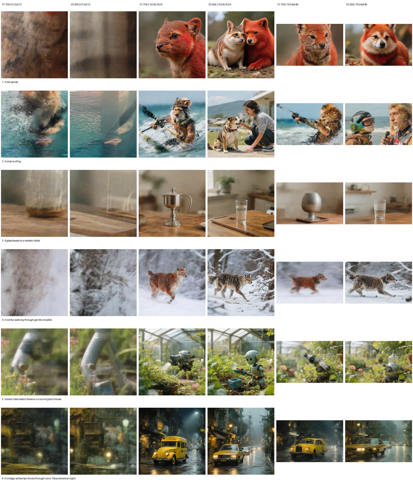
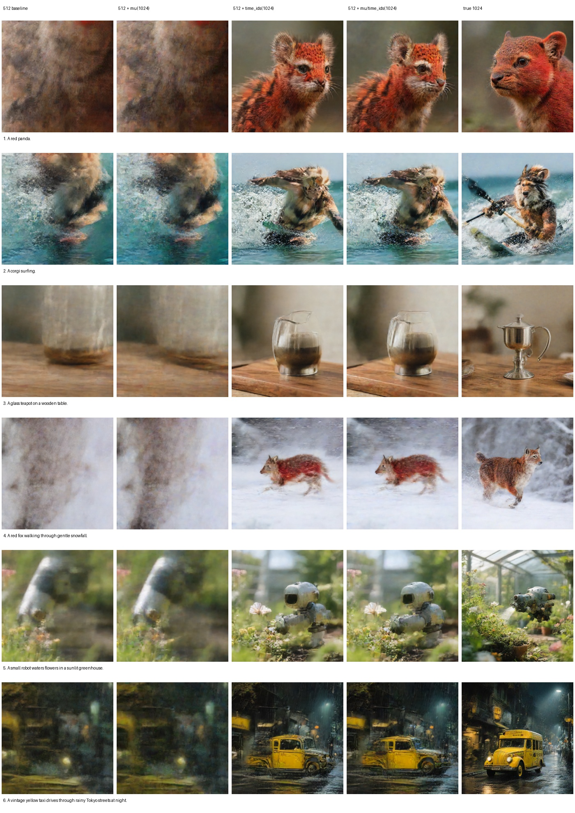
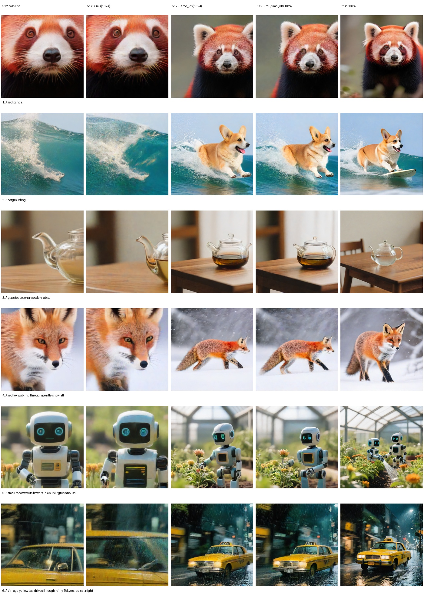

# Training Image Bridge DreamLite

> **Later versions.** This report records the analysis that led through V7.
> The continuation, including the V8 controlled VBench ablations and V9
> from-scratch recipe, is maintained in
> [DreamLite Image Bridge: V7 to V9](DREAMLITE_IMAGE_BRIDGE_V7_TO_V9.md).

**Date:** 2026-08-04

## Executive Summary

This report documents the latest DreamLite Image Bridge experiments and the
reason the bridge appeared substantially worse at `512x512` than at larger
resolutions. The key finding is that the problem is not explained by pixel
count alone.

DreamLite has two distinct resolution-dependent inputs:

1. The actual latent grid controls how many image tokens the UNet processes.
2. `time_ids=(width,height)` provides a global canvas-size condition to the
   UNet.

The controlled ablation shows that the second factor is dominant for framing
and composition. Keeping the actual image at `512x512` but changing only
`time_ids` from `(512,512)` to `(1024,1024)` recovers recognizable subjects and
more complete compositions for both the native Qwen3-VL condition and the
distilled V1 bridge. Changing only the scheduler shift has almost no visible
effect.

This changes the interpretation of earlier results:

- The V1 70K bridge was underestimated because it was mainly inspected at
  `512x512`, which is a difficult conditioning regime for this DreamLite
  checkpoint.
- The compact V3 bridge is not conclusively worse than V1. V3 was evaluated at
  step 30K while V1 had reached step 70K.
- Higher resolution does not repair a semantically incorrect bridge, but it
  exposes the bridge's learned capability much more faithfully.
- The next training run should keep the compact variable-length architecture,
  replace the current functional-state construction with teacher-forced native
  trajectory states, and use a resolution/time-ID curriculum rather than
  training every functional call at `512x512`.

## System Under Study

The deployed image path is:

```text
prompt
  -> frozen SmolVLM2
  -> trainable DreamLite Image Bridge
  -> variable-length [B, L, 2048] condition
  -> frozen DreamLite UNet, four denoising calls
  -> frozen Tiny VAE
  -> image
```

The native teacher path replaces SmolVLM2 and the bridge with Qwen3-VL. The
DreamLite UNet, scheduler, noise seed, output size, and number of denoising
calls remain identical when native and student conditions are compared.

Two bridge checkpoints were evaluated:

| Bridge | Step | Trainable parameters | Token contract | Main training characteristic |
|---|---:|---:|---|---|
| V1 | 70K | 11.15M | Fixed 128 tokens | Larger query bridge; representation and functional training |
| Compact V3 | 30K | 5.73M | Variable length | Compact bridge; exact prompt-dependent output length |

The comparison is useful for diagnosis but is not a controlled architecture
ablation because the checkpoints have seen different numbers of updates.

## Why Resolution Needed a Dedicated Ablation

At `512x512`, many bridge outputs looked blurry, over-cropped, or incomplete.
The same checkpoints produced substantially more coherent images at
`1024x1024`. Several explanations were initially possible:

- The smaller image simply contains too few pixels.
- DreamLite's scheduler uses a different timestep shift for different latent
  sequence lengths.
- The UNet uses an explicit global width/height condition.
- Bridge errors are amplified outside the native training distribution.

DreamLite's released mobile pipeline defaults to `1024x1024`. With an 8x VAE
downsampling factor, this corresponds to the checkpoint's configured latent
sample size of `128x128`. At inference, DreamLite also constructs:

```python
time_ids = (width, height)
```

and passes them to the UNet on every call. Separately, the scheduler computes a
dynamic shift from the actual latent token count. Therefore, changing the
output size changes both mechanisms at once unless they are explicitly
separated.

## Evaluation Protocol

Six prompts were generated with fixed seeds and four DreamLite denoising
calls. The suite covered short and compositional prompts:

1. `A red panda.`
2. `A corgi surfing.`
3. `A glass teapot on a wooden table.`
4. `A red fox walking through gentle snowfall.`
5. `A small robot waters flowers in a sunlit greenhouse.`
6. `A vintage yellow taxi drives through rainy Tokyo streets at night.`

The multiresolution test used five output shapes:

```text
512x512
768x768
1024x1024
1024x640
640x1024
```

The factorized resolution test used the same initial noise and separated
actual latent resolution, scheduler shift, and `time_ids`:

| Variant | Actual image grid | Scheduler shift | UNet `time_ids` |
|---|---|---|---|
| 1. Baseline | `512x512` | 512-derived | `(512,512)` |
| 2. Scheduler only | `512x512` | 1024-derived | `(512,512)` |
| 3. Time IDs only | `512x512` | 512-derived | `(1024,1024)` |
| 4. Both conditions | `512x512` | 1024-derived | `(1024,1024)` |
| 5. True 1024 | `1024x1024` | 1024-derived | `(1024,1024)` |

The ablation was run for both the native Qwen3-VL condition and the V1 70K
student condition.

## Finding 1: Image Size Strongly Changes Observed Bridge Quality

### V1 70K

| Resolution | Warm sampling time | Edge variance | Luma standard deviation | Entropy, bits |
|---|---:|---:|---:|---:|
| `512x512` | 0.249 s | 0.00282 | 0.1287 | 6.9087 |
| `768x768` | 0.229 s | 0.00382 | 0.1568 | 7.0604 |
| `1024x1024` | 0.259 s | 0.00920 | 0.1690 | 7.1887 |
| `1024x640` | 0.236 s | 0.00542 | 0.1609 | 7.1154 |
| `640x1024` | 0.234 s | 0.00609 | 0.1672 | 7.1859 |

The `1024x1024` output has 3.26 times the edge variance of the `512x512`
output. Visual inspection also shows that subjects and actions that appeared
missing at 512 can become recognizable at 1024. This means the 512-only review
was not a reliable estimate of the bridge's best generation behavior.

### Compact V3 30K

| Resolution | Warm sampling time | Edge variance | Luma standard deviation | Entropy, bits |
|---|---:|---:|---:|---:|
| `512x512` | 0.246 s | 0.00225 | 0.1237 | 6.8504 |
| `768x768` | 0.235 s | 0.00387 | 0.1720 | 7.1991 |
| `1024x1024` | 0.263 s | 0.01126 | 0.1986 | 7.4956 |
| `1024x640` | 0.241 s | 0.00471 | 0.1757 | 7.3295 |
| `640x1024` | 0.240 s | 0.00672 | 0.1817 | 7.3751 |

The V3 edge variance rises by 5.01 times from 512 to 1024. The larger image is
visually more complete, but some semantic errors remain: for example, a red
panda can become a fox/cat-like animal and a glass teapot may become a generic
glass object. Resolution therefore improves rendering and composition but does
not substitute for better semantic distillation.

Sampling time changes only slightly in this warm four-call measurement. These
numbers measure the denoising section in the current GPU environment, not
mobile end-to-end latency, and should not be interpreted as a deployment
benchmark.



## Finding 2: V1 70K Was Better Than Its Earlier 512 Evaluation Suggested

At high resolution, V1 70K followed several prompts better than compact V3
30K. In the six-prompt qualitative review:

- V1 was stronger on the red panda, surfing corgi, and teapot prompts.
- V3 was stronger on the robot and taxi prompts.
- The fox prompt remained ambiguous for both checkpoints.

A rough prompt-level count was V1 winning three examples, V3 winning two, and
one tie. This is not a final architecture result because V1 had 40K more
updates. It does establish two important points:

1. V1 70K is a meaningful baseline and should not be discarded based on the
   earlier 512 outputs.
2. Compact V3 must be trained to a comparable step count before its lower
   parameter count can be judged fairly.

The image statistics tell a complementary story. V3 at `1024x1024` has higher
edge variance and entropy than V1, but V1 is semantically better on more of the
tested prompts. Sharpness or entropy alone therefore cannot select the best
bridge.

## Finding 3: `time_ids` Is the Main Resolution-Control Factor

The factorized ablation provides the clearest result in this study:

- Replacing the 512 scheduler shift with the 1024 shift while leaving
  `time_ids=(512,512)` produces almost no visible recovery.
- Keeping the 512 latent grid and scheduler but setting
  `time_ids=(1024,1024)` dramatically restores the subject and full-scene
  composition.
- Changing both scheduler shift and `time_ids` is visually close to changing
  only `time_ids`.
- A true `1024x1024` grid adds detail and can further improve scene completion,
  but it is not the main reason the subject suddenly becomes recognizable.

This pattern occurs for both native Qwen3-VL and the distilled V1 condition.
The bridge is therefore not creating the size sensitivity by itself. It is
interacting with a real property of the released DreamLite generator.





### Interpretation

DreamLite does not treat width and height only as output-buffer dimensions.
They are learned global conditioning variables. At `(512,512)`, the model has a
strong tendency toward close-up framing and can amplify small student
conditioning errors into blurry or incomplete images. At `(1024,1024)`, the
same actual 512 latent grid can be interpreted as a larger logical canvas,
which encourages a more complete composition.

The correct mental model is therefore:

```text
actual width/height
  -> latent token count, compute, scheduler shift

logical width/height in time_ids
  -> learned global composition and scale condition
```

These two sizes can be decoupled during training and inference.

## Finding 4: The Current Functional Loss Uses the Wrong State for Later Calls

DreamLite denoises in four sequential calls. The state seen at call `k` is the
output of calls `0..k-1`; it is not fresh Gaussian noise sampled independently
at timestep `k`.

The current one-call functional branch samples a call index but feeds a fresh
initial Gaussian at that call's timestep. This is correct only for the first
call. For calls two through four, the UNet is supervised on a state outside the
native deployed trajectory distribution.

This mismatch can make the functional loss numerically small without teaching
the bridge how DreamLite actually reacts to its condition during generation.
It is analogous to measuring the correct function at the wrong input point.

The independent closed-loop loss does not fully solve this issue. Teacher and
student trajectories quickly move to different states, after which their
predictions are compared on different inputs. That mixes condition mismatch
with accumulated state mismatch and can produce a difficult or ambiguous
gradient.

The next run should use a simpler teacher-forced same-state objective:

```text
1. Sample call k from {0,1,2,3}.
2. Starting from shared noise, run native teacher calls 0..k-1 with no grad.
3. Detach the resulting native state x_k.
4. Evaluate native and student conditions on exactly the same (x_k, t_k).
5. Backpropagate only through the student condition at call k.
```

This preserves deployment realism without storing a four-call student graph or
comparing two diverged trajectories.

## Finding 5: Raw Embedding Scale Is Not the Most Important Target

DreamLite applies its own `text_proj_rms` projection to the 2048-dimensional
condition before the condition controls the UNet. This means that raw token
norm, raw mean, and raw variance are weaker behavioral targets than:

- normalized token direction;
- prompt-specific cosine separation;
- the representation after DreamLite's frozen text projection;
- same-state UNet response.

The bridge should still avoid collapsed outputs, but heavily weighting raw
moments can spend capacity matching differences that the frozen controller
normalizes away. The objective should focus more directly on the condition
space that DreamLite consumes.

## Recommended Next Training Design

### Architecture

Keep the compact V3 variable-length bridge:

- approximately 5.73M trainable parameters;
- prompt-dependent output length rather than unconditional 128-slot padding;
- FP32 master parameters and optimizer states;
- BF16 forwards for frozen SmolVLM2, Qwen3-VL, and DreamLite;
- frozen DreamLite UNet and Tiny VAE.

There is not enough evidence to add another architecture module. The next
experiment should first correct the objective and resolution distribution.

### Representation Loss

Let `C_s` and `C_t` be student and teacher token conditions after aligning
their valid sequence lengths. Let `P` be DreamLite's frozen
`text_proj_rms` path, and let `p_s`, `p_t` be pooled valid-token conditions.

```text
L_raw =
    0.5 * MSE(LN(C_s), LN(C_t))
  + 1.0 * cosine_distance(C_s, C_t)

L_projected =
    0.5 * MSE(LN(P(C_s)), LN(P(C_t)))
  + 1.0 * cosine_distance(P(C_s), P(C_t))

L_pooled = 0.25 * cosine_distance(p_s, p_t)

L_repr = L_raw + L_projected + L_pooled
```

All token losses must be mask-aware. Token norm, token mean/standard
deviation, and raw variance losses should be removed or assigned only a small
anti-collapse weight unless a new ablation proves that they improve behavior.

### Teacher-Forced Functional Loss

For a teacher-produced native state `x_k`:

```text
u_t = DreamLite(x_k, t_k, C_t)
u_s = DreamLite(x_k, t_k, C_s)

L_func = 5.0 * relative_MSE(u_s, stop_gradient(u_t))
       + 0.1 * cosine_distance(u_s, stop_gradient(u_t))
```

The proposed total objective is:

```text
L_total = L_repr + lambda_func(step) * L_func
```

with `lambda_func` ramped from zero to one rather than enabled abruptly.

### Resolution and Logical-Canvas Curriculum

The ablation supports using inexpensive actual grids while exposing DreamLite
to its native logical-canvas condition. A practical first curriculum is:

| Probability | Actual compute grid | Logical `time_ids` | Purpose |
|---:|---|---|---|
| 20% | `512x512` | `(1024,1024)` | Low-cost native-scale square proxy |
| 10% | `768x768` | `(1024,1024)` | Higher-detail square supervision |
| 5% | `1024x1024` | `(1024,1024)` | Exact native square anchor |
| 25% | `640x400` | `(1280,800)` | Low-cost landscape proxy |
| 20% | `1024x640` | `(1280,800)` | NeoDragon-compatible landscape anchor |
| 12% | `400x640` | `(800,1280)` | Low-cost portrait proxy |
| 8% | `640x1024` | `(800,1280)` | High-resolution portrait anchor |

The scheduler shift should continue to be computed from the **actual latent
grid**, while `time_ids` represent the **logical canvas**. This is the minimal
change supported by the ablation; there is no evidence that forcing a
1024-derived scheduler onto a 512 grid helps.

For the NeoDragon first-frame path, `1280x800` is a useful candidate because it
has the same 1.6 aspect ratio as NeoDragon's `1024x640` input and approximately
the native one-megapixel DreamLite canvas area. The DreamLite output can then
be downsampled to `1024x640` without cropping.

### Training Phases

```text
steps 0-5K:
  representation only

steps 5K-15K:
  representation + linear ramp of teacher-forced functional loss

steps 15K-100K:
  representation + full teacher-forced functional loss
```

Closed-loop and terminal-trajectory losses should be disabled in this run.
They can be reintroduced only if a teacher-forced checkpoint matches native
one-call responses but still shows measured four-call drift.

Editing data should also remain disabled until generation conditioning passes
the fixed prompt suite. This isolates the current problem and prevents editing
instructions from changing the prompt distribution before the generation
bridge is stable.

## Evaluation Gates for the Next Checkpoint

The next run should not be selected from training loss alone. Every archived
checkpoint should be evaluated with fixed seeds on:

1. Native versus student embedding alignment, with valid-token masks.
2. Alignment after DreamLite's frozen text projection.
3. Teacher-forced same-state UNet response at all four calls.
4. Free-running four-call trajectory drift, used as evaluation rather than an
   initial training objective.
5. Prompt-image semantics for short, medium, and long prompts.
6. Object identity, action, relation, count, and style prompt subsets.
7. Both native-scale and deployment-scale canvases:
   - true `1024x1024`;
   - true `1280x800` or `1024x640`;
   - low-compute `512x512` with logical `(1024,1024)`;
   - baseline `512x512` with logical `(512,512)`.

The final qualitative comparison must use identical seeds, actual grids,
logical `time_ids`, and denoising schedules for native and student conditions.

## Decision

The latest findings are a green light for another DreamLite bridge run, but not
for simply extending the current V3 recipe. The bridge is capable of producing
useful images, and V1 70K is materially better than its earlier low-resolution
review suggested. The main remaining weakness is semantic conditioning, not
the ability of DreamLite to render a complete image.

The most defensible next step is therefore:

```text
compact variable-length bridge
+ mask-aware raw and projected representation alignment
+ teacher-forced same-state functional distillation
+ actual-grid/logical-canvas resolution curriculum
- independent closed-loop loss for now
- editing data for now
```

This design directly follows the measured failure modes, preserves the compact
deployment target, and avoids adding architecture complexity before the
training objective has been corrected.

## V4 Implementation

The V4 training path implements the design above without adding trainable
modules. It uses the same compact, variable-length bridge as V3 (approximately
5.73M trainable parameters), but changes how DreamLite provides supervision:

- one resolution bucket is selected deterministically per global step, so all
  eight DDP ranks execute the same graph;
- actual output size controls latent shape and scheduler shift;
- logical canvas size is passed independently through DreamLite `time_ids`;
- for sampled call `k`, the frozen native teacher performs calls `0..k-1` to
  construct `x_k`, then teacher and student are evaluated on that same detached
  state;
- only the student condition path receives gradients;
- closed-loop loss is disabled rather than mixed with same-state supervision;
- raw and projected moment matching terms are disabled in the default V4 job.

The Berzelius job is submitted from the repository root with:

```bash
sbatch scripts/train_dreamlite_compact_v4_1node8gpu.sbatch
```

The default output is:

```text
output/dreamlite_compact_v4/<SLURM_JOB_ID>/
```

The job saves `dreamlite_image_bridge_latest.pt` every 5K steps and an archived
`dreamlite_image_bridge_stepXXXXXX.pt` every 10K steps. It uses all three
OpenVid caption granularities with equal probability and automatically resumes
from the latest checkpoint in the same output directory.

## V7: Mobile-O Prompt Mixing and Image-Grounded Functional Distillation

V7 keeps the V6 compact bridge unchanged at approximately 5.73M trainable
parameters. Qwen3-VL, SmolVLM2, the DreamLite UNet, and the DreamLite Tiny VAE
remain frozen. The change is entirely in the data curriculum and loss states.

The default source-level distribution is:

- 45% OpenVid short/medium/long captions;
- 36% merged Mobile-O JourneyDB + Short-Caption rows;
- 9% Mobile-O-SFT rows when that manifest is available;
- 10% synthetic semantic/compositional prompts.

Weights are applied at the manifest level rather than in proportion to raw row
counts. This prevents the one-million-row OpenVid manifest from suppressing the
smaller short-caption and SFT sources. The synthetic curriculum now includes a
larger object vocabulary and explicit scene categories such as kitchens,
libraries, laboratories, stations, aquariums, classrooms, and shops. It does
not contain the VBench prompt list.

Mobile-O rows retain their raw image path. On 25% of eligible functional
batches containing Mobile-O data, up to one raw image per GPU is encoded with
DreamLite's own Tiny VAE. A valid scheduler sigma constructs a noisy state from
this clean latent, and the frozen DreamLite UNet is evaluated twice on the same
state:

```text
raw Mobile-O image -> frozen DreamLite Tiny VAE -> clean target latent
clean target latent + noise + native sigma -> shared state x_k

frozen UNet(x_k, native Qwen condition)  -> teacher response
frozen UNet(x_k, Mobile-OV condition)    -> student response
```

The response and one-step transition losses are matched exactly as in regular
functional distillation. The raw image is not passed through the edit channel,
so an image-caption pair is never misrepresented as an editing example. Old
WanVAE latent pickles are intentionally ignored because they are not in
DreamLite's latent space.

Grounded functional supervision is scaled by 0.5 and shares the existing
functional ramp. All other functional steps retain the V6 generated-state
objective. Closed-loop training remains disabled.

Berzelius submission:

```bash
sbatch scripts/train_dreamlite_compact_v7_mobileo_1node8gpu.sbatch
```

The launcher expects the old Mobile-OV data under
`../Mobile-OV_Alpha/data` by default. Override `MOBILEO_ROOT`,
`MOBILEO_PROMPTS`, or `MOBILEO_SFT_PROMPTS` when needed. Its output is written
to `output/dreamlite_compact_v7_mobileo/<SLURM_JOB_ID>/`.
