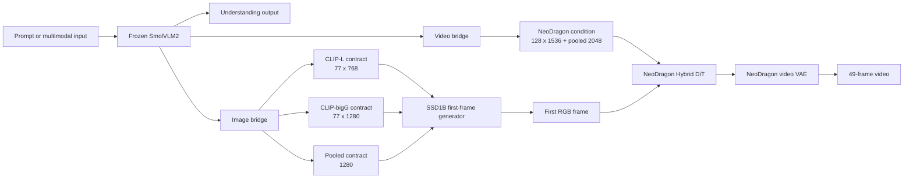

# Part 1: System, Data, and Methods

## 1. Research Goal

Mobile-OV is intended to share one compact multimodal understanding backbone
across understanding and generation. The long-term target includes:

- text and video understanding;
- text-to-image generation;
- text-to-video generation;
- image-to-video generation;
- image and video editing;
- a deployment path that remains realistic for mobile hardware.

The present work focuses on the conditioning and generation baseline. It asks
whether SmolVLM2 representations can replace the native text encoders expected
by efficient image and video generators without retraining those generators
from scratch.

## 2. Current Architecture



There are three distinct condition contracts:

1. SmolVLM2's native representations for understanding.
2. NeoDragon's post-ContextAdapter token and pooled conditions for video.
3. SSD1B's dual-CLIP token and pooled conditions for image generation.

The image and video heads are therefore not interchangeable. They can share the
SmolVLM2 forward pass, but each must reproduce the numerical and behavioral
contract of a different downstream generator.

## 3. Native NeoDragon Structure

Native NeoDragon contains:

- a native text encoder bundle;
- a ContextAdapter that maps text features to DiT conditioning;
- an SSD1B first-frame generator;
- an 18-block video DiT;
- an asymmetric causal video VAE;
- a pyramidal scheduler.

Hybrid generation uses:

```text
1 image anchor
6 generated latent units
3 pyramid stages per generated unit
18 one-step DiT calls
49 decoded RGB frames at 24 fps
```

The released Hybrid checkpoint is important because it is not an ordinary
flow-matching checkpoint. It is pruned and step-distilled for the `1-1-1`
schedule. Its success depends on a sequence of specialized transition maps,
not only on fitting the continuous flow field used by a monolithic model.

## 4. Video Bridge Contract

The original Mobile-OV NeoDragon bridge is deliberately direct:

```text
SmolVLM2 hidden states
  -> MCP lexical-gated projection and refinement
  -> token condition [B, 128, 1536]
  -> pooled projection [B, 2048]
```

The clean experiment family kept this architecture fixed. Exp1-Exp5 changed
losses, schedules, initialization, and trainable components, not the deployed
bridge architecture. This is crucial when interpreting old checkpoints:
architectural incompatibility was not the cause of their different quality.

## 5. Image Bridge Contract

The SSD1B Image Bridge maps one frozen SmolVLM2 forward to:

```text
CLIP-L-like tokens:    [B, 77, 768]
CLIP-bigG-like tokens: [B, 77, 1280]
pooled bigG feature:   [B, 1280]
```

It uses 11,148,293 trainable parameters. No additional native CLIP encoder is
required by the student path after distillation, but both native CLIPs remain
necessary during training as teachers.

No resampler was added before the output heads. All available SmolVLM2 tokens
remain visible to the bridge, and the bridge learns the fixed 77-token SSD1B
contract directly. This was chosen to minimize architecture complexity and
avoid discarding useful semantic tokens prematurely.

## 6. Data Pipeline

### 6.1 OpenVid-1M

The production manifest contains approximately 1,019,957 rows. The raw dataset
was downloaded as many resumable parts, extracted into the current repository,
and indexed by a local manifest.

The data pipeline was made restartable because both downloading and VAE
encoding exceed a single short interactive session:

- completed archive parts receive completion markers;
- interrupted files resume rather than restart;
- each GPU owns a deterministic manifest shard;
- existing latent files are skipped;
- failed samples are recorded separately;
- final shard manifests can be merged after all workers complete.

### 6.2 Multi-granularity captions

The recaptioned manifest provides:

```text
caption_short
caption_medium
caption_long
```

Exp1, Exp5, rollout distillation, and Image Bridge training use equal
short/medium/long sampling unless noted otherwise. Legacy Exp2-Exp4 use
`5:4:1`. Balanced sampling proved useful because it exposes the bridge to terse
VBench-like prompts as well as descriptive captions.

### 6.3 NeoDragon clip preparation

Long OpenVid videos are converted into the native NeoDragon training unit:

```text
duration:    about 2 seconds
frames:      49
resolution:  320 x 512 for prepared training clips
caption:     one sampled granularity
```

NeoDragon VAE encoding is performed offline on eight GPUs. Each rank encodes
roughly one eighth of the manifest. The resulting latent manifest is the input
to DiT training, avoiding repeated online video decode and VAE encode.

## 7. WanVAE Anchor Feasibility Study

Before the NeoDragon direction was finalized, a 100-video WanVAE experiment
tested an anchor-first Latent Motion Weaver design.

For 81 RGB frames at `480x832`:

```text
full video latent: [16, 21, 60, 104]
one-frame latent:  [16, 1, 60, 104]
```

Measured over 100 videos:

| Comparison | Mean cosine | Mean relative error |
| --- | ---: | ---: |
| `encode(first_frame, T=1)[:,0]` vs `encode(full_video)[:,0]` | 1.00000003 | 0.0000 |
| Full latent slice 0 vs slice 1 | 0.8281 | 0.5776 |
| Full latent slice 0 vs slice 2 | 0.7622 | 0.6654 |
| Independently encoded frame 10 vs full slice 0 | 0.8390 | 0.5345 |

Independent calls, cache clearing, and the frame-10 negative control ruled out
simple tensor reuse. The anchor assumption was therefore validated: WanVAE's
single first-frame latent is exactly compatible with the first temporal slice
of the full-video latent.

This was a green light for an anchor-first LMW, but it did not prove that a
small deterministic motion network could infer a full motion trajectory from
one frame and text. The project later prioritized the already fast NeoDragon
Hybrid baseline rather than scaling a new LMW training program.

## 8. Distributed Training Infrastructure

Production jobs use:

```text
cluster:              Berzelius
nodes:                normally 1
GPUs per node:        8
launcher:             torchrun
distributed backend: NCCL
sharding:             FSDP where full DiT training requires it
forward dtype:        BF16
trainable masters:    FP32 where small learning rates are used
```

Important engineering fixes included:

- initializing one process per GPU rather than one multi-GPU inference process;
- using deterministic per-rank data sharding;
- avoiding unnecessary collectives during independent VAE encoding;
- extending or removing end-of-job collectives that could time out when ranks
  completed at different times;
- using FP32 optimizer-owned parameters to prevent sub-BF16 updates from
  disappearing;
- preserving optimizer, scheduler, RNG, epoch, and batch offsets for exact
  resume;
- using a small GPU heartbeat only during CPU/network-heavy setup on clusters
  that terminate jobs with no GPU activity.

The VAE encoding timeout near 99% was caused by ranks reaching a final NCCL
collective at different times. It was not evidence that the per-rank encoders
had stopped. Resume logic allowed the unfinished shard to continue without
re-encoding completed files.

## 9. Evaluation Protocol

### 9.1 Controlled generation

The main diagnostic suite uses six prompts:

- two short prompts;
- two medium prompts;
- two long prompts.

Where possible, comparisons share:

- prompt text;
- random seed;
- first RGB frame;
- generation noise;
- Hybrid `1-1-1` schedule;
- decoder and output settings.

Sharing the first frame is mandatory when attributing motion differences to the
video condition or DiT. A first frame generated by a different image condition
changes the entire causal video trajectory.

### 9.2 Metric interpretation

| Metric | What it measures | What it does not prove |
| --- | --- | --- |
| Cosine/MSE on conditions | tensor alignment | downstream generation parity |
| Retrieval and CKA | prompt identity and global geometry | image/video quality |
| Same-state response error | local generator response | closed-loop trajectory stability |
| Adjacent RGB MAE | frame-to-frame pixel change | natural motion |
| First-last RGB MAE | long-range visual change | semantic correctness |
| Farneback flow | apparent motion magnitude | motion quality |
| Laplacian variance | content-sensitive sharpness proxy | perceptual quality |
| CLIP prompt-image/video | semantic alignment proxy | human preference |
| VBench | broad automated dimensions | perfect causal diagnosis |

The central methodological lesson is that local tensor metrics and training
loss must be paired with controlled closed-loop inference.
