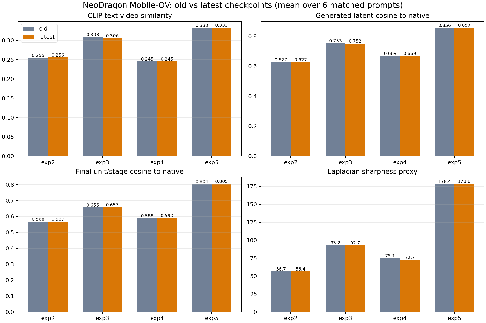
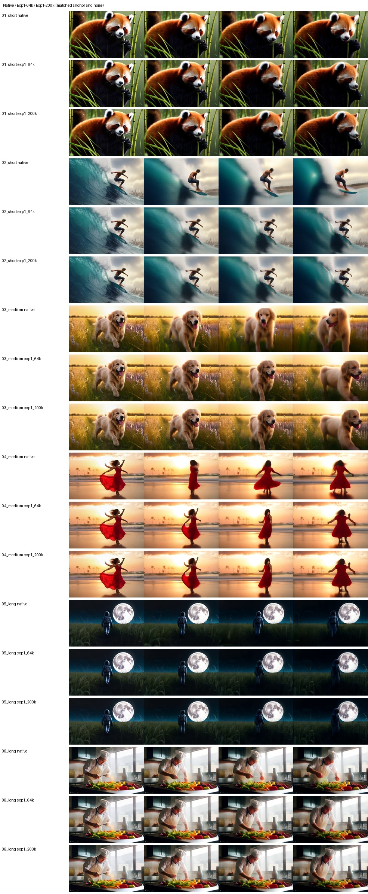
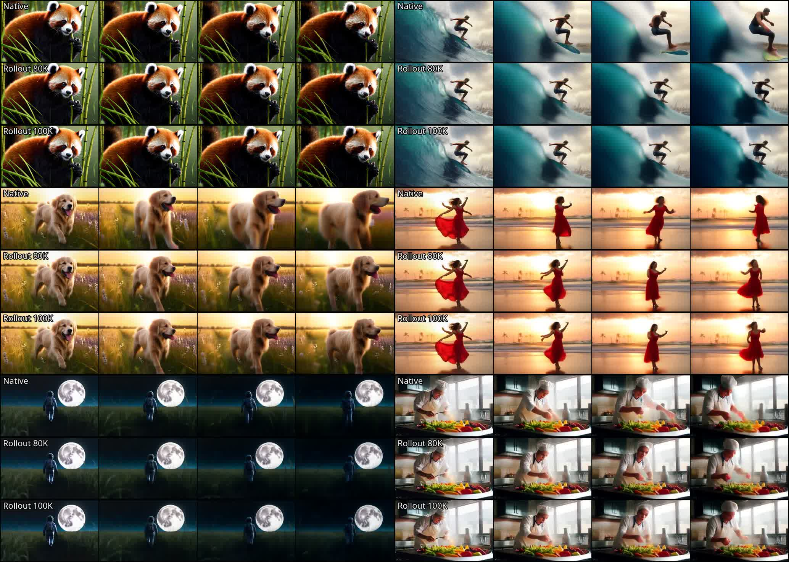
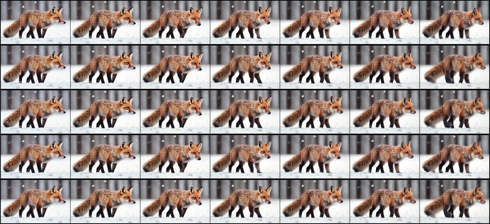
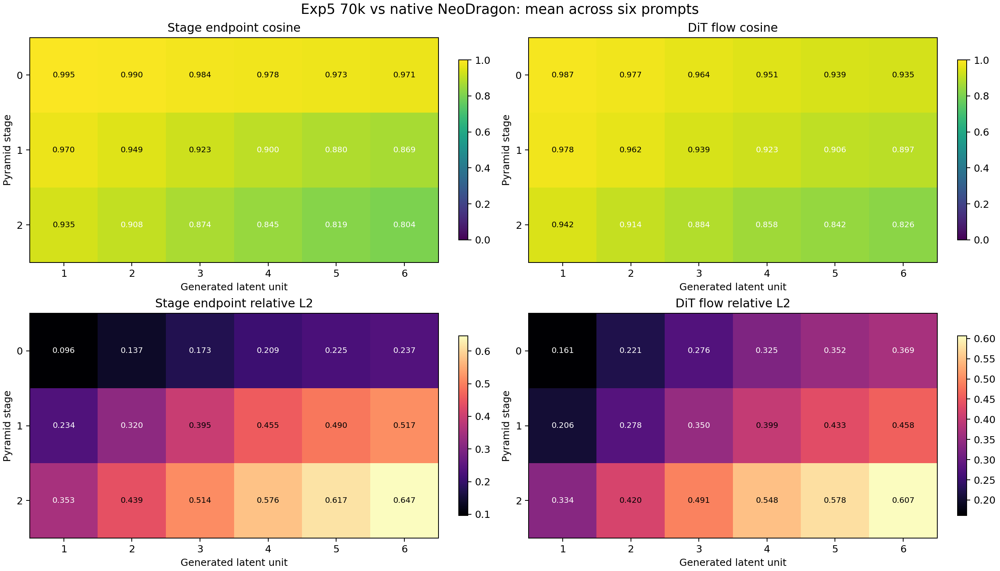

# Part 2: Video Bridge and DiT Experiments

## 1. Experiment Map

All experiments use the same deployed Mobile-OV video bridge architecture.
They differ in initialization, objective, schedule, and whether the released
NeoDragon Hybrid DiT is frozen.

| Experiment | Bridge initialization | DiT state | Main supervision | Final status |
| --- | --- | --- | --- | --- |
| Old bridge 200K | random | frozen | simple condition alignment | poor generation |
| Exp1 64K | random | frozen | full representation + one-call functional | successful bridge baseline |
| Exp1 continuation 200K | Exp1 64K | frozen | same family at low LR | invalid as a learning test; BF16 updates nearly zero |
| Exp1 rollout 80K/100K | Exp1 64K | frozen | representation + all 18 causal calls | valid, but no clear gain over 80K and motion remains below native |
| Legacy Exp2 240K | old 200K bridge | trainable | weak bridge anchor + flow + response + preservation | failed |
| Exp3 200K | random | trainable | full bridge losses + flow + response + preservation | failed |
| Exp4 200K | random | trainable | flow only | failed |
| Exp5 staged | Exp1 64K | trainable | protected staged joint training | bridge survived; DiT degraded |
| Exp6 2K | native conditions | trainable DiT | Hybrid transition-map recovery pilot | executable, no proven quality gain |



## 2. Shared Loss Definitions

### 2.1 Bridge representation loss

For valid teacher tokens, the complete Exp1 representation objective is:

```text
L_repr =
    0.25 * raw_token_MSE
  + 1.00 * normalized_token_MSE
  + 0.50 * token_cosine_distance
  + 0.10 * token_norm_loss
  + 0.25 * pooled_MSE
  + 0.20 * pooled_cosine_distance
  + 0.10 * distributed_relational_loss
```

Each term protects a different property:

- raw MSE preserves the absolute post-ContextAdapter numerical contract;
- normalized MSE emphasizes feature shape;
- cosine preserves direction;
- norm loss preserves attention-relevant scale;
- pooled losses supervise NeoDragon's global condition;
- relational loss prevents semantically different prompts from collapsing.

No single term is sufficient. The old 200K run showed that low average
embedding error can coexist with weak generation.

### 2.2 Frozen-DiT functional loss

Teacher and student conditions are sent through the same frozen released DiT at
the same scheduler-valid state:

```text
L_func =
    MSE(v_student, stopgrad(v_teacher))
  + 0.10 * cosine_distance(v_student, stopgrad(v_teacher))
```

This measures whether conditions produce the same local vector field, not just
whether their embeddings are numerically close.

### 2.3 Native flow matching

For clean video latent `x`, noise `eps`, and scheduler sigma `s`:

```text
x_noisy = s * eps + (1 - s) * x
v_target = eps - x
L_flow = MSE(DiT(x_noisy, condition, t), v_target)
```

This is a valid monolithic flow objective. The experiments show that it is not
enough to preserve the behavior of an already pruned and step-distilled Hybrid
DiT.

### 2.4 Response distillation

At the same real noisy latent:

```text
L_distill =
    MSE(v_trainable_DiT, stopgrad(v_released_DiT))
  + 0.10 * cosine_distance(...)
```

This remains teacher-forced and local. It does not directly supervise the
student-generated state distribution encountered after multiple causal calls.

### 2.5 Teacher-condition preservation

The trainable DiT is also evaluated with the original native text condition:

```text
L_preserve =
    MSE(v_trainable(native_condition), v_released(native_condition))
  + 0.10 * cosine_distance(...)
```

This protects native-condition behavior, but does not guarantee preservation
under the Mobile-OV bridge condition.

## 3. Old 200K Bridge

The original bridge-only distillation ran for 200K optimizer steps with:

```text
global batch: 8
prompt exposures: about 1.60M
base LR: 1e-4
frozen-DiT functional supervision: absent
```

Its training loss became numerically modest, but generation remained poor. The
main lesson was not that bridge distillation is impossible. The bridge was
optimized against an incomplete target: average condition similarity without a
strong downstream functional contract.

This checkpoint later became a harmful initialization in legacy Exp2. Direct
embedding closeness did not guarantee that it occupied a basin compatible with
the released Hybrid DiT.

## 4. Exp1: Successful Bridge-Only Functional Distillation

### 4.1 Setting

```text
GPUs:                     8
batch per GPU:            4
global batch:             32
steps:                    64,000
prompt exposures:         2.048M
caption ratio:            short/medium/long = 1:1:1
base LR:                  5e-5
bridge:                   random initialization, trainable
released Hybrid DiT:      frozen
functional supervision:  one random unit-stage call per step
```

The objective was:

```text
L_exp1 = L_repr + ramp(step) * L_func
```

At 64K, the run had seen more total prompts than the old 200K run and about
512K functionally supervised examples.

### 4.2 Why it succeeded

The key factors were:

1. The teacher target was the post-ContextAdapter condition actually consumed
   by NeoDragon.
2. Token direction, scale, pooled state, and distributed prompt geometry were
   all supervised.
3. The frozen DiT converted condition matching into behavioral matching.
4. The global batch of 32 stabilized geometry losses.
5. Equal caption sampling prevented short prompts from being underrepresented.
6. The released generator never moved, so the target contract stayed fixed.

Exp1 is evidence that the original architecture is sufficient for useful
conditioning. It is not evidence that direct embedding losses alone are
sufficient.

## 5. Exp1 64K-to-200K Continuation

The continuation appeared to show that another 136K steps did not improve
generation. Weight analysis changed that interpretation:

| Measurement | 64K versus 200K |
| --- | ---: |
| Parameter cosine similarity | approximately 0.9999999983 |
| Relative parameter L2 change | approximately `5.86e-5` |
| Elements that changed | approximately 0.017% |

The bridge parameters were stored and optimized in BF16 with a `1e-5` learning
rate. Most intended AdamW updates were below the representable BF16 increment.
The run therefore performed optimizer steps without meaningfully changing the
model.



The correct conclusion is:

```text
The 200K continuation was nearly a no-op.
It does not prove that Exp1 saturates at 64K.
```

Subsequent trainers keep frozen inference modules in BF16 but use FP32 master
parameters for trainable bridge weights.

## 6. Exp1 Full-Rollout Distillation

### 6.1 Motivation

One random functional call does not reproduce NeoDragon's causal inference:

```text
call 1 -> scheduler update -> call 2 -> ... -> call 18
```

Later calls consume states created by earlier calls. A bridge can match an
isolated local response while accumulating error across the full trajectory.

### 6.2 Setting

```text
initialization:             Exp1 64K
target step:               100K
new steps:                 36K
representation batch/GPU: 4
rollout batch/GPU:         1
global representation:    32 prompts
trajectories per step:     8
calls per trajectory:      18
supervised calls per step: 144
additional prompt views:   1.152M
additional trajectories:  288K
additional call targets:  5.184M
LR:                        1e-5 -> 1e-6 cosine
trainable masters:         FP32
released DiT:              frozen
caption ratio:             1:1:1
```

For call `i`:

```text
L_i = MSE(v_student_i, stopgrad(v_teacher_i))
    + 0.10 * cosine_distance(...)

L_rollout = mean(L_1 ... L_18)
L_total = L_repr + ramp(step) * L_rollout
```

The teacher is evaluated on the detached student state. The student graph stays
differentiable through all earlier scheduler updates, so a late-call loss can
backpropagate through calls `1..i`.

### 6.3 Memory feasibility

Measured on one H200:

| Calls | Activation checkpointing | Native teacher resident | Peak VRAM |
| ---: | --- | --- | ---: |
| 1 | no | no | 6.89 GiB |
| 3 | no | no | 8.57 GiB |
| 6 | no | no | 12.95 GiB |
| 18 | no | no | 28.21 GiB |
| 18 | last 40% | no | 18.06 GiB |
| 18 | all calls | no | 5.09 GiB |
| 18 | no | yes | 30.22 GiB |
| 18 | all calls | yes | 7.10 GiB |

The production batch-four test measured about 30.29 GiB peak allocation per
H200, so the design also fits 80 GiB Berzelius GPUs.

### 6.4 Result

Controlled six-prompt motion diagnostics with the same native SSD1B anchors:

| Metric | Native | Rollout 80K | Rollout 100K |
| --- | ---: | ---: | ---: |
| Adjacent RGB MAE | 0.01626 | 0.01097 | 0.01111 |
| First-last RGB MAE | 0.13055 | 0.10781 | 0.10868 |
| Corrected flow at `256x160` | 0.54574 | 0.28313 | 0.27881 |
| Mean Laplacian variance | 177.28 | 197.79 | 194.57 |
| RGB MAE to native | - | 0.06385 | 0.06400 |



The 100K model is not a clear aggregate improvement over 80K. Some prompts
improved while surfer and astronaut regressed. Both rollout checkpoints remain
substantially less dynamic than native NeoDragon.

Full-rollout supervision is therefore a methodological improvement, not yet a
quality solution.

## 7. Legacy Exp2: Old Bridge Plus Joint DiT Training

### 7.1 Setting

```text
bridge init:                 old 200K bridge
DiT init:                    released Hybrid
final step:                 240K
batch/GPU:                  1
global batch:               8
DiT LR:                     3e-6
bridge LR:                  1e-5
flow weight:                peak 0.3, final 0.1
functional bridge loss:     disabled
raw/relational bridge loss: disabled
preservation frequency:     every 4 steps
caption ratio:              5:4:1
```

This was not a controlled initialization ablation against Exp3 because it used
weaker bridge supervision and a different flow schedule. A corrected Exp2
script was later added, but the failed legacy checkpoint remains useful for
diagnosing negative transfer from the old bridge.

### 7.2 Final diagnostics

| Metric | Exp2 final |
| --- | ---: |
| Condition cosine similarity | 0.5179 |
| Pooled cosine similarity | 0.5084 |
| Generated-latent cosine | 0.6267 |
| Local-flow cosine | 0.7801 |
| Endpoint cosine | 0.7368 |
| Unit 6 / stage 2 cosine | 0.5671 |
| CLIP text-video | 0.2556 |
| Sharpness proxy | 56.41 |

Despite moderate condition similarity, generated behavior was poor and did not
recover between 90K and 240K.

## 8. Exp3: Full Joint Objectives From a Random Bridge

### 8.1 Setting

```text
bridge init:              random
DiT init:                 released Hybrid
final step:              200K
DiT LR / bridge LR:      3e-6 / 1e-5
flow schedule:           0.05 -> 0.30 -> 0.10
bridge repr scale:       1.0 -> 0.1
functional scale:        0 -> 1.0 -> 0.1
functional frequency:    every 4 steps
preservation frequency:  every 4 steps
caption ratio:           5:4:1
```

### 8.2 Final diagnostics

| Metric | Exp3 final |
| --- | ---: |
| Condition cosine similarity | 0.0998 |
| Pooled cosine similarity | 0.0761 |
| Generated-latent cosine | 0.7518 |
| Local-flow cosine | 0.8694 |
| Endpoint cosine | 0.8465 |
| Unit 6 / stage 2 cosine | 0.6569 |
| CLIP text-video | 0.3059 |
| Sharpness proxy | 92.70 |

Exp3 had much worse direct condition similarity than Exp2 but better generated
behavior. This is strong evidence that condition cosine alone is not a reliable
model-selection metric. It suggests negative transfer from the old bridge, but
does not prove random initialization is better because Exp2 and Exp3 were not
otherwise identical.

## 9. Exp4: Flow-Only Joint Training

Exp4 removed all native teacher, preservation, representation, and functional
losses:

```text
L_exp4 = scheduled_weight * L_flow
```

It trained the random bridge and full released Hybrid DiT for 200K steps with
the same `3e-6 / 1e-5` learning rates and `5:4:1` caption ratio.

This was the clearest test of the hypothesis that enough OpenVid flow matching
would make the model work. It failed. From 150K to 200K:

```text
generated-latent cosine: 0.66905 -> 0.66870
critical unit cosine:    0.58822 -> 0.58978
CLIP text-video:         0.24528 -> 0.24530
sharpness:               75.06 -> 72.73
```

More steps did not produce recovery.

## 10. Why Exp2-Exp4 Failed

### 10.1 Teacher-forcing mismatch

Training sampled real noisy OpenVid latents. Inference visits states generated
by previous one-step Hybrid calls. These distributions are not the same.

### 10.2 Wrong granularity

Local response loss asks whether one prediction is close at one externally
provided state. It does not constrain the 18-call endpoint or the causal
history.

### 10.3 Hybrid is not monolithic

The Hybrid model's `1-1-1` behavior was created by pruning and step
distillation. Generic flow MSE does not preserve the exact one-step transition
map or stage-specific corrections.

### 10.4 Preservation used the wrong condition

Native-condition preservation can remain low while Mobile-OV-conditioned
behavior degrades. The model is protected where the native teacher operates,
not necessarily where the bridge sends it.

### 10.5 Uniform averages hide critical calls

Errors grow across units and stages. Averaging all samples and timesteps can
hide late-stage failures that dominate final decoded quality.

### 10.6 Weak text usage

At Exp5 step 70K, shuffled text barely changed flow loss:

```text
correct-caption flow loss:  0.76131
shuffled-caption flow loss: 0.77291
text sensitivity:           0.00308
off-diagonal condition cos: 0.96836
```

The model could reduce flow loss without learning strong prompt dependence.

## 11. Exp5: Protected Staged Joint Training

### 11.1 Design

Exp5 attempted to preserve the successful Exp1 bridge while adapting the DiT:

```text
initial bridge: Exp1 64K
initial DiT:    released Hybrid
total steps:    255K
batch/GPU:      1
DiT LR:         3e-6
bridge LR:      1e-6
caption ratio:  1:1:1
latest save:    every 5K
archive save:   every 20K
```

Phases:

| Phase | Steps | Bridge | DiT | Purpose |
| --- | ---: | --- | --- | --- |
| A | 1-10K | frozen | trainable | DiT warmup under strong bridge |
| B | 10,001-130K | trainable with full protection | trainable | joint refinement |
| C | 130,001-255K | frozen | trainable | DiT consolidation |

The DiT objective combined flow, response distillation, and preservation. Phase
B additionally used full Exp1 representation and functional losses.

### 11.2 Result

At step 30K, compared with Exp1-64K:

| Six-prompt mean | Exp1-64K | Exp5-30K | Change |
| --- | ---: | ---: | ---: |
| Adjacent MAE | 2.873 | 2.185 | -23.9% |
| First-last change | 25.065 | 23.506 | -6.2% |
| Optical flow | 0.267 | 0.230 | -13.9% |
| Mean sharpness | 205.7 | 195.7 | lower |
| Last-frame sharpness | 168.0 | 135.4 | lower |


Step 70K remained close to step 30K. More training did not clearly recover the
lost dynamics or late-frame detail.

### 11.3 Component-swap ablation

| Bridge | DiT | Flow | Mean sharpness | Last sharpness |
| --- | --- | ---: | ---: | ---: |
| Exp1-64K | released | 0.3111 | 176.50 | 185.96 |
| Exp5-30K | Exp5-30K | 0.3451 | 144.59 | 104.75 |
| Exp5-70K | Exp5-70K | 0.3353 | 146.14 | 108.19 |
| Exp5-70K | released | 0.3110 | 178.03 | 194.30 |
| Exp1-64K | Exp5-70K | 0.3354 | 146.01 | 110.74 |



The degradation follows the Exp5 DiT, not the Exp5 bridge. The bridge remains
useful when paired with the released DiT.

The training checkpoint was about 9.53 GiB because it included:

| Payload | Approximate size |
| --- | ---: |
| DiT weights | 2.92 GiB |
| Bridge and shared-state weights | 0.96 GiB |
| DiT AdamW state | 5.63 GiB |
| Bridge AdamW state | 0.02 GiB |

This is a training-state size, not the deployed inference size.

## 12. Stage and Unit Analysis

Exp5-70K and native NeoDragon were traced under the same first frame and
generation noise:

```text
mean condition cosine:       0.5094
mean pooled cosine:          0.5930
mean generated-unit cosine:  0.8563
mean local-flow cosine:      0.9235
mean endpoint cosine:        0.9204
calls per prompt:            18
```



The high average flow cosine did not imply equal final quality. Differences
were structured by unit and stage and accumulated through the causal path. This
reinforces the need for stage-aware endpoint evaluation rather than a single
global local-response average.

## 13. Exp6: Hybrid Transition-Recovery Pilot

Exp6 tested a different question: can the released Hybrid DiT be adjusted
toward teacher transition maps while remaining in a tight trust region?

### 13.1 Setting

```text
steps:                    2,000
global batch:             8
trainable DiT params:     1,568,778,304
middle-block LR:          1e-6
edge-block LR:            2.5e-7
input/output LR:          5e-7
map MSE weight:           1.0
map cosine weight:        0.05
Hybrid trust weight:      0.15
real endpoint weight:     0.05
```

The 6.16 GB checkpoint contains model weights for a roughly 1.57B-parameter
FP32 trainable DiT. Its size is expected.

### 13.2 Logged transition evidence

Representative relative-L2 diagnostics:

| Mode | Student to target | Hybrid to target | Student-Hybrid gap |
| --- | ---: | ---: | ---: |
| Teacher map | 0.1053 | 0.1488 | 0.0848 |
| Student replay | 0.0922 | 0.1648 | 0.1249 |
| Noisy history | 0.0926 | 0.1448 | 0.0928 |
| Real endpoint | 0.4892 | 0.4979 | 0.0875 |

The pilot executed without collapse and sometimes moved closer to the selected
target while remaining near Hybrid. However, the end-to-end evaluation did not
show a controlled quality gain over the released Hybrid DiT. Exp6 is therefore
a valid implementation pilot, not a successful model checkpoint.

## 14. Consolidated Video Findings

1. The original bridge architecture is adequate; Exp1 proves this.
2. Full representation loss plus frozen-generator functional loss is much more
   predictive than average embedding MSE.
3. Step count is a poor proxy for progress. Prompt exposure, functional
   exposure, precision, and target quality matter more.
4. The old 200K bridge is not a strong initialization despite its low
   distillation loss.
5. Exp2-Exp4 are failed experiments, not undertrained checkpoints.
6. Exp5 isolates the main degradation to DiT updates.
7. Full-rollout bridge distillation is technically correct but still leaves a
   large native-motion gap.
8. The released Hybrid DiT should remain frozen until a stage-aware objective
   demonstrates controlled improvement without sacrificing native behavior.
