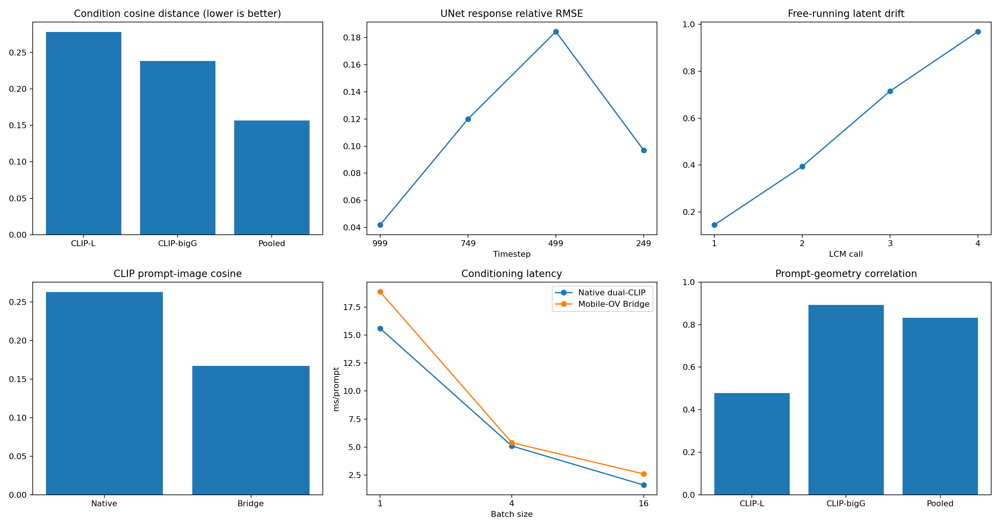
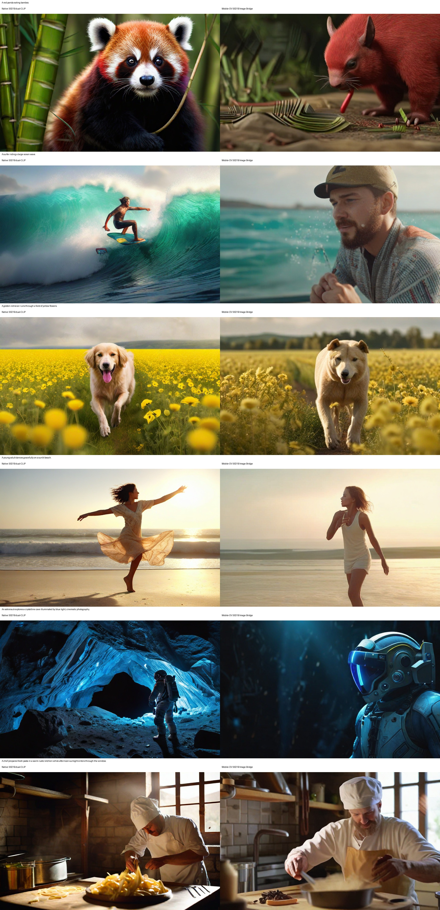
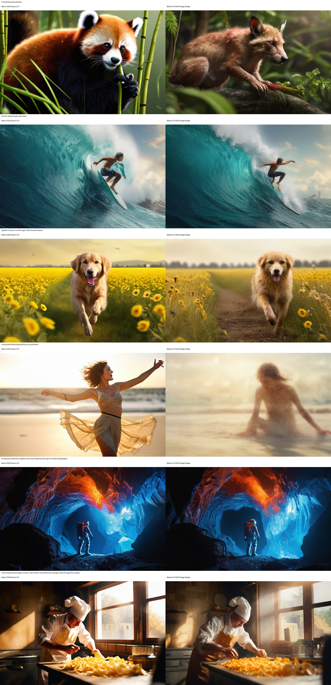
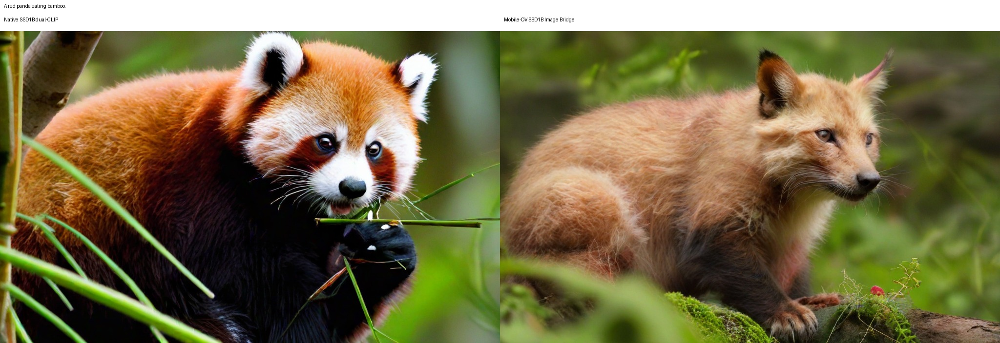
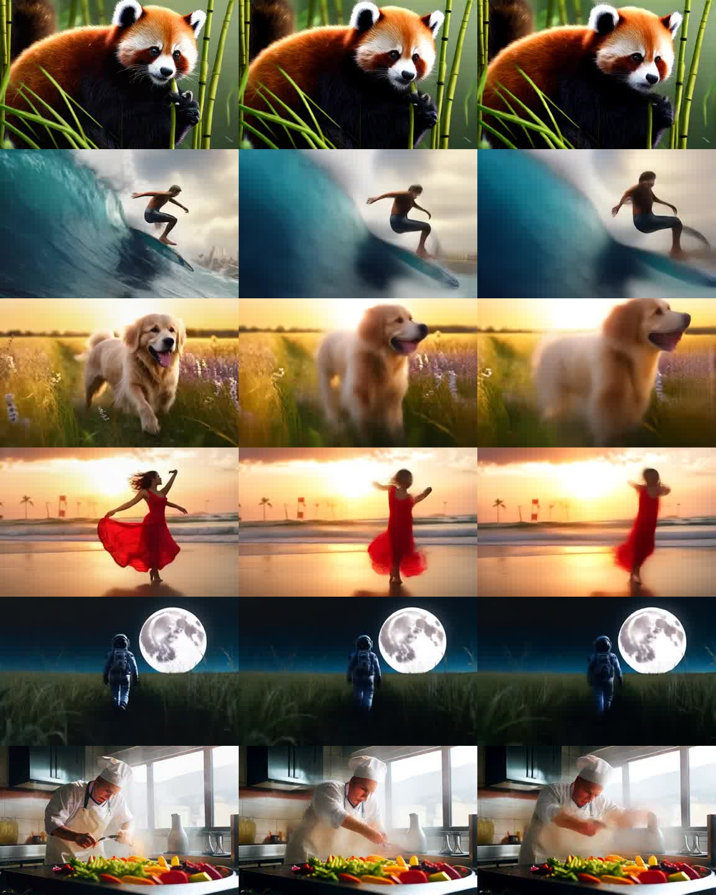
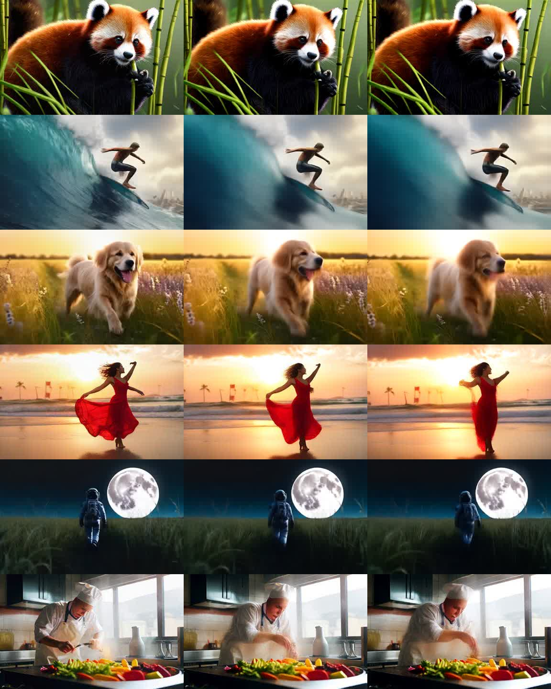
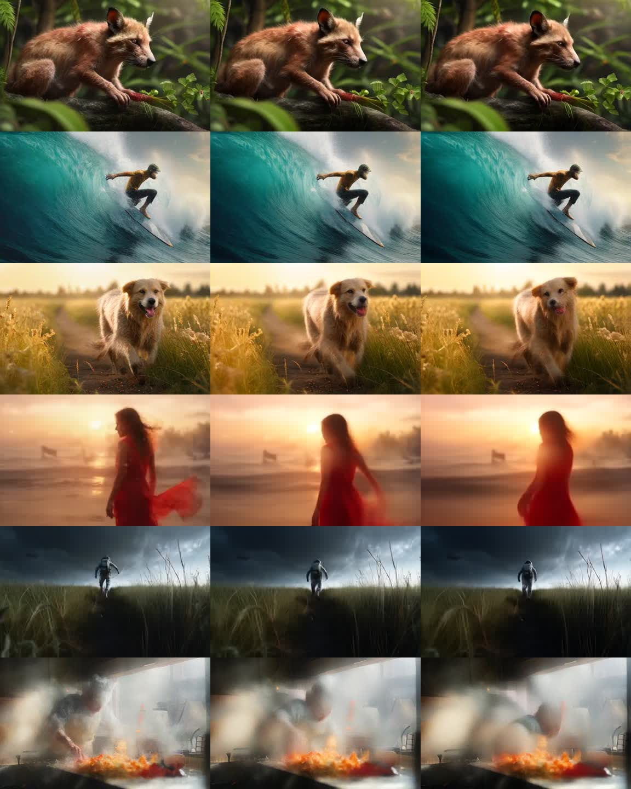

# Part 3: Image Bridge and End-to-End Results

## 1. Goal

SSD1B natively uses two large text encoders:

```text
CLIP-L    -> [B, 77, 768]
CLIP-bigG -> [B, 77, 1280] and pooled [B, 1280]
```

The Image Bridge asks whether one frozen SmolVLM2 forward plus an 11.15M
trainable bridge can replace both encoders while preserving SSD1B behavior.
This is attractive for model unification, but the required standard is high:
matching tensor shapes is not enough. The student must preserve prompt identity
and the full four-call SSD1B trajectory.

## 2. Image Bridge V1

### 2.1 Training setting

```text
steps:                    100K
GPUs:                     8
batch per GPU:            4
global batch:             32
LR:                       5e-5
trainable parameters:     11,148,293
frozen SmolVLM2:          507.48M parameters
caption sampling:         short/medium/long = 1:1:1
trainable master dtype:   FP32
frozen forward dtype:     BF16
```

The training curriculum used:

1. representation alignment;
2. frozen-UNet one-step functional alignment;
3. a local rollout objective on the student state.

The 100K run represented approximately:

```text
3.2M representation prompt exposures
670K one-step functional prompt exposures
90K rollout trajectories
360K student UNet calls
```

### 2.2 Representation measurements

Evaluation used 384 prompts, evenly split across short, medium, and long
captions.

| Output | Cosine distance | Top-1 retrieval | Top-5 retrieval | Linear CKA |
| --- | ---: | ---: | ---: | ---: |
| CLIP-L tokens | 0.2780 | 41.93% | 73.44% | 0.7575 |
| CLIP-bigG tokens | 0.2385 | 11.46% | 27.34% | 0.9512 |
| Pooled condition | 0.1567 | 71.09% | 90.36% | 0.8917 |

High CKA and poor retrieval can coexist. V1 retained broad dataset structure
but did not reliably preserve which prompt produced which condition.

### 2.3 Diversity compression

| Output | Student effective rank | Native effective rank |
| --- | ---: | ---: |
| CLIP-L | 27.92 | 70.59 |
| CLIP-bigG | 11.54 | 41.96 |
| Pooled | 60.38 | 86.96 |

The CLIP-bigG student is the largest bottleneck. Its first principal direction
explains 53.18% of variance, compared with 32.91% for the native teacher. The
bridge found a compressed solution that was easy to optimize but weak at prompt
separation.

### 2.4 Padding shortcut

The original representation loss weighted all 77 positions equally:

| Prompt form | Mean active tokens | Mean padding |
| --- | ---: | ---: |
| Raw prompt | 13.99 | 63.01 |
| Prompt plus quality modifier | 24.93 | 52.07 |

With the modifier, 67.6% of the target positions were padding. Position-wise
cosine distance confirmed that BOS and padding-like positions were easiest,
while early content positions were worst:

| Region | CLIP-L distance | CLIP-bigG distance |
| --- | ---: | ---: |
| BOS | 0.0197 | 0.0362 |
| Positions 1-20 | 0.4838 | 0.5581 |
| Positions 21-55 | 0.2322 | 0.1735 |
| Positions 56-76 | 0.1706 | 0.0521 |

### 2.5 Local and closed-loop behavior

Same-state frozen-UNet relative RMSE:

| SSD1B timestep | Relative RMSE |
| ---: | ---: |
| 999 | 0.0418 |
| 749 | 0.1199 |
| 499 | 0.1843 |
| 249 | 0.0968 |

The independent native and student trajectories diverged much more quickly:

| Call | Latent relative RMSE | Latent cosine distance |
| ---: | ---: | ---: |
| 1 | 0.1446 | 0.0109 |
| 2 | 0.3942 | 0.0813 |
| 3 | 0.7153 | 0.2719 |
| 4 | 0.9688 | 0.5121 |

This is the image-branch version of the same lesson learned from NeoDragon:
local one-call parity does not guarantee a stable free-running trajectory.



### 2.6 Image-level result

On 30 prompt-image pairs with the quality modifier:

| Metric | Native SSD1B | Image Bridge V1 |
| --- | ---: | ---: |
| CLIP prompt-image cosine | 0.2627 | 0.1673 |
| Mean Laplacian variance | 489.9 | 181.7 |
| Prompt-to-image retrieval top-1 | 90% | 50% |

Native-to-bridge image cosine was 0.7000, PSNR was 11.31 dB, and SSIM was
0.412. These are fidelity diagnostics, not evidence of standalone quality.



## 3. Prompt Modifier Ablation

The SSD1B prompt modifier is a fixed quality suffix appended to the user
prompt. It can help native image generation, but it creates repeated tokens that
may dominate student distillation.

| Metric | With modifier | Raw prompt |
| --- | ---: | ---: |
| Native CLIP prompt-image | 0.2627 | 0.2698 |
| Bridge CLIP prompt-image | 0.1673 | 0.1895 |
| Bridge-native gap | -0.0954 | -0.0803 |
| Bridge sharpness | 181.7 | 272.6 |
| Native/bridge image cosine | 0.7000 | 0.7018 |

For V1, the modifier improved neither semantic alignment nor sharpness. It
likely made the repeated generic quality phrase easier to match than the unique
prompt content.

The semantic gap was length-dependent:

| Prompt length | Native CLIP | Bridge CLIP | Gap |
| --- | ---: | ---: | ---: |
| Short | 0.2477 | 0.1952 | -0.0524 |
| Medium | 0.2550 | 0.2124 | -0.0425 |
| Long | larger native advantage | lower bridge robustness | about -0.1235 |

Long descriptive prompts exposed the largest mismatch.

## 4. Image Bridge V2

### 4.1 What changed

V2 intentionally kept the architecture and parameter count unchanged. It
changed only the objective and curriculum:

- semantic-token masks instead of uniform 77-position weighting;
- prompt identity and anti-collapse losses;
- balanced functional timesteps;
- an independent closed-loop trajectory target;
- improved rollout logging;
- FP32 trainable masters;
- representation, functional, and closed-loop phases.

```text
Phase A, 1-10K:      representation
Phase B, 10K-25K:   functional
Phase C, 25K-100K:  closed loop
LR:                 4e-5
```

### 4.2 Average functional improvement

Across the six-prompt parity test:

| Metric | V1 | V2 | Relative change |
| --- | ---: | ---: | ---: |
| Mean UNet MSE | 0.010396 | 0.006763 | -34.9% |
| Mean UNet cosine distance | 0.006774 | 0.004484 | -33.8% |

This confirms that V2 improved average local generator parity.

### 4.3 Prompt-level semantic result

Pooled cosine distance changed as follows:

| Prompt | V1 | V2 | Result |
| --- | ---: | ---: | --- |
| Red panda | 0.1583 | 0.2791 | worse |
| Surfer | 0.0991 | 0.1235 | worse |
| Golden retriever | 0.1020 | 0.1358 | worse |
| Dancing woman | 0.1286 | 0.2205 | worse |
| Astronaut | 0.1350 | 0.0344 | better |
| Chef | 0.1165 | 0.0886 | better |

Average functional improvement did not translate to consistent semantic
improvement. V2 solved some prompts and regressed others.



### 4.4 Red-panda diagnosis

For `A red panda eating bamboo`, V2's pooled target cosine was about 0.7212.
Nearest prompt conditions included red fox and squirrel ahead of the correct
target. Token-level cosine was:

```text
red:     0.6934
panda:   0.3165
eating:  0.2321
bamboo:  0.0585
```

The bridge represented the broad concept of a red animal but lost the
fine-grained species and object relation.



## 5. Why V2 Still Failed Important Prompts

### 5.1 Prompt-distribution mismatch

The bridge was trained primarily on OpenVid captions. Those captions describe
observed video content and often contain long, documentary-style sentences.
SSD1B's native text encoders were trained for image-generation prompt
distributions with different style, composition, attribute, and quality-token
statistics.

Matching native SSD1B conditions on an out-of-distribution caption stream can
teach broad structure while leaving rare compositional boundaries weak.

Future image-bridge training should mix:

- short object and attribute prompts;
- generative image prompts;
- compositional prompts;
- style prompts;
- hard negative pairs differing by species, action, count, color, or relation;
- OpenVid captions only as one component, not the entire distribution.

### 5.2 Metric imbalance

Average MSE favors common prompts and common token structure. Rare but critical
semantic distinctions can regress without greatly changing the mean. Retrieval
margin, hard-negative contrast, prompt-conditioned UNet sensitivity, and
per-prompt closed-loop errors must be first-class metrics.

## 6. End-to-End Image-to-Video Compatibility

The following combinations were tested:

```text
A. native SSD1B anchor + native NeoDragon condition
B. same native SSD1B anchor + Exp1 video condition
C. Image Bridge anchor + Exp1 video condition
```

NeoDragon preserved the supplied first frame in all valid runs. This is good
for image-to-video compatibility but creates a strict dependency: the video
branch cannot repair a wrong species, action, or composition already present in
the image anchor.

Representative timing from the controlled Exp6 evaluation:

| Stage | Mean time |
| --- | ---: |
| Native SSD1B first frame | about 0.221 s |
| Image Bridge first frame | about 0.230-0.260 s |
| Native-condition video | about 2.025 s |
| Exp1-condition video | about 2.0-2.1 s |

The generation path is operational. The remaining issue is semantic and
behavioral parity, not tensor plumbing.

## 7. Exp6 End-to-End Visual Evaluation

The Exp6 2K DiT was tested under three controlled condition/anchor paths.

### Native condition and shared native anchor



### Exp1 condition and the same native anchor



### Full Image Bridge plus Exp1 condition



Measured first-to-last frame proxies:

| Path | RGB difference | Blur proxy |
| --- | ---: | ---: |
| Native condition, native anchor | 2.3492 | 7.9026 |
| Exp1 condition, same native anchor | 1.5413 | 7.5443 |
| Exp1 condition, Image Bridge anchor | 0.8973 | 9.3028 |

These values indicate progressively less apparent change, but they do not by
themselves rank perceptual quality. The visual evidence does not establish an
Exp6 improvement over the released Hybrid DiT.

## 8. Image-Branch Decision

The Image Bridge is an informative research result but not yet a replacement
for native SSD1B text conditioning.

Confirmed:

- the three output contracts are correct;
- 11.15M trainable parameters are enough for plausible images;
- V2 improves average local UNet parity;
- one SmolVLM2 forward can serve both image and video heads;
- the generated frame is compatible with NeoDragon I2V conditioning.

Not yet achieved:

- reliable species, object, action, and relation identity;
- native-level prompt retrieval;
- native-level embedding diversity;
- stable four-call SSD1B trajectory parity;
- consistent qualitative improvement from V1 to V2.

The quality-first baseline should therefore keep native SSD1B dual CLIPs. The
Image Bridge should only replace them after it passes prompt-level semantic,
retrieval, closed-loop, and image-quality gates on an SSD1B-relevant prompt
distribution.
